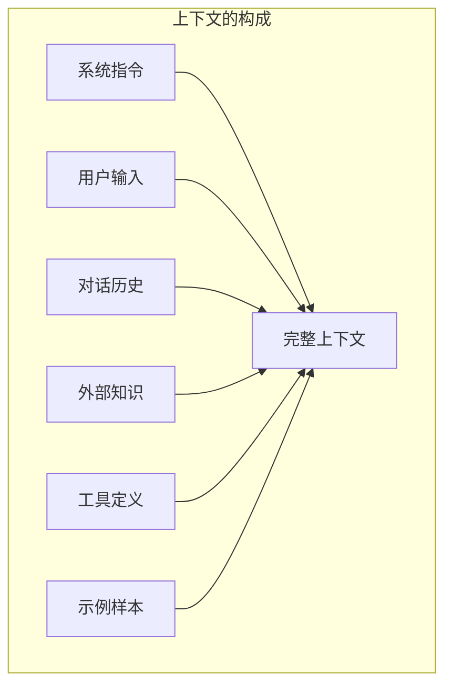

## 1.1 什么是上下文工程

### 1.1.1 定义与内涵

**上下文工程**（Context Engineering）是一门系统性的工程学科，它研究如何设计、组织、优化和管理大语言模型所需的全部信息环境，以确保模型能够在正确的时间获得正确的信息，从而产生准确、可靠、符合预期的输出。

这个定义包含几个关键要素：

1. **系统性**：上下文工程不是孤立的技巧集合，而是一套完整的方法论体系
2. **信息环境**：关注的不仅是输入给模型的文本，还包括所有可能影响模型行为的信息
3. **时机与形式**：强调在正确的时间、以正确的格式提供信息
4. **目标导向**：最终目的是实现可靠、可预测的模型输出

### 1.1.2 上下文的多维构成

在大模型应用中，“上下文”是一个多层次的概念，它包括：

- **系统指令**：定义模型角色、行为准则和输出格式的基础设定
- **用户输入**：当前任务的具体请求和参数
- **对话历史**：多轮对话中的历史交互记录
- **外部知识**：通过检索或其他方式引入的领域知识、事实信息
- **工具定义**：模型可调用的外部工具、API 的描述
- **示例样本**：用于引导模型行为的少样本示例

### 1.1.3 上下文工程的核心挑战

上下文工程面临三大核心挑战：

**挑战一：有限的上下文窗口**

尽管现代大模型的上下文窗口已经扩展到数十万甚至百万 Token，但它仍然是有限的资源。当需要处理的信息超出窗口容量时，如何选择最相关的内容成为关键问题。

**挑战二：信息质量与密度**

模型的输出质量高度依赖于输入信息的质量。冗余、噪声或不相关的信息不仅浪费上下文空间，还可能干扰模型的判断。在不少评测与线上实践中，过度填充上下文（Context Stuffing）常会带来性能波动、成本上升和延迟增加。

**挑战三：动态与实时性**

许多应用场景需要实时更新的信息，如最新的市场数据、用户状态或系统配置。如何构建动态的上下文管理系统，确保信息的时效性，是一个持续的技术挑战。

### 1.1.4 上下文工程的重要性

为什么上下文工程如此重要？原因在于：

1. **模型能力的放大器**：相同的模型，配合精心设计的上下文，可以展现出截然不同的能力水平
2. **可靠性的保障**：系统化的上下文管理能显著降低幻觉、错误和不一致行为的发生
3. **成本效率的关键**：优化的上下文策略直接影响 Token 使用量和 API 调用成本
4. **可扩展性的基础**：良好的上下文架构是构建复杂 AI 应用的技术基石

随着大模型从简单的问答助手演进为能够完成复杂任务的智能体，上下文工程的重要性还将持续提升。在智能体时代，上下文不仅是静态的输入，更是动态演化的工作空间。掌握上下文工程，就是掌握了驾驭 AI 能力的核心技术。
