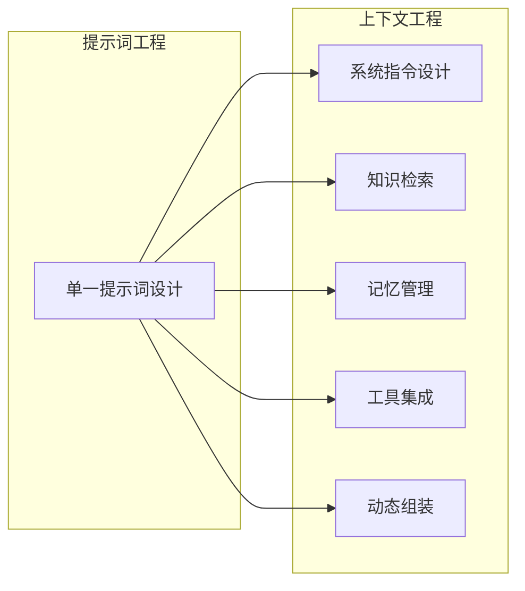

## 1.2 从提示词工程到上下文工程

### 1.2.1 提示词工程的起源与局限

**提示词工程**（Prompt Engineering）是指通过精心设计输入给模型的文本指令，来引导模型产生期望输出的技术。自 GPT-3 等大模型问世以来，提示词工程迅速成为 AI 应用开发的核心技能。

提示词工程的典型技巧包括：

- **角色设定**：如“你是一位专业的法律顾问”
- **任务描述**：清晰说明期望模型完成的任务
- **输出格式**：指定 JSON、Markdown 等结构化输出
- **少样本学习**：提供几个示例引导模型行为
- **思维链提示**：要求模型逐步推理

这些技巧在许多场景下效果显著，但随着应用场景的复杂化，提示词工程的局限也逐渐显现：

| 局限性 | 具体表现 |
|--------|----------|
| 静态性 | 提示词通常是预定义的，难以适应动态变化的需求 |
| 孤立性 | 聚焦于单次交互，缺乏对对话历史和外部信息的系统管理 |
| 可扩展性差 | 随着任务复杂度增加，提示词变得冗长且难以维护 |
| 缺乏工程化 | 更多依赖直觉和试错，缺乏系统化的方法论 |

### 1.2.2 上下文工程的演进

上下文工程是提示词工程的自然演进和扩展。如果说提示词工程关注的是“写什么指令”，那么上下文工程关注的是“如何构建完整的信息环境”。

Anthropic 公司在其官方文档中明确指出：提示词工程是上下文工程的一个子集。这一观点准确描述了两者的关系——提示词工程仍然重要，但它只是上下文工程这个更大画卷中的一部分。

### 1.2.3 核心差异对比

| 维度 | 提示词工程 | 上下文工程 |
|------|------------|------------|
| **关注点** | 单次指令的措辞和格式 | 完整信息环境的设计 |
| **范围** | 提示词文本 | 指令、数据、工具、记忆、策略 |
| **时间维度** | 静态、一次性 | 动态、跨会话 |
| **信息来源** | 手工编写 | 多源融合、自动检索 |
| **工程化程度** | 技巧驱动、经验依赖 | 系统化、可量化、可测试 |
| **应用场景** | 简单任务、单轮对话 | 复杂任务、多轮交互、智能体 |

### 1.2.4 为什么需要这种演进

这种从提示词工程到上下文工程的演进，是由几个关键因素驱动的：

**因素一：任务复杂度的提升**

早期的 LLM 应用主要是简单的问答和文本生成，一个精心设计的提示词就足够了。如今的应用场景包括代码编写、数据分析、复杂推理、多步骤任务执行等，这些都需要更丰富的上下文支持。

**因素二：智能体的兴起**

AI 智能体需要在长时间跨度内持续工作，处理多个子任务，协调多个工具，维护工作状态。这种场景下，静态的提示词远远不够，需要系统化的记忆管理和上下文编排。

**因素三：生产环境的要求**

从原型到生产，AI 应用需要面对可靠性、一致性、可观测性、成本控制等一系列工程化要求。上下文工程提供了应对这些挑战的系统方法。

**因素四：模型能力的提升**

随着模型能力增强，上下文窗口扩大，模型能够利用更丰富的信息。如何高效利用这些能力，需要更高层次的工程方法。

### 1.2.5 一个类比

可以用建筑来类比这种演进：

- **提示词工程**如同为一座房子设计入口大门——门的设计很重要，但它只是整个建筑的一部分
- **上下文工程**如同建筑设计——需要考虑整体结构、空间布局、采光通风、管道电路等所有要素的协调配合

单凭一道漂亮的大门无法成就一座优秀的建筑；同样，单凭精巧的提示词也无法构建可靠的 AI 系统。从提示词工程升级到上下文工程，是 AI 应用开发走向成熟的必由之路。
