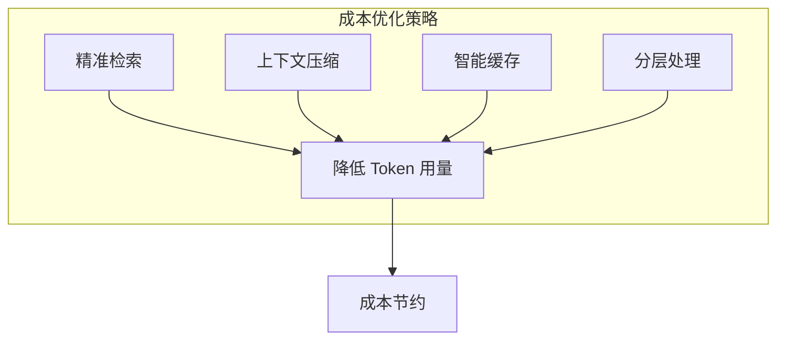

## 1.3 上下文工程的核心价值

上下文工程为 AI 应用开发带来多维度的价值，这些价值从技术层面延伸到商业层面，最终影响用户体验和产品成功。

### 1.3.1 提升模型输出质量

上下文工程的首要价值是显著提升模型输出的质量。这种提升体现在多个方面：

* **准确性提升**：通过精准的知识检索和上下文构建，模型获得执行任务所需的事实依据，大幅降低幻觉和错误的发生概率。研究表明，配合高质量上下文的 [RAG](../05_select/5.1_rag_principles.md) 系统，可以将事实准确性提升 40% 以上。
* **相关性增强**：动态上下文管理确保模型获得与当前任务高度相关的信息，避免被无关内容干扰。相关性是决定用户满意度的关键因素之一。
* **一致性保障**：系统化的上下文策略能够保证模型在不同会话、不同用户、不同时间点产生一致的行为，这对于企业级应用至关重要。

### 1.3.2 优化成本效率

在大模型应用中，Token 使用量直接关联成本。上下文工程通过多种策略优化成本：

- **精准检索**：只检索和传递真正需要的信息，避免上下文冗余
- **上下文压缩**：通过摘要等技术压缩信息，保留关键内容
- **智能缓存**：复用频繁使用的上下文片段，减少重复计算
- **分层处理**：对不同复杂度的任务使用不同规模的模型或策略

实践证明，良好的上下文工程可以将 Token 消耗降低 30%-50%，在大规模部署场景下意味着巨大的成本节约。

### 1.3.3 增强系统可靠性

生产环境对可靠性有严格要求，上下文工程从多个角度增强系统可靠性：

| 可靠性维度 | 上下文工程的作用 |
|------------|------------------|
| 错误预防 | 通过上下文约束降低模型产生不当输出的概率 |
| 边界控制 | 明确定义模型的能力边界和行为约束 |
| 故障隔离 | 模块化的上下文设计便于定位和隔离问题 |
| 降级策略 | 当部分上下文源不可用时提供优雅降级 |
| 可审计性 | 完整的上下文记录支持事后分析和审计 |

### 1.3.4 支撑复杂应用场景

上下文工程使得构建复杂 AI 应用成为可能：

- **多轮对话系统**: 通过对话历史管理和上下文累积，支持真正具有"记忆"的多轮对话，让交互更加自然流畅。
- **智能体系统**: 为 AI 智能体提供工作记忆、长期记忆和工具访问能力，使其能够执行跨越多个步骤的复杂任务。
- **多模态应用**: 统一管理文本、图像、代码等不同模态的上下文信息，支持多模态理解和生成。
- **垂直领域应用**: 通过专业知识库的集成和领域特定的上下文策略，打造深度垂直的 AI 解决方案。

### 1.3.5 加速开发迭代

上下文工程带来的工程化方法显著提升开发效率：

- **模块化设计**:将上下文管理分解为可复用的模块（检索器、压缩器、记忆管理器等），便于组合和替换。
- **可测试性**:上下文构建过程可测试、可度量，支持自动化测试和持续优化。
- **可观测性**: 完善的上下文日志和监控，便于理解系统行为、诊断问题、迭代改进。
- **团队协作**: 标准化的上下文工程实践便于团队协作，降低知识壁垒。

### 1.3.6 创造竞争优势

从商业角度看，上下文工程能力是 AI 应用的核心竞争力之一：

- **差异化**：在相同基础模型上，通过卓越的上下文工程实现差异化的用户体验
- **护城河**：积累的上下文策略、领域知识库、优化经验形成技术壁垒
- **持续进化**：上下文工程框架支持系统持续学习和改进
- **适应性**：灵活的上下文管理能力使系统能够快速适应新需求、新场景

在 AI 能力逐渐商品化的趋势下，上下文工程能力将成为区分优秀产品与平庸产品的关键因素。那些能够精准理解用户需求、高效利用模型能力、提供可靠一致体验的产品，将在竞争中脱颖而出。
