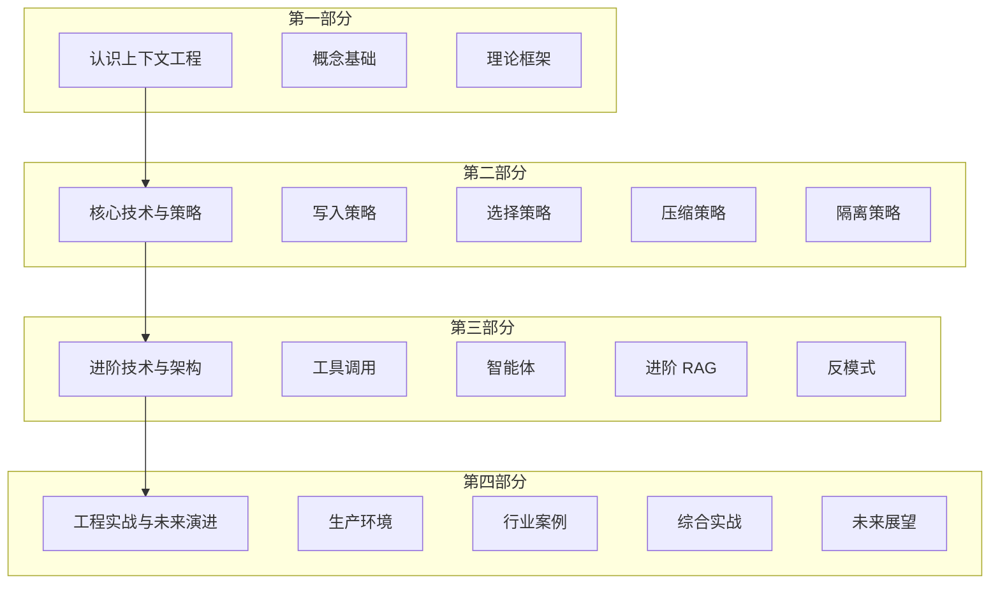

## 1.4 本书结构与学习路径

### 1.4.1 全书架构

本书按照"从入门到精通"的逻辑组织，共分为四个部分：

**第一部分：认识上下文工程**

这一部分建立对上下文工程的整体认知。[第一章](../01_overview/README.md)介绍上下文工程的定义、起源和价值；[第二章](../02_llm_basics/README.md)深入大模型基础，理解上下文窗口的工作机制；[第三章](../03_framework/README.md)构建理论框架，介绍四大核心策略和评估方法。

**第二部分：核心技术与策略**

这是本书的技术核心，详细讲解上下文工程的四大策略：
- [第四章](../04_write/README.md)：写入策略——如何构建和管理外部记忆
- [第五章](../05_select/README.md)：选择策略——如何通过检索获取相关信息
- [第六章](../06_compress/README.md)：压缩策略——如何优化信息密度
- [第七章](../07_isolate/README.md)：隔离策略——如何结构化组织上下文

**第三部分：进阶技术与架构**

这一部分聚焦进阶技术和架构设计。[第八章](../08_tools/README.md)讲解工具调用与 MCP 协议；[第九章](../09_agents/README.md)专注智能体系统的上下文管理；[第十章](../10_advanced/README.md)探讨 Agentic RAG 等进阶 RAG 技术；[第十一章](../11_antipatterns/README.md)总结常见的上下文工程陷阱。

**第四部分：工程实战与未来演进**

这一部分关注落地应用。[第十二章](../12_production/README.md)汇总生产环境的最佳实践；[第十三章](../13_cases/README.md)展示各行业的实战案例；[第十四章](../14_practice/README.md)带领读者构建企业级问答系统；[第十五章](../15_future/README.md)展望未来发展趋势。

### 1.4.2 各部分学习目标

| 部分 | 章节 | 学习目标 |
|------|------|----------|
| 第一部分 | 1-3 章 | 理解概念、掌握理论、建立认知框架 |
| 第二部分 | 4-7 章 | 掌握核心技术、理解策略原理 |
| 第三部分 | 8-11 章 | 掌握工具调用、智能体及进阶 RAG 技术，识别反模式 |
| 第四部分 | 12-15 章 | 学习生产实践、行业案例及系统构建，展望未来 |

### 1.4.3 学习建议

**对于初学者**

建议按顺序完整阅读，不要跳过基础章节。每章的概念都建立在前一章的基础上，扎实的基础将使后续学习事半功倍。每章末尾的"本章小结"是复习巩固的好资源。

**对于有经验的开发者**

可以先快速浏览第一部分，然后深入阅读第二部分的核心技术。根据实际工作需求，有选择地深入第三部分的相关章节。第四部分的进阶内容值得仔细研读。

**对于架构师和技术负责人**

建议重点关注[第三章](../03_framework/README.md)的理论框架、[第十二章](../12_production/README.md)的生产实践，以及[第十章](../10_advanced/README.md)的进阶架构。这些内容对于系统设计和技术决策最有价值。

### 1.4.4 实践建议

上下文工程是一门实践性很强的学科，纯粹的阅读远远不够。建议：

1. **动手实验**：在阅读每一技术章节时，尝试用代码实现其中的关键概念
2. **项目驱动**：选择一个实际项目，将学到的技术逐步应用到项目中
3. **对比分析**：在引入新策略时，对比优化前后的效果差异
4. **持续迭代**：上下文工程是一个持续优化的过程，不断观察、分析、改进

### 1.4.5 附录资源

本书附录提供四个重要资源：

- **附录 A 术语表**：快速查阅专业术语的定义
- **附录 B 常用工具与框架**：主流工具的介绍和选型建议
- **附录 C 参考资源**：延伸阅读的推荐资料
- **附录 D 参考文献**：书中引用的论文与技术报告索引

这些资源可在学习过程中随时查阅，也是学习结束后持续提升的重要参考。

现在，让我们正式开始上下文工程的学习之旅。
