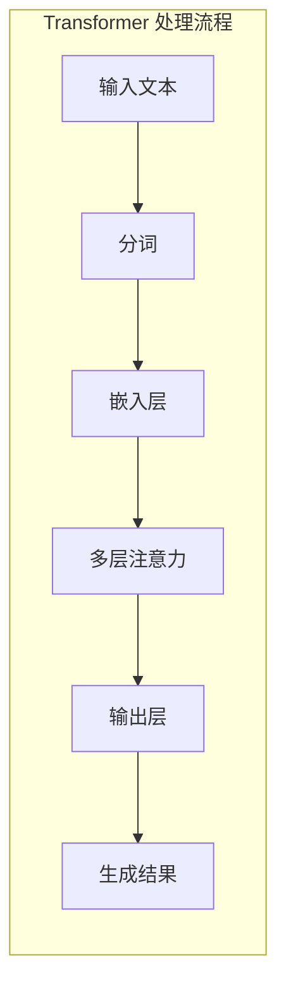

## 2.1 大语言模型工作原理

### 2.1.1 从神经网络到 Transformer 架构

现代大语言模型的基础是 2017 年由 Google 提出的 Transformer 架构。这一架构从根本上改变了自然语言处理的方式，使得模型能够高效地处理长序列文本。

Transformer 的核心创新是**自注意力机制**（Self-Attention），它允许模型在处理每个词元时，同时"关注"序列中的所有其他词元，从而捕捉长距离的语义依赖关系。

### 2.1.2 自回归生成机制

大语言模型采用**自回归**（Autoregressive）方式生成文本：逐个预测下一个 Token，每次预测都基于之前所有的 Token。

这一机制的核心公式是：

$$P(x_1, x_2, ..., x_n) = \prod_{i=1}^{n} P(x_i | x_1, x_2, ..., x_{i-1})$$

简言之，模型将生成整个序列的概率分解为：每个 Token 出现的概率，条件是之前所有 Token 都已知。

这意味着：
- 模型需要"记住"之前的所有内容才能正确预测下一个 Token
- 序列越长，需要维护的"记忆"就越多
- 这种记忆就体现在上下文窗口中

### 2.1.3 注意力机制与上下文

自注意力机制的计算过程决定了模型如何利用上下文：

1. **Query、Key、Value**：每个 Token 被转换为三个向量
2. **注意力分数计算**：Query 与所有 Key 计算相似度
3. **加权求和**：根据注意力分数对 Value 加权求和
4. **输出表示**：得到融合了上下文信息的 Token 表示

关键点在于：每个 Token 的最终表示都包含了对整个上下文的"感知"。位置靠后的 Token 可以"看到"之前的所有 Token，这就是上下文窗口的技术基础。

### 2.1.4 计算复杂度

标准自注意力的计算复杂度是 $O(n^2)$，其中 $n$ 是序列长度。这意味着：
- 序列长度翻倍，计算量增加 4 倍
- 这是限制上下文窗口大小的主要技术瓶颈

为解决这一问题，研究者提出了多种优化技术：

| 技术 | 原理 | 代表模型 |
|------|------|----------|
| 稀疏注意力 | 只计算部分位置对的注意力 | Longformer, BigBird |
| 线性注意力 | 近似自注意力，降低复杂度 | Linear Transformer |
| 滑动窗口 | 限制每个位置只关注局部 | Mistral |
| 分组查询注意力 | 减少 Key-Value 头数量 | LLaMA 2, Gemini |

### 2.1.5 预训练与涌现能力

大语言模型通过在海量文本上预训练，学习语言的统计规律和世界知识。当模型规模达到一定程度（通常是数百亿参数以上），会展现出**涌现能力**（Emergent Abilities）：

- 少样本学习：通过几个示例就能理解新任务
- 逻辑推理：执行多步推理
- 代码生成：根据自然语言描述生成代码
- 工具使用：理解和调用外部工具

这些涌现能力使得大模型能够胜任复杂的任务，但前提是需要提供合适的上下文来激活和引导这些能力。这正是上下文工程的意义所在。

### 2.1.6 模型架构的演进

从 GPT-3 到 GPT-5，从 LLaMA 到 LLaMA 4，从 Claude 2 到 Claude 4，大模型在以下方面持续进化：

- **参数规模**：从千亿级向万亿级发展
- **上下文窗口**：从 2K/4K 扩展到 128K/200K 甚至更大
- **多模态能力**：从纯文本扩展到图像、音频、视频
- **效率优化**：推理速度提升，成本降低

理解这些演进趋势，有助于把握上下文工程的未来发展方向。
