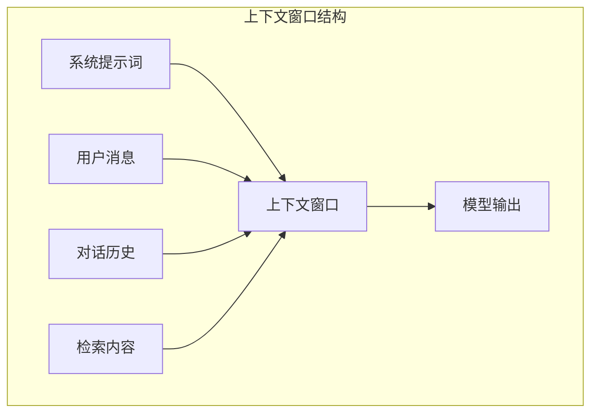

## 2.2 上下文窗口的本质

### 2.2.1 什么是上下文窗口

**上下文窗口**（Context Window）是大语言模型一次能够处理的最大 Token 序列长度。它包括输入的提示词、对话历史、检索到的文档等所有信息，以及模型生成的输出。

可以将上下文窗口类比为模型的"工作记忆"：
- 它有固定的容量上限
- 超出容量的内容无法被处理
- 窗口内的所有信息相互可见、相互影响

### 2.2.2 输入与输出的关系

上下文窗口容量需要同时容纳输入和输出：

$$上下文窗口容量 = 输入Token数 + 输出Token数$$

例如，一个 8K 窗口的模型：
- 如果输入占用 6K Token
- 则输出最多只剩 2K Token 的空间

这意味着在实际应用中，需要谨慎规划输入内容的规模，为输出留出足够空间。

### 2.2.3 上下文窗口的技术实现

从技术角度看，上下文窗口的限制来自多个层面：

**位置编码**

Transformer 使用位置编码（Positional Encoding）让模型感知 Token 的位置。传统的绝对位置编码难以泛化到训练时未见过的长度，这限制了上下文窗口的扩展。

现代模型采用改进的位置编码方案：
- **RoPE**（旋转位置编码）：LLaMA、Qwen 等模型采用
- **ALiBi**（注意力线性偏置）：无需显式位置编码

**KV 缓存**

在生成过程中，模型需要缓存之前所有 Token 的 Key 和 Value 向量，这个缓存称为 KV Cache。KV 缓存的大小与上下文长度成正比，占用大量显存。

对于一个 70B 参数的模型，128K 上下文的 KV 缓存可能需要数十 GB 显存，这是硬件层面的重要限制。

**注意力计算**

如前所述，自注意力的 $O(n^2)$ 复杂度使得超长上下文的计算成本极高。虽然有各种优化技术，但基本的计算瓶颈依然存在。

### 2.2.4 长上下文的挑战

随着上下文窗口不断扩大，新的挑战也随之出现：

**"大海捞针"问题**

研究发现，当关键信息被埋在超长上下文的中间位置时，模型的检索能力会下降。模型倾向于更关注上下文的开头和结尾，而忽略中间部分。

**注意力稀释**

上下文越长，每个 Token 的平均注意力权重越低，重要信息可能被"稀释"。

**成本与延迟**

更长的上下文意味着更高的计算成本和更长的响应延迟。在生产环境中，这直接影响用户体验和运营成本。

**质量与长度的权衡**

研究表明，对于许多任务，精心筛选的短上下文可能比冗长的长上下文效果更好。信息质量比数量更重要。

### 2.2.5 有效上下文长度

需要区分两个概念：
- **声称上下文长度**：模型官方宣称支持的最大长度
- **有效上下文长度**：模型能够真正有效利用的长度

许多模型在接近最大上下文长度时，性能会显著下降。一个声称支持 128K 的模型，有效长度可能只有 64K 甚至更短。

评估有效上下文长度的常用方法是"大海捞针"测试（Needle in a Haystack）：将一条关键信息放置在上下文的不同位置，测试模型能否准确检索。

### 2.2.6 上下文窗口的发展趋势

上下文窗口正在快速扩展：

| 年份 | 代表模型 | 上下文窗口 |
|------|----------|------------|
| 2020 | GPT-3 | 4K-8K |
| 2023 | GPT-4 | 8K-128K |
| 2024 | Claude 3 | 200K |
| 2025 | Gemini 2.0 | 1M+ |

然而，更大的上下文窗口并不意味着可以忽视上下文工程。事实上，超大上下文窗口让上下文管理变得更加重要——如何在巨大的可用空间中高效组织信息、避免噪声干扰、确保关键信息被正确利用，这些都是上下文工程需要解决的问题。
