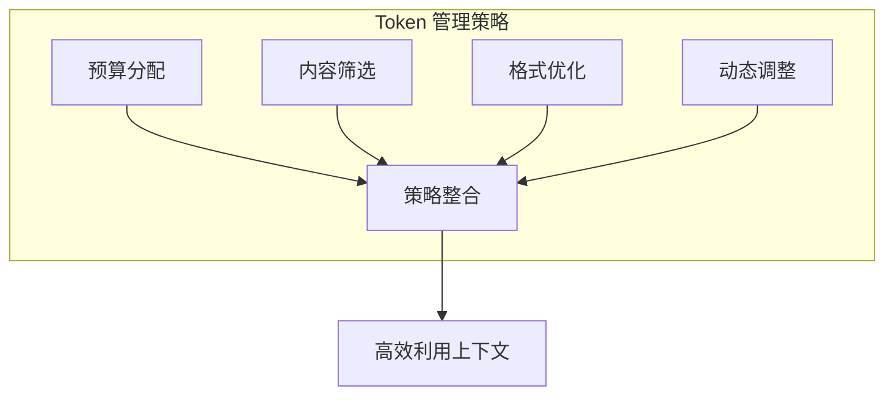

## 2.3 Token 与上下文限制

### 2.3.1 什么是 Token

**Token** 是大语言模型处理文本的基本单位。模型不直接处理字符或单词，而是将文本先转换为 Token 序列，再进行处理。

Token 可以是：
- 一个完整的单词（如 “hello”）
- 单词的一部分（如 “understanding” 可能被分为 “under” + “stand” + “ing”）
- 单个字符或标点符号
- 特殊符号（如空格、换行符）

对于中文，由于没有天然的单词分隔，分词方式有所不同：
- 一个常见汉字通常是 1-2 个 Token
- 生僻字可能需要更多 Token

### 2.3.2 分词算法

主流的分词算法包括：

- **BPE（Byte Pair Encoding）**：OpenAI 的 GPT 系列采用，从单字符开始迭代合并最频繁出现的字符对，直到达到预设的词表大小
- **WordPiece**：Google 的 BERT 采用，与 BPE 类似但使用不同的合并策略
- **SentencePiece**：处理多语言文本的通用方案，不依赖于预先的空格分词，特别适合中文、日文等语言

不同模型使用不同的分词器，因此相同文本在不同模型中的 Token 数量可能不同。

### 2.3.3 Token 计数的重要性

精确的 Token 计数在上下文工程中至关重要：

**1. 容量规划**

确保总 Token 数不超过上下文窗口限制。无论是 8K 还是 128K，上下文窗口总是有限的。在构建 Prompt 之前精确计算 System Prompt、历史记录、检索内容的总和，可以避免请求因超长被截断或拒绝，保证应用的稳定性。

**2. 成本估算**

API 调用按 Token 计费。商业模型的计费精确到每百万 Token。不准确的计数会导致成本预算严重偏差。对于高并发应用，哪怕每个请求多出几十个无用 Token，累积起来也是巨大的浪费。

**3. 性能优化**

减少不必要的 Token 以降低延迟。LLM 的推理延迟（尤其是首 Token 时间和总生成时间）与输入和输出的 Token 数正相关。精简 Input Token 不仅省钱，还能显著提升用户感知的响应速度。

### 2.3.4 Token 计数实践

以下是常见模型的 Token 估算规则：

| 内容类型 | 英文估算 | 中文估算 |
|----------|----------|----------|
| 普通文本 | 约 1 Token/4 字符 | 约 1-2 Token/汉字 |
| 代码 | 变化较大，取决于语言 | - |
| JSON | 结构符号增加 Token | - |
| Markdown | 格式符号增加 Token | - |

实际应用中，建议使用官方提供的分词器进行精确计数，而非依赖估算。主要模型平台都提供了分词器工具：

- OpenAI：tiktoken 库
- Anthropic：Claude 分词器
- Google：Gemini tokenizer

### 2.3.5 上下文限制的管理策略

面对有限的上下文窗口，需要采取系统性策略：

图 2-4：Token 管理策略

**预算分配**

为不同组成部分分配 Token 预算：
- 系统提示词：保持精简，通常 500-2000 Token
- 检索内容：根据任务复杂度分配，可能占 30%-50%
- 对话历史：保留最相关的轮次
- 输出预留：确保输出空间充足

**内容筛选**

只包含与当前任务真正相关的信息：
- 精准检索而非全量加载
- 移除冗余和重复内容
- 过滤噪声信息

**格式优化**

优化信息的表达方式以节省 Token：
- 使用简洁的表达
- 避免不必要的格式修饰
- 结构化而非散文式表述

**动态调整**

根据任务需求动态调整：
- 简单任务使用更小的上下文
- 复杂任务扩展必要信息
- 实时监控 Token 使用情况

### 2.3.6 Token 与成本

在商业模型中，Token 直接关联费用。各平台的定价策略通常包含以下特点：

| 计费维度 | 说明 |
|----------|------|
| 输入 Token | 按输入的上下文 Token 数量计费 |
| 输出 Token | 按生成的 Token 数量计费，通常比输入贵 2-4 倍 |
| 缓存 Token | Prompt Caching 可节省 50-90% 的输入成本 |
| 模型层级 | 同系列中更强的模型价格更高 |

> **注意**：Token 价格变化频繁，建议查阅各平台最新定价：
> - [OpenAI Pricing](https://openai.com/pricing)
> - [Anthropic Pricing](https://www.anthropic.com/pricing)
> - [Google AI Pricing](https://ai.google.dev/pricing)

**成本优化策略**：
- 压缩输入以减少输入 Token
- 控制输出长度，设置 `max_tokens` 参数
- 充分利用 Prompt Caching 机制复用公共内容
- 简单任务使用小模型，复杂任务再用大模型
- 批量请求可能有折扣

精细的 Token 管理不仅关乎技术性能，也直接影响项目的经济可行性。在大规模部署场景下，结合缓存、压缩、检索裁剪与输出控制，往往可以获得可观的成本优化；具体节约幅度取决于业务请求分布、缓存命中率以及模型定价。
