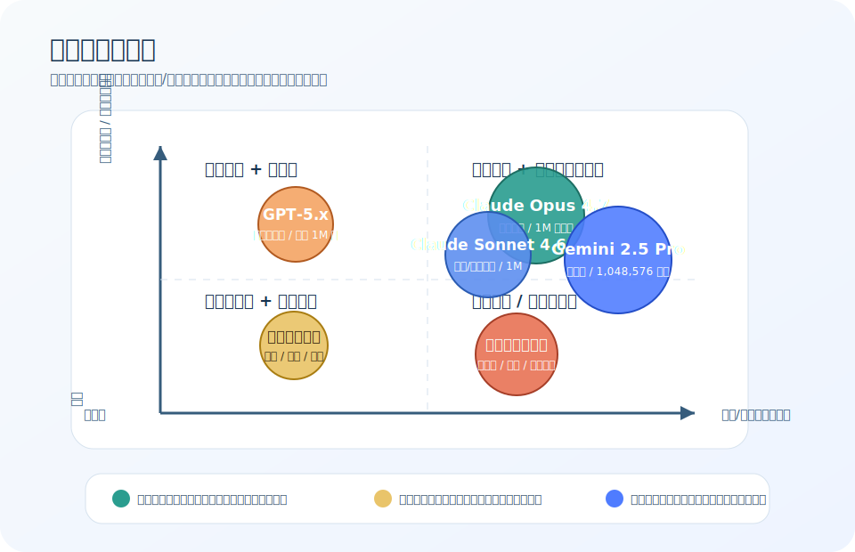

## 2.4 主流模型的上下文能力对比

### 2.4.1 主流模型概览

模型参数变化非常快。以下内容是 **能力分层示意**（官方核验日期：2026-05-17），用于帮助理解选型思路，而非实时参数公告。生产决策必须以各厂商官网模型页、价格页和实际账号可用区为准。

| 模型系列 | 官方快照中的代表能力 | 典型优势 | 典型取舍 |
|------|--------|------------|------------|
| OpenAI GPT 系列 | 官方模型页显示 `gpt-5.5`、`gpt-5.4` 为 1M 上下文，`gpt-5.4-mini` 为 400K；均通过 Responses API 和 SDK 使用 | 通用推理、代码与工具生态成熟 | 价格按短/长上下文、缓存、区域处理和服务层级变化 |
| Anthropic Claude 系列 | 官方文档显示 Claude Opus 4.7、Opus 4.6、Sonnet 4.6 为 1M 上下文，Haiku 4.5 为 200K；Opus 4.7 tokenizer 对同一文本可能多用至多 35% tokens | 长文理解、代码与写作稳定性 | 峰值吞吐、区域路由、缓存和批处理价格需按场景评估 |
| Google Gemini 系列 | Gemini API 模型页同时列出稳定、预览和已弃用模型；页面显示 Gemini 3 Pro Preview 已关闭，应以具体模型页的 token limits 为准 | 多模态与长上下文任务 | 预览/弃用状态变化快，部署前需确认可用模型字符串 |
| Meta Llama 系列 | Meta 2025-04-05 官方博客称 Llama 4 Scout 支持 10M 输入上下文；实际托管服务可能给出更低上限 | 私有化与可定制能力 | 需要自行评估部署、显存、量化和服务商限制 |
| Qwen / DeepSeek 等开源或开放 API 系列 | 上下文窗口、价格和工具能力随具体模型、服务商和部署方式变化 | 中文、多语言或推理性价比突出 | 需结合官方文档、模型卡和本地压测确认 |

*注：价格、上下文窗口、工具能力、区域可用性和弃用状态都属于高波动信息。方案文档应记录“查询日期 + 具体模型 ID + 模型页/价格页链接”，并在上线或迁移前重新核验。*

图 2-5：模型选型象限图

这张图不是替代表格，而是把选型时最常见的两类张力显式化：一类是任务复杂度与质量要求，另一类是成本和延迟约束；真正落地时还要把上下文窗口、工具能力和部署方式一起纳入判断。

### 2.4.2 选择模型的考量因素

选择模型时需要综合考虑多个因素：

**上下文需求**

根据应用场景的上下文需求选择：
- 简单对话：8K-32K 通常足够
- 文档问答：64K-128K 较为适合
- 大规模代码库分析：需要 200K 以上
- 超长文档处理：考虑 1M 级别模型

**任务类型**

不同模型在不同任务上表现各异：
- 代码生成：优先看代码基准、工具调用稳定性和长代码编辑能力
- 中文处理：优先看中文任务集、专业术语覆盖和事实一致性
- 推理任务：优先看复杂推理基准与失败样例分析
- 多模态：优先看图文/语音端到端效果和延迟

**成本因素**

上下文长度直接影响成本：
- 更长的上下文意味着更高的 Token 费用
- 需要权衡上下文丰富度与成本效益
- 考虑是否有批量折扣、缓存机制、区域处理溢价或长上下文溢价

**延迟要求**

上下文长度影响响应速度：
- 长上下文增加首 Token 延迟
- 实时应用可能需要限制上下文规模
- Flash 系列模型在延迟上有优势

### 2.4.3 长上下文性能评测

评估模型长上下文能力的常用基准：

- **Needle in a Haystack (NIAH)**：在长文档中插入特定信息，测试模型能否准确检索。好的模型在整个上下文范围内应保持一致的检索能力
- **RULER**：更全面的长上下文评测基准，包含多种任务类型：检索、聚合、跟踪等
- **LongBench**：中英文双语长上下文基准，覆盖问答、摘要、代码等多种场景

### 2.4.4 实际应用建议

**分层策略**

为不同场景配置不同模型：
- 简单查询：使用小规模快速模型
- 复杂任务：调用大规模高能力模型
- 超长文档：选择长上下文专用模型

**混合架构**

组合使用多个模型：
- 用小模型做初步筛选和分类
- 用大模型处理复杂推理
- 用专业模型处理特定任务

**上下文优化优先**

无论选择哪个模型，都应该先优化上下文：
- 减少冗余信息
- 提高信息密度
- 结构化组织内容

单纯依赖更大的上下文窗口并非最佳策略。研究表明，经过优化的短上下文往往比未优化的长上下文效果更好。上下文工程的核心价值正在于此。

### 2.4.5 未来趋势

上下文窗口将继续扩大，但更值得关注的是：

**1. 有效利用率提升**

让模型更好地利用长上下文。当前模型在超长上下文中的信息利用效率仍有提升空间，尤其是中间位置的信息容易被“遗忘”。未来的架构改进将解决这一问题，使模型在整个上下文范围内保持一致的注意力和理解能力。

**2. 成本效率改善**

长上下文的计算成本降低。随着稀疏注意力、线性注意力等技术的成熟，处理长上下文的计算复杂度将从 O(n²) 降低到接近 O(n)。这意味着使用长上下文将不再是成本上的奢侈选择。

**3. 动态上下文技术**

按需加载和卸载上下文。未来模型可能支持在推理过程中动态管理上下文，不再是一次性全部加载。这类似于操作系统的虚拟内存，只有需要的部分才占用计算资源。

**4. 上下文缓存**

复用公共上下文，减少重复计算。系统提示、知识库等固定内容可以预先计算并缓存其表示，多次请求之间复用。这将大幅降低延迟和成本，尤其适合高频调用场景。

这些技术进展将与上下文工程紧密结合，共同推动 AI 应用能力的提升。

### 2.4.6 官方信息入口（用于参数核验）

- [OpenAI Models](https://platform.openai.com/docs/models)
- [OpenAI Pricing](https://platform.openai.com/docs/pricing)
- [Anthropic Claude Models](https://docs.anthropic.com/en/docs/about-claude/models)
- [Anthropic Pricing](https://docs.anthropic.com/en/docs/about-claude/pricing)
- [Google Gemini Models](https://ai.google.dev/gemini-api/docs/models)
- [Meta Llama](https://www.llama.com/)
- [Qwen](https://qwenlm.github.io/)
- [DeepSeek API 文档](https://api-docs.deepseek.com/)
