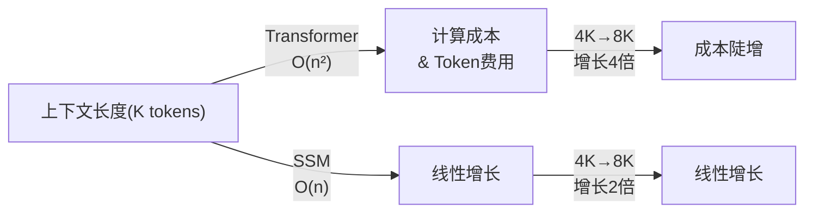
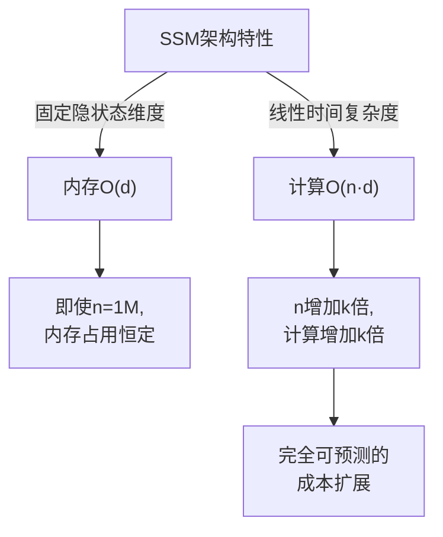
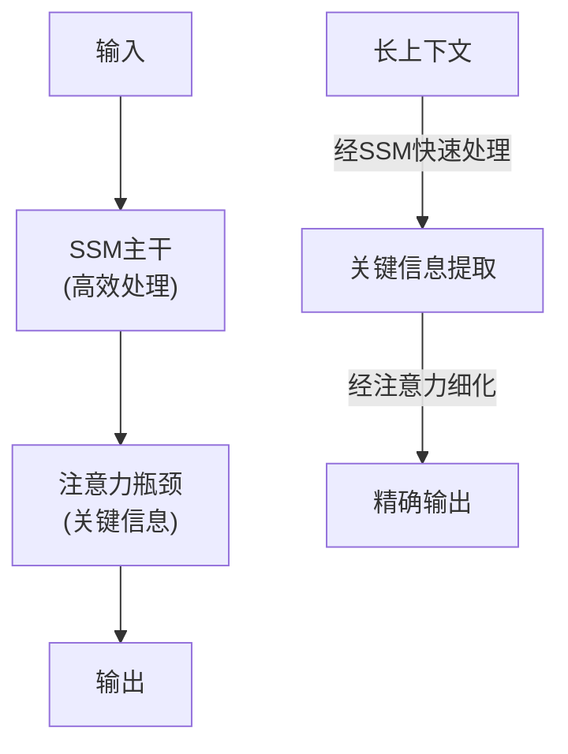
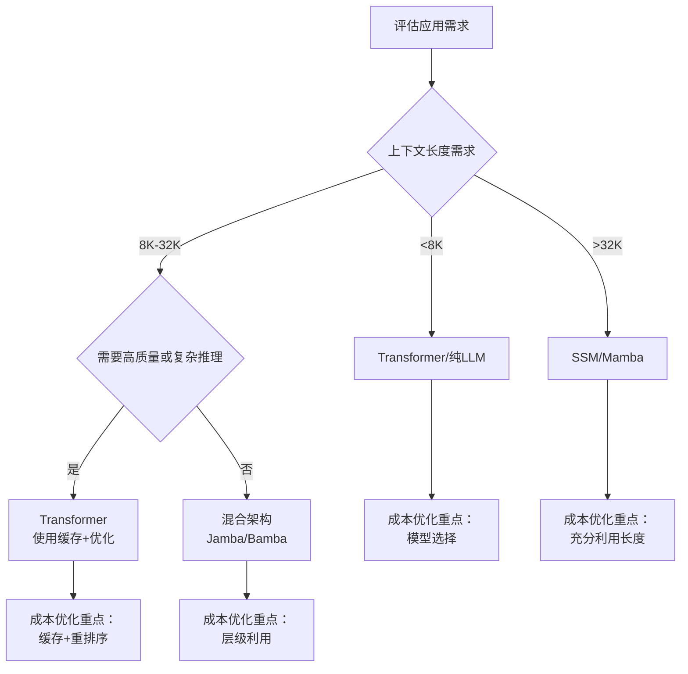

## 2.5 SSM vs Transformer 在上下文工程中的对比

### 2.5.1 引言：架构之战如何影响上下文策略

2024年以来，大模型架构出现了显著的分化。Transformer凭借其自注意力机制长期统治，但一类新兴架构——**状态空间模型（SSM, State Space Models）**——开始对LLM领域产生深远影响。这不仅仅是学术讨论，更直接改变了我们设计上下文工程策略的方式。

不同架构在处理上下文时具有根本性差异：

- **自注意力复杂度**：Transformer为O(n²)，SSM为O(n)
- **上下文长度成本**：长上下文下，Transformer费用陡增，SSM线性增长
- **信息流向**：Transformer全局互注，SSM线性扫描
- **检索策略**：需要不同的优化方向

本节将深入分析这两类架构在上下文工程中的实际影响，帮助您为不同架构设计合适的上下文策略。

### 2.5.2 Transformer自注意力机制与上下文成本

#### 自注意力的计算本质

Transformer的核心是自注意力（Self-Attention）机制。对于长度为 n 的上下文序列，注意力的计算方式为：

```text
Attention(Q, K, V) = softmax(Q·K^T / √d_k)·V
```

关键的成本特征：

- **时间复杂度**：O(n²)，其中 n 是上下文长度
- **空间复杂度**：O(n²)，需要存储注意力矩阵
- **每个Token成本随上下文线性增长**：第i个Token需要计算与所有(i-1)个前序Token的注意力

#### 上下文长度与成本的非线性关系



实际例子：假设使用按 Token 计费的 API（如输入价格 $0.003/1K token）。**这里要分清两个概念**：API 账单通常只看输入 Token 数，而模型内部的计算压力则取决于架构复杂度。

| 上下文长度 | Token数 | API 输入成本 | Transformer 理论计算量（相对 4K） | SSM 理论计算量（相对 4K） | 工程含义 |
|-----------|--------|-------------|-------------------------------|------------------------|--------|
| 4K | 4000 | $0.012 | 1x | 1x | 基线 |
| 8K | 8000 | $0.024 | 4x | 2x | Transformer 的延迟和显存压力开始明显上升 |
| 32K | 32000 | $0.096 | 64x | 8x | 更依赖检索裁剪、压缩与重排序 |
| 128K | 128000 | $0.384 | 1024x | 32x | Transformer 侧的注意力与 KV Cache 压力会急剧放大 |
| 256K | 256000 | $0.768 | 4096x | 64x | 长上下文下更需要架构和系统级优化 |

注：虽然 API 账单相同，**关键差异在内部计算与系统开销**。同样的上下文长度下：
- **Transformer**：随着上下文长度增加，注意力计算、显存占用和端到端延迟通常会更快恶化
- **SSM**：理论复杂度更平滑，但真实吞吐量仍受实现、硬件、批大小和算子优化影响，不能简单理解为“长序列一定线性提速”

此外，**内存占用** 也显著不同：
- Transformer需存储注意力矩阵（O(n²)内存），64K长度需要4GB+
- SSM仅需固定的隐状态（O(d)内存），同样长度仅需512MB

这使得 SSM 在 **相同 Token 账单** 下，往往更有机会把预算转化为更稳定的延迟、更高的并发容量或更长的可承载上下文，但具体收益仍取决于实现细节和部署方式。

#### Attention中的上下文丢失问题

Transformer的自注意力虽然强大，但面临一个悖论性的上下文工程问题：**“注意力分散”**（attention dilution）

```python
# 简化示意：当上下文过长时的问题
context_length = 128000
num_tokens = 128000
attention_per_token = 1.0 / num_tokens  # 每个Token分配的注意力权重

# 结果：
# - 每个历史Token平均获得 1/128000 ≈ 0.0000078 的注意力权重
# - 重要信息可能被"淹没"在众多Token中
# - 模型需要更多"注意力头"或其他机制来解决
```

这导致一个现象：**虽然Transformer理论上可以看到所有上下文，但在实际应用中，过长上下文会导致“关键信息注意力不足”**。研究表明，Transformer经常只关注开头和结尾的信息（Lost-in-the-Middle问题）。

### 2.5.3 SSM与线性复杂度的上下文处理

#### 状态空间模型的数学基础

SSM将序列处理建模为状态演化过程：

```text
h_t = A·h_{t-1} + B·x_t  （状态更新）
y_t = C·h_t + D·x_t      （输出生成）
```

其中：
- **h_t**：隐状态（固定维度，如1024或4096）
- **A, B, C, D**：可学习矩阵
- **x_t**：输入Token

关键特性：

1. **固定内存占用**：无论上下文多长，隐状态维度固定
2. **线性时间复杂度**：每个Token的处理时间恒定
3. **因果结构**：天然支持流式处理，h_t只依赖h_{t-1}

#### Mamba与选择性状态空间

2023年Mamba的发布引入了 **选择性状态空间（Selective State Space）**，解决了基础SSM的一个关键问题：**固定的参数矩阵A无法根据输入动态调整**。

```python
# Mamba的核心创新：动态选择（Dynamic Selection）
Δ_t = softmax(W_Δ·x_t)  # 根据当前输入动态确定时间尺度
A_t = exp(-Δ_t·A)        # 动态衰减矩阵
h_t = A_t * h_{t-1} + B_t * x_t
```

这使Mamba能够：
- **动态遗忘**：根据输入重要性调整隐状态更新
- **选择性记忆**：只在必要时候保留信息
- **上下文感知**：隐状态的演化取决于输入序列的内容

#### 上下文长度的线性扩展

对于SSM模型（如Mamba-2），上下文成本几乎完全线性：



文献与工程报告中，SSM/混合架构在长上下文场景下通常会展现出以下量级优势：

| 指标 | 纯 Transformer（长上下文） | SSM / 混合架构（长上下文） | 常见差异 |
|-----|--------|-----------|------|
| 吞吐量 | 更易随序列变长而下滑 | 更容易保持稳定 | 中到高 |
| 内存占用 | 注意力矩阵与缓存压力更大 | 通常更可控 | 高 |
| 推理延迟 | 更易受长序列拖累 | 更容易平滑扩展 | 中到高 |
| 长上下文扩展成本 | 上升更快 | 更可预测 | 高 |

### 2.5.4 混合架构的兴起

鉴于纯Transformer和纯SSM各有优缺点，业界推出了 **混合架构**：

#### Jamba

结构：**交错的SSM层和注意力层**

```text
Layer 1: SSM
Layer 2: Attention (全局)
Layer 3: SSM
Layer 4: Attention (全局)
...
```

优势：
- SSM层处理大规模上下文，成本低
- Attention层在关键位置提供全局视角
- 相比纯Transformer节省60%的训练成本
- 32K上下文性能与256K上下文Transformer相当

#### Bamba

结构：**层级混合 + Bottleneck机制**



特点：
- 大部分层为SSM（低成本）
- 仅在必要位置使用Attention
- 特别适合长序列处理

#### Titans + MIRAS

最新方向：**门控线性注意力 + Mamba融合**

```python
# 伪代码示意
class TitansMIRAS(nn.Module):
    def __init__(self):
        self.mamba_layer = MambaBlock()
        self.gated_linear_attn = GatedLinearAttention()

    def forward(self, x):
        # SSM处理
        mamba_out = self.mamba_layer(x)  # O(n)

        # 门控线性注意力（比标准Attention更高效）
        attn_out = self.gated_linear_attn(x)  # O(n)

        # 融合
        return self.gate(mamba_out, attn_out)
```

优势：
- 两路都是线性复杂度
- 保留了全局信息流
- 100K+上下文下性能接近短上下文

### 2.5.5 架构选择对上下文工程的实际影响

#### Transformer模型的检索优化

```python
# Transformer模型：长上下文成本高，需要优化检索
class TransformerRetrievalStrategy:
    def __init__(self):
        # 1. 严格控制检索数量
        self.max_context_tokens = 4000  # 保持在4K以内
        self.target_chunks = 5  # 少量高质量chunk

        # 2. 重排序至关重要
        self.use_reranker = True
        self.rerank_top_k = 50  # 从50个候选中选5个

        # 3. 压缩策略
        self.use_compression = True
        self.compression_ratio = 0.5  # 压缩一半

    def retrieve_and_prepare(self, query, documents):
        # 密集检索 -> 重排序 -> 压缩
        candidates = self.dense_retrieve(query, top_k=50)
        reranked = self.rerank(query, candidates, k=5)
        compressed = self.compress(reranked)
        return compressed  # ≈ 2K tokens
```

#### SSM/Mamba模型的检索优化

```python
# SSM模型：可以容纳更多上下文，检索策略不同
class SSMRetrievalStrategy:
    def __init__(self):
        # 1. 放宽上下文限制
        self.max_context_tokens = 64000  # SSM可轻松处理
        self.target_chunks = 50  # 获取更多内容

        # 2. 重排序可选
        self.use_reranker = False  # 也可选择性使用

        # 3. 压缩可选
        self.use_compression = False

    def retrieve_and_prepare(self, query, documents):
        # 密集检索 -> 直接使用
        candidates = self.dense_retrieve(query, top_k=50)
        return candidates  # ≈ 50K tokens, 成本仍可接受
```

#### Token成本的实际差异

假设一个QA系统，平均查询返回50个检索结果：

**Transformer架构（GPT-5.4）**
- 每query成本：50×256字/chunk×0.75字/token×$0.0025/1K = $0.024
- 月成本（10000 queries）：$240

**SSM架构假设（价格同价）**
- 每query成本：同样50 chunks，但模型性能好，更少被过度优化压缩
- 每query成本：$0.024
- **但可以提高质量**：如增加到200 chunks
- 新成本：$0.096，月成本$960
- **质量提升**：但成本仍比Transformer限制下的加强版低

### 2.5.6 上下文工程策略针对不同架构的优化建议

#### 对于Transformer模型

1. **上下文控制**
   ```text
   推荐窗口大小：4K-8K tokens
   最大容纳：32K tokens（成本陡增）
   超过32K：ROI快速下降
   ```

2. **检索优化优先级**
   - 最高：重排序器（相关性精准）
   - 次高：压缩（减少token）
   - 可选：知识图谱（提升结构化查询）

3. **缓存策略**
   - 启用Prompt Caching
   - 系统提示词固定 → 重复使用 → 缓存命中率高
   - 预缓存常见的长上下文片段

4. **成本优化杠杆**
   ```python
   # 成本优化的优先级
   优化1：减少检索chunk数（影响最大）
   优化2：启用缓存（30-50%节省）
   优化3：压缩上下文（20-30%节省）
   优化4：使用更便宜模型（10-20%节省）
   ```

#### 对于SSM/Mamba模型

1. **上下文充分利用**
   ```text
   推荐窗口大小：32K-128K tokens
   最大容纳：可达1M tokens
   成本增长：完全线性
   ```

2. **检索优化优先级**
   - 优先：检索数量增加（成本仍可控）
   - 次要：重排序（可选，用于极高精度）
   - 可选：压缩（牺牲质量无必要）

3. **上下文设计**
   ```python
   # SSM友好的上下文设计
   - 长系统提示词：可详细规范指令
   - 长对话历史：保留完整上下文
   - 多文档检索：一次性处理数十篇文档
   - 知识库融合：检索+知识图谱可并用
   ```

4. **架构利用策略**
   - 利用线性复杂度处理 **超长上下文任务**
   - 特别是：长文档分析、多轮对话、知识库问答
   - 单次请求可以包含整个会话历史

#### 混合架构的策略

利用两者优势：

```python
class HybridArchitectureStrategy:
    """
    混合架构同时拥有Transformer和SSM特性
    策略：
    1. 短上下文（<4K）：SSM层足以处理，性能优异
    2. 中等上下文（4K-32K）：发挥混合优势，既有质量又有效率
    3. 长上下文（32K+）：SSM主要处理，Attention瓶颈提高关键信息
    """

    def optimize_for_hybrid(self, query_complexity, context_size):
        if context_size < 4000:
            # SSM层会处理充分，低成本高效
            use_reranking = False  # 不必要
            compression_ratio = 0.0  # 无需压缩
        elif context_size < 32000:
            # 混合发挥最大作用
            use_reranking = True  # 优化Attention层的输入
            compression_ratio = 0.0  # 无需压缩
        else:
            # 长上下文，SSM主处理
            use_reranking = False  # 不必要，SSM已高效
            compression_ratio = 0.0  # 无需压缩
```

### 2.5.7 实践案例：同一任务在不同架构下的上下文工程

**任务**：法律合同审查系统，需要分析用户的合同并对标行业模板

**输入**：
- 用户合同：50KB（~35K tokens）
- 行业模板库：10份典型合同模板（~200K tokens）
- 审查指南：10个审查维度（~5K tokens）
- 用户历史问题上下文：（~5K tokens）

**总需求上下文：~245K tokens**

#### Transformer架构方案（如GPT-5.4）

```text
实际可用上下文：128K（最大）
限制：无法同时加载所有内容

分解策略：
1. 固定内容（系统提示+审查指南）：5K → 启用缓存
2. 用户合同：35K
3. 相关模板检索：只检索最相关3份（~60K tokens）
4. 总计：≈100K tokens

成本计算：
- 系统提示（缓存）：5K×$0.00025/K = $0.00125（首次$0.003125，后续折扣）
- 用户合同+模板：95K×$0.0025/K = $0.2375
- 输出：~2K tokens×$0.015/K = $0.03
- 总成本/请求：$0.269（缓存命中后）

质量折衷：无法同时引用所有模板，可能遗漏重要参照
```

#### SSM/Mamba架构方案

```text
可用上下文：200K（轻松）
完整使用：可同时加载所有内容

完整策略：
1. 系统提示+审查指南：5K
2. 用户合同：35K
3. 所有行业模板库：200K
4. 用户历史：5K
5. 总计：245K tokens

成本计算（使用GPT-5.4，假设与Transformer定价相同）：
- 245K tokens×$0.0025/K = $0.6125
- 输出：~2K tokens×$0.015/K = $0.03
- 总成本/请求：$0.6425

质量优势：
- 模型可参考所有模板
- 更准确的对标分析
- 更全面的风险识别
- 一次完整分析，无遗漏

ROI分析：
成本增加：$0.6425 - $0.269 = $0.3735（139%）
价值增加：更全面的法律风险识别，可避免潜在法律风险
粗估：若识别一个风险可节省$5K法律费用，
此方案年均ROI仍为正（按照合理的查询频率）
```

### 2.5.8 如何选择最适合的架构

建立决策框架：



关键指标表：

| 架构 | 最优上下文 | 推理速度 | 成本效率 | 复杂推理 | 生产成熟度 |
|-----|----------|--------|--------|--------|----------|
| Transformer | 4K-8K | 中等 | 优 | 优 | 最成熟 |
| SSM/Mamba | 32K-128K | 快 | 优 | 中等 | 快速成熟 |
| 混合(Jamba) | 8K-32K | 快 | 优 | 优 | 初期 |
| 混合(Bamba) | 8K-32K | 快 | 优 | 优 | 初期 |
| Titans+MIRAS | 64K-256K | 很快 | 优 | 优 | 研究阶段 |

### 2.5.9 小结

| 维度 | Transformer | SSM/Mamba | 混合架构 |
|-----|-----------|----------|--------|
| 上下文成本 | O(n²)，高 | O(n)，线性 | O(n)，线性 |
| 推荐窗口 | 4K-8K | 32K-128K | 8K-32K |
| 检索重点 | 精准→压缩 | 充分→多样 | 平衡两端 |
| 缓存策略 | 启用优先 | 可选 | 启用优先 |
| 长上下文应用 | 避免 | 优先 | 适中支持 |
| 成熟度 | 生产级 | 快速上升 | 初期 |

选择合适的架构并采用相应的上下文工程策略，可以在保持或提升质量的同时，将成本降低30-70%。
