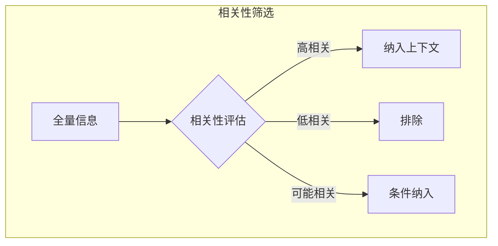

## 3.1 信息环境设计原则

### 3.1.1 信息环境的概念

**信息环境**（Information Environment）是指模型在执行任务时可获取的全部信息的集合与组织方式。上下文工程的本质就是设计和管理这个信息环境。

一个优秀的信息环境应该满足以下特性：
- 包含任务所需的充分信息
- 排除无关的噪声信息
- 以模型易于理解的方式组织
- 能够动态适应任务需求

### 3.1.2 注意力预算与上下文腐烂

在深入设计原则之前，我们先引入两个在业界实践中常用的概念，用来帮助理解“为什么上下文需要被当作稀缺资源来设计”。

**注意力预算（Attention Budget）**

与人类有限的工作记忆类似，大语言模型也有一个"注意力预算"，用于处理上下文中的大量信息。每引入一个新的 Token，都会消耗一定的注意力预算。这意味着：

- 上下文必须被当作**有限资源**来管理
- 边际效用递减：更多的 Token 不一定带来更好的结果
- 需要在上下文大小和注意力集中度之间权衡

**上下文腐烂（Context Rot）**

在一些长上下文评测与工程观察中，人们发现：随着上下文窗口中 Token 数量增加，模型对关键信息的提取与回忆稳定性可能下降。这里将这种“有效利用率随长度下降”的现象称为"上下文腐烂"（Context Rot）。

造成这一现象的原因：
- Transformer 架构使每个 Token 都关注其他所有 Token，产生 n² 级别的成对关系
- 上下文越长，模型捕获这些关系的能力越分散
- 模型的训练数据中，短序列通常比长序列更常见

> **核心指导原则**：优秀的上下文工程意味着找到**最小可能的高信号 Token 集**，以最大化实现期望结果的可能性。

### 3.1.3 设计原则一：相关性优先

**核心理念**：只包含与当前任务直接相关的信息。

相关性是上下文质量的首要指标。经验上，无关信息不仅浪费上下文空间，还可能干扰模型判断，导致输出质量下降。

实践要点：
- 建立任务-信息的映射关系
- 使用语义相似度评估相关性
- 设置相关性阈值，过滤低分内容
- 对于边界情况，宁缺毋滥

### 3.1.4 设计原则二：信息密度优化

**核心理念**：用最少的 Token 传达最多的有效信息。

信息密度定义为：有效信息量与 Token 数量的比值。高密度的上下文意味着：
- 更高的空间利用效率
- 更低的计算成本
- 更快的响应速度

提升信息密度的方法：
- 删除冗余词汇和重复内容
- 使用结构化格式替代散文
- 压缩长文本为摘要
- 提取关键事实而非全文

### 3.1.5 设计原则三：结构化组织

**核心理念**：用清晰的结构组织信息，便于模型理解和定位。

结构化组织的优势：
- 帮助模型快速定位相关信息
- 明确不同信息块的角色和关系
- 减少歧义和误解
- 支持模块化更新和维护

常用的结构化方法：

| 方法 | 适用场景 | 示例 |
|------|----------|------|
| XML 标签 | 区分不同类型内容 | `<instructions>...</instructions>` |
| Markdown | 层级化文档 | 标题、列表、代码块 |
| JSON | 结构化数据 | 配置、元数据 |
| 分隔符 | 简单内容分隔 | `---`、`===` |

### 3.1.6 设计原则四：上下文分层

**核心理念**：根据信息的重要性和稳定性，分层组织上下文。

典型的分层结构：

- **系统层**：最稳定，定义模型的基本角色和行为边界
- **知识层**：相对稳定，提供任务所需的背景知识
- **任务层**：随任务变化，描述当前的具体目标
- **交互层**：最动态，反映即时的用户输入和对话状态

分层的好处：
- 稳定层可以缓存复用
- 动态层独立更新
- 便于调试和维护

### 3.1.7 设计原则五：显式优于隐式

**核心理念**：明确说明期望，而非依赖模型推测。

模型擅长遵循明确的指令，但对隐含期望的推测可能不可靠。因此：

- 明确输出格式要求
- 显式说明限制条件
- 清楚定义术语含义
- 提供具体的正例和反例

### 3.1.8 设计原则六：渐进式提供

**核心理念**：按需提供信息，避免一次性加载全部内容。

这一原则在智能体系统中尤为重要。渐进式提供的方式：

- **即时加载**：在需要时通过工具获取信息
- **分步展开**：随着任务进展逐步添加细节
- **条件触发**：基于特定条件加载相关内容

渐进式方法的优势：
- 避免上下文过载
- 确保信息的时效性
- 降低初始延迟

### 3.1.9 原则的综合应用

这六项原则并非孤立，而是需要综合应用。一个良好的上下文设计应该：

1. 从相关性筛选开始，确定需要包含的信息
2. 对选中的信息进行密度优化
3. 使用合适的结构组织内容
4. 按层级安排信息的位置
5. 显式表达所有重要要求
6. 设计动态加载机制处理变化需求

在实际项目中，可能需要在这些原则之间做出权衡。理解每项原则的目的，有助于在具体场景下做出正确的决策。
