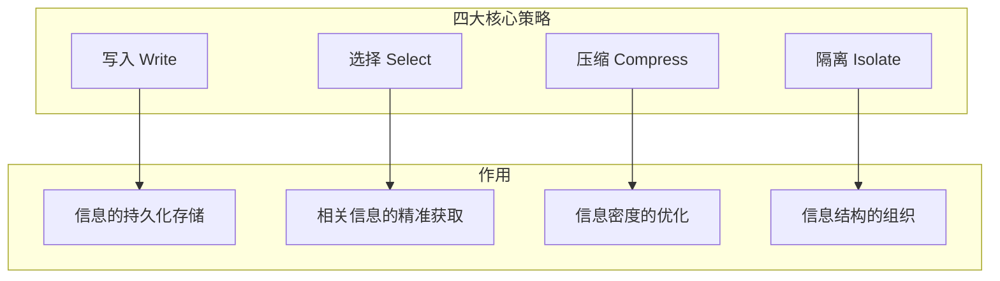

## 3.2 四大核心策略概览

上下文工程的实践可以归纳为四大核心策略：**写入**（Write）、**选择**（Select）、**压缩**（Compress）、**隔离**（Isolate）。这四大策略相互配合，共同构成上下文管理的完整方法论。

### 3.2.1 策略框架总览

### 3.2.2 写入策略

**核心问题**：如何在上下文窗口之外存储和管理信息？

上下文窗口是有限的，但许多应用需要处理远超窗口容量的信息。写入策略解决的是信息的持久化存储问题。

**主要技术**：
- **外部记忆系统**：将信息存储到外部存储中供后续检索
- **知识库构建**：组织结构化的领域知识
- **向量数据库**：将文本转换为向量进行存储和检索
- **记忆架构**：设计多层次的记忆结构

**应用场景**：
- 构建企业知识库
- 实现跨会话的长期记忆
- 存储用户偏好和历史

详细技术将在第四章展开。

### 3.2.3 选择策略

**核心问题**：如何从海量信息中获取与当前任务最相关的内容？

当信息存储在外部时，需要在执行任务时选择性地加载相关内容。选择策略是 [RAG](../05_select/5.1_rag_principles.md)（[检索增强生成](../05_select/5.1_rag_principles.md)）的核心。

**主要技术**：
- **语义检索**：基于语义相似度搜索相关内容
- **关键词检索**：基于关键词匹配的精确搜索
- **混合检索**：结合语义和关键词的优势
- **重排序**：对检索结果进行二次排序优化

**应用场景**：
- 文档问答系统
- 知识库查询
- 代码检索

详细技术将在第五章展开。

### 3.2.4 压缩策略

**核心问题**：如何在有限的上下文空间中容纳更多有效信息？

即使经过筛选，需要放入上下文的信息仍可能超出限制，或占用过多空间导致成本上升。压缩策略旨在提高信息密度。

**主要技术**：
- **文本摘要**：将长文档压缩为精练摘要
- **信息提取**：提取关键事实和实体
- **对话压缩**：压缩冗长的对话历史
- **递进式摘要**：分层次逐步压缩

**应用场景**：
- 长文档处理
- 对话历史管理
- 成本优化

详细技术将在第六章展开。

### 3.2.5 隔离策略

**核心问题**：如何组织和结构化上下文中的不同信息？

即使信息已经精选和压缩，如何组织这些信息同样重要。隔离策略关注上下文的结构化设计。

**主要技术**：
- **XML/标签标记**：用标签区分不同类型内容
- **指令分层**：分层组织系统指令
- **任务隔离**：为不同任务创建独立上下文
- **多智能体编排**：在多智能体间分配上下文

**应用场景**：
- 复杂提示词设计
- 多任务系统
- 智能体协作

详细技术将在第七章展开。

### 3.2.6 策略之间的关系

四大策略不是孤立的，而是形成一个协作的工作流：

1. **写入**：将信息存储到外部系统
2. **选择**：检索相关信息
3. **压缩**：优化信息密度
4. **隔离**：结构化组织

在实际应用中，这些策略可能需要迭代执行。例如：
- 检索后发现信息不足，触发新的写入
- 压缩后发现关键信息丢失，调整压缩策略
- 隔离过程中发现结构不合理，重新组织

### 3.2.7 策略选择指南

不同场景对策略的侧重不同：

| 场景 | 重点策略 | 原因 |
|------|----------|------|
| 知识密集型问答 | 选择 | 准确检索是关键 |
| 长期助手 | 写入 | 需要持久记忆 |
| 成本敏感应用 | 压缩 | 控制 Token 用量 |
| 复杂指令系统 | 隔离 | 清晰的结构很重要 |

大多数生产级应用需要综合应用所有四个策略，关键是找到适合具体场景的平衡点。
