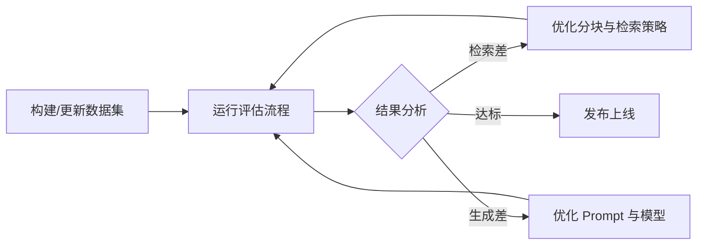

## 3.3 上下文质量评估

### 3.3.1 为什么需要评估

上下文质量直接影响模型输出质量。没有系统化的评估，优化工作就像在黑暗中摸索。

评估的难点在于：
- **主观性**：什么是“好”的上下文，往往取决于具体任务。
- **多维性**：需要同时考虑相关性、完整性、噪声比等多个维度。
- **动态性**：随着知识库的更新，评估结果也会发生变化。

### 3.3.2 检索质量评估

在 RAG 系统中，检索是第一道关卡。如果检索结果质量差，后续的模型生成再强也无济于事（Garbage In, Garbage Out）。

常用的检索评估指标包括：

#### 召回率指标

常用写法：Recall@K。
**定义**：在前 K 个检索结果中，包含了多少个相关文档。
$$ \text{Recall@K} = \frac{\text{前 K 个结果中的相关文档数}}{\text{总相关文档数}} $$
- **意义**：衡量检索系统“找全”的能力。
- **适用场景**：当需要确保关键信息不遗漏时（如法律合规检查）。

#### 平均倒数排名指标

常用写法：MRR（Mean Reciprocal Rank）。
**定义**：第一个相关文档出现位置的倒数的平均值。
$$ \text{MRR} = \frac{1}{|Q|} \sum_{i=1}^{|Q|} \frac{1}{\text{rank}_i} $$
- **意义**：衡量检索系统“首中”的能力。模型通常对靠前的信息关注度最高。
- **适用场景**：问答系统，用户通常只看最上面的结果。

#### 归一化折损累计增益指标

常用写法：NDCG（Normalized Discounted Cumulative Gain）。
**定义**：考虑了所有相关文档的排名位置，排名越靠前权重越高。
- **意义**：最全面的排序质量指标，不仅看“有没有”，还看“排得对不对”。
- **适用场景**：复杂的检索任务，需要对多个相关文档进行优先级排序。

### 3.3.3 生成质量评估

有了好的上下文，还需要评估模型生成的答案质量。

#### 传统指标
- **BLEU / ROUGE**：基于 n-gram 重叠度的字面匹配指标。
- **局限性**：对语义理解能力弱，LLM 的回答可能字面不同但意思完全正确，因此在 LLM 评估中权重逐渐降低。

#### 基于模型的评估
利用更强的 LLM（如 GPT-4）作为裁判（LLM-as-a-Judge）。

- **G-Eval**：让 LLM 基于明确的评分标准对输出进行打分（如 1-5 分）。
- **BERTScore**：计算生成文本与参考文本的语义相似度向量。

#### 评估框架指标
[Ragas](https://github.com/explodinggradients/ragas) 是目前流行的 RAG 评估框架之一，提出了三个核心指标：

1.  **信实度 (Faithfulness)**：
    - 答案是否完全基于上下文生成？
    - 用于检测幻觉（Hallucinations）。
2.  **答案相关性 (Answer Relevance)**：
    - 答案是否直接回答了用户的问题？
    - 用于检测答非所问。
3.  **上下文精确度 (Context Precision)**：
    - 检索到的上下文中有多少是真正有用的？
    - 用于评估信噪比。

### 3.3.4 端到端系统评估

除了评估各个组件，还需要看系统的整体表现。

- **人工评估 (Human Evaluation)**：
    - **Likert Scale**：1-5 分打分。
    - **Pairwise Comparison**：A/B 两个答案选更好的。
    - **优点**：最准确。**缺点**：贵，慢，不可扩展。
- **A/B 测试**：
    - 在生产环境中分流，比较不同策略下的用户反馈（点击率、点赞/点踩、后续追问率）。

### 3.3.5 构建评估数据集

没有数据就无法评估。构建高质量的评估集（Golden Dataset）是上下文工程的重要一环。

#### 数据集结构
一个标准的评估样本通常包含：
```json
{
  "question": "如何配置 Redis 缓存？",
  "ground_truth": "需要在配置文件中设置...",
  "contexts": ["doc_id_1", "doc_id_2"],  // 期望检索到的文档ID
  "answer": "配置 Redis 缓存的步骤如下..." // 期望的标准答案
}
```

#### 构建方法

1.  **人工构建 (Human Curated)**
    - 挑选真实的用户高频问题。
    - 由领域专家撰写标准答案和标注相关文档。
    - 质量最高，但成本昂贵。

2.  **合成数据生成 (Synthetic Data Generation)**
    - 利用 LLM “逆向”生成数据。
    - **Doc2Query**：给一段文档，让 LLM 生成“用户可能会问的问题”。
    - 流程：
        1.  分块文档。
        2.  Prompt: “请针对这段文字生成 3 个相关的问题和标准答案”。
        3.  人工抽检生成的质量。
    - 这种方法可以快速低成本地构建数千个 QA 对。

### 3.3.6 评估与迭代闭环



**建议**：在 CI/CD 流程中集成自动化评估（如使用 Ragas 或自研脚本），每次修改 Prompt 或 检索策略后自动运行，防止效果回退。
