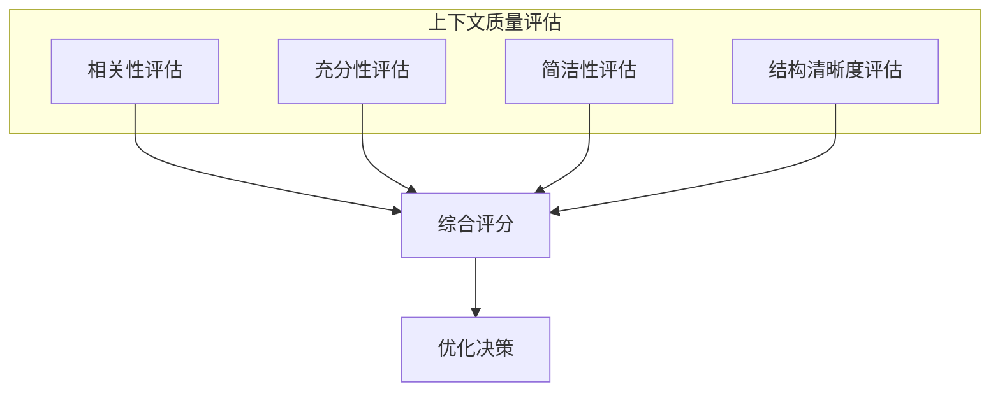

## 3.3 上下文质量评估

### 3.3.1 为什么需要评估

上下文质量直接影响模型输出质量。没有评估，就无法判断优化是否有效。系统化的评估方法是持续改进的基础。

上下文评估面临的独特挑战：
- 上下文质量不能直接观测，需要通过下游效果间接评估
- 同一上下文对不同任务可能有不同效果
- 评估需要同时考虑多个维度

### 3.3.2 评估维度

#### 相关性

**定义**：上下文内容与当前任务的匹配程度。

**评估方法**：
- 人工标注：专家评估每段内容的相关性得分
- 自动评估：使用语言模型评判相关性
- 间接指标：检索命中率、任务成功率

**相关性指标**：
- 精确率（Precision）：检索内容中相关内容的比例
- 召回率（Recall）：相关内容被检索到的比例
- F1 分数：精确率和召回率的调和平均

#### 充分性

**定义**：上下文是否包含完成任务所需的全部信息。

**评估方法**：
- 任务完成率：能否基于上下文正确完成任务
- 信息覆盖度：关键信息点的覆盖比例
- 缺失分析：模型输出中出现"不知道"的频率

#### 简洁性

**定义**：上下文是否避免了冗余和噪声。

**评估方法**：
- Token 效率：有效信息与总 Token 数的比率
- 冗余检测：重复内容的比例
- 噪声比例：无关内容的占比

#### 结构清晰度

**定义**：上下文的组织是否便于模型理解和利用。

**评估方法**：
- 指令遵循率：模型是否正确理解和执行结构化指令
- 信息定位效率：模型能否快速找到需要的信息
- 格式一致性：结构标记的规范程度

### 3.3.3 综合评估框架

综合评估需要权衡多个维度：
- 高相关性但不够充分 → 需要补充信息
- 很充分但不够简洁 → 需要压缩优化
- 内容好但结构差 → 需要重组

### 3.3.4 评估方法比较

| 方法 | 优点 | 缺点 | 适用场景 |
|------|------|------|----------|
| 人工评估 | 准确、细致 | 成本高、难扩展 | 重要场景、基准建立 |
| LLM 评估 | 可扩展、成本低 | 可能有偏差 | 大规模迭代测试 |
| 任务性能 | 直接、客观 | 需要下游任务 | 端到端优化 |
| 对比测试 | 简单直接 | 只能比较相对好坏 | A/B 测试 |

### 3.3.5 评估实践建议

**建立基准**

首先建立评估基准：
- 收集代表性测试用例
- 标注期望的输出
- 确定评估指标和阈值

**持续监控**

在生产环境中持续监控：
- Token 使用量分布
- 任务成功率变化
- 用户反馈信号

**迭代优化**

基于评估结果持续优化：
- 识别主要问题维度
- 调整相应策略
- 验证优化效果

### 3.3.6 常见评估陷阱

- **过度关注单一指标**：例如只看相关性而忽略充分性
- **评估与实际脱节**：测试集不能代表真实分布
- **忽视成本维度**：高质量但成本过高可能不实用
- **静态评估**：一次评估不能反映动态变化

上下文质量评估是一个持续的过程，需要随着应用的演进不断调整和完善。
