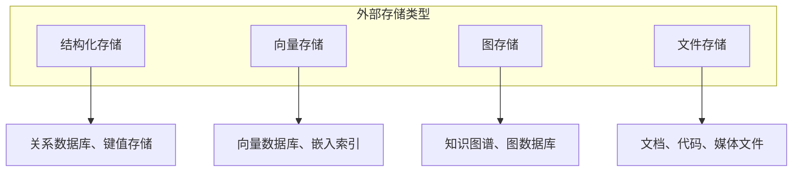
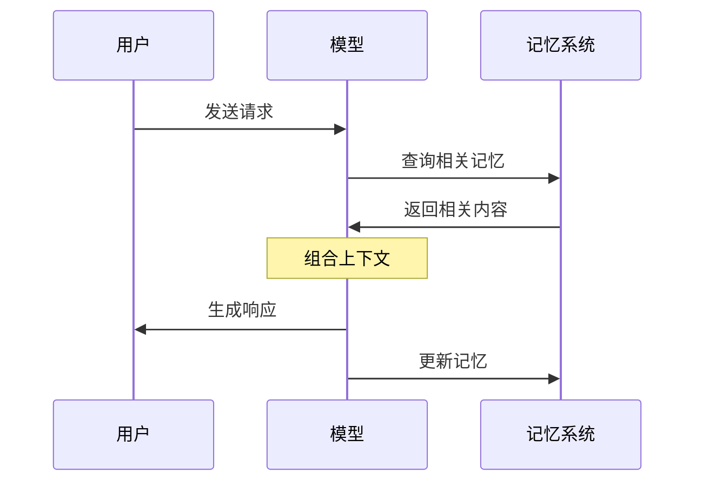

## 4.1 外部存储与记忆系统

### 4.1.1 为什么需要外部存储

大语言模型本身没有持久记忆能力。每次交互，模型都是从零开始，仅能依赖当前上下文中的信息。这带来几个根本问题：

1. **会话隔离**：不同会话之间无法共享信息
2. **容量限制**：大量信息无法同时放入上下文窗口
3. **时效性**：模型训练数据有截止日期，缺乏最新知识

外部存储系统让模型能够"记住"超出上下文窗口的信息，并在需要时检索使用。

### 4.1.2 外部存储的类型

**结构化存储**

适合存储结构化数据：用户信息、配置、元数据等。
- 关系数据库：PostgreSQL、MySQL
- 键值存储：Redis、DynamoDB
- 文档数据库：MongoDB

**向量存储**

适合存储和检索语义内容，是 [RAG](../05_select/5.1_rag_principles.md) 系统的核心。
- 专用向量数据库：Pinecone、Weaviate、Milvus、Qdrant
- 通用数据库支持：PostgreSQL (pgvector)、Oracle Database (23ai)、MySQL (8.0+)、Elasticsearch

**图存储**

适合存储实体关系和知识网络。
- 图数据库：Neo4j、Amazon Neptune
- 知识图谱平台：专用知识图谱系统

**文件存储**

适合存储原始文档和非结构化内容。
- 对象存储：S3、GCS、Azure Blob
- 文件系统：本地或网络文件系统

### 4.1.3 记忆系统的设计模式

**模式一：全量加载**

将所有相关信息加载到上下文。简单但受限于窗口容量。

适用场景：信息量小、任务简单

**模式二：按需检索**

只检索当前任务需要的信息。高效但需要精准的检索能力。

适用场景：信息量大、查询明确

**模式三：层级缓存**

热数据缓存在快速存储，冷数据存储在持久层。平衡效率和容量。

适用场景：高频查询、大规模系统

**模式四：流式更新**

持续更新存储中的信息，保持数据新鲜。适合实时应用。

适用场景：动态信息、实时系统

### 4.1.4 记忆与上下文的协作

外部存储不是对上下文的替代，而是补充。典型的协作模式：

关键设计决策：
- **何时读取**：请求处理前还是过程中
- **读取什么**：基于什么条件选择记忆
- **何时写入**：响应后、会话结束时、还是实时
- **写入什么**：全部内容还是提取的关键信息

### 4.1.5 记忆更新策略

记忆并非一成不变，需要适当的更新策略：

| 策略 | 描述 | 适用场景 |
|------|------|----------|
| 追加式 | 新信息不断追加，旧信息保留 | 日志、历史记录 |
| 覆盖式 | 新信息替换旧信息 | 状态信息、配置 |
| 合并式 | 新旧信息智能合并 | 知识累积 |
| 淘汰式 | 按规则删除旧信息 | 容量管理 |

**1. 记忆淘汰算法 (Eviction Algorithms)**

当存储空间受限时，决定哪些记忆应该被移除：

*   **LRU (Least Recently Used)**
    *   **原理**：维护一个链表，最近访问的移动到表头。当容量满时，淘汰表尾（最久未访问）的记忆。
    *   **适用**：假设最近使用的信息在未来最可能被再次使用。
    *   **缺陷**：可能淘汰掉低频但非常关键（如用户过敏原）的信息。

*   **时间衰减 (Time-Decay)**
    *   **原理**：为每条记忆分配一个初始权重，随时间推移按指数衰减。$$ Weight_t = Weight_0 \times e^{-\lambda t} $$。当权重低于阈值时淘汰。
    *   **优化**：每次访问时重置权重，模拟人类的"复习"巩固机制。
    *   **适用**：模拟人类遗忘曲线，保留新鲜记忆。

*   **重要性评估 (Importance Scoring)**
    *   **原理**：利用 LLM 对每条新记忆进行评分（1-10分）。淘汰时优先保留高分记忆。
    *   **示例**："我想吃披萨"（2分） vs "我对花生过敏"（10分）。
    *   **适用**：确保关键事实不被错误淘汰。

**2. 记忆整合机制 (Consolidation Mechanisms)**

将零散的短期记忆转化为结构化的长期记忆：

*   **摘要 (Summarization)**
    *   **过程**：定期（如每晚或每积累 N 条对话）触发 Summarization Agent。
    *   **操作**：读取最近的对话记录，生成一段精炼的摘要，存入长期记忆，然后清空原始对话。
    *   **效果**：极大压缩存储空间，同时保留核心上下文。

*   **合成 (Synthesis)**
    *   **过程**：检测到新信息与旧记忆相关但不完全一致时触发。
    *   **操作**：Retrieve 相关旧记忆 -> 让 LLM 分析冲突或增量 -> 生成新的综合性记忆 -> 覆盖旧记忆。
    *   **效果**：解决信息冲突，维持知识库的一致性。

### 4.1.6 实现考量

构建记忆系统时需要考虑：

**一致性**
- 多个请求并发访问时如何保证一致性
- 记忆更新的原子性保证

**可靠性**
- 存储系统的持久性保证
- 故障恢复机制

**性能**
- 读写延迟对响应时间的影响
- 大规模数据下的检索效率

**成本**
- 存储成本
- 计算成本（特别是嵌入计算）
