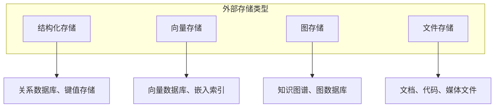
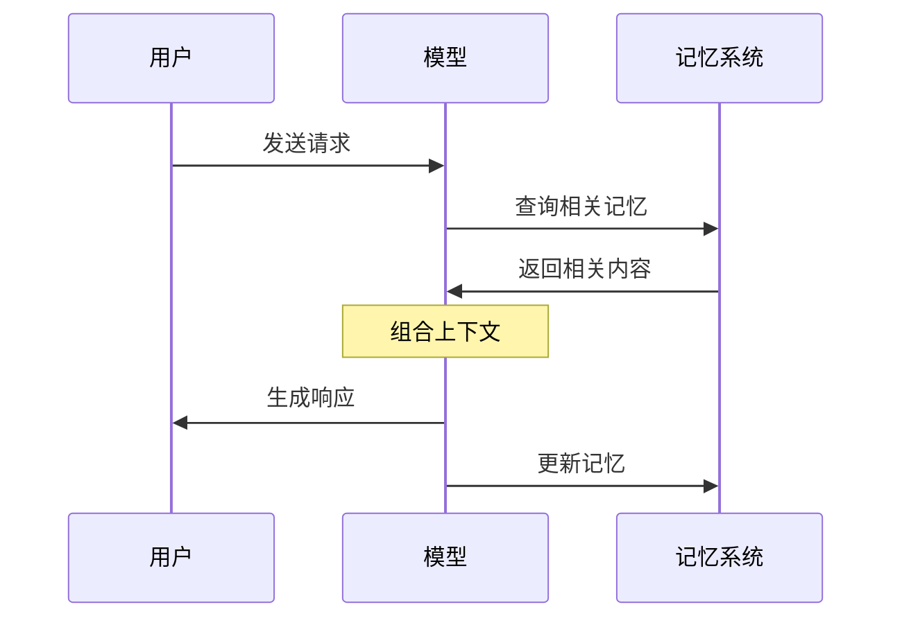

## 4.1 外部存储与记忆系统

### 为什么需要外部存储

大语言模型本身没有持久记忆能力。每次交互，模型都是从零开始，仅能依赖当前上下文中的信息。这带来几个根本问题：

1. **会话隔离**：不同会话之间无法共享信息
2. **容量限制**：大量信息无法同时放入上下文窗口
3. **时效性**：模型训练数据有截止日期，缺乏最新知识

外部存储系统让模型能够"记住"超出上下文窗口的信息，并在需要时检索使用。

### 外部存储的类型

**结构化存储**

适合存储结构化数据：用户信息、配置、元数据等。
- 关系数据库：PostgreSQL、MySQL
- 键值存储：Redis、DynamoDB
- 文档数据库：MongoDB

**向量存储**

适合存储和检索语义内容，是 RAG 系统的核心。
- 专用向量数据库：Pinecone、Weaviate、Milvus、Qdrant
- 数据库扩展：pgvector、Elasticsearch 向量搜索

**图存储**

适合存储实体关系和知识网络。
- 图数据库：Neo4j、Amazon Neptune
- 知识图谱平台：专用知识图谱系统

**文件存储**

适合存储原始文档和非结构化内容。
- 对象存储：S3、GCS、Azure Blob
- 文件系统：本地或网络文件系统

### 记忆系统的设计模式

**模式一：全量加载**

将所有相关信息加载到上下文。简单但受限于窗口容量。

适用场景：信息量小、任务简单

**模式二：按需检索**

只检索当前任务需要的信息。高效但需要精准的检索能力。

适用场景：信息量大、查询明确

**模式三：层级缓存**

热数据缓存在快速存储，冷数据存储在持久层。平衡效率和容量。

适用场景：高频查询、大规模系统

**模式四：流式更新**

持续更新存储中的信息，保持数据新鲜。适合实时应用。

适用场景：动态信息、实时系统

### 记忆与上下文的协作

外部存储不是对上下文的替代，而是补充。典型的协作模式：

关键设计决策：
- **何时读取**：请求处理前还是过程中
- **读取什么**：基于什么条件选择记忆
- **何时写入**：响应后、会话结束时、还是实时
- **写入什么**：全部内容还是提取的关键信息

### 记忆更新策略

记忆并非一成不变，需要适当的更新策略：

| 策略 | 描述 | 适用场景 |
|------|------|----------|
| 追加式 | 新信息不断追加，旧信息保留 | 日志、历史记录 |
| 覆盖式 | 新信息替换旧信息 | 状态信息、配置 |
| 合并式 | 新旧信息智能合并 | 知识累积 |
| 淘汰式 | 按规则删除旧信息 | 容量管理 |

常见的淘汰规则：
- **时间淘汰**：超过一定时间的记忆被删除
- **使用频率**：不常访问的记忆优先淘汰
- **重要性权重**：低重要性的记忆优先淘汰
- **容量上限**：超出容量时淘汰最旧/最不重要的

### 实现考量

构建记忆系统时需要考虑：

**一致性**
- 多个请求并发访问时如何保证一致性
- 记忆更新的原子性保证

**可靠性**
- 存储系统的持久性保证
- 故障恢复机制

**性能**
- 读写延迟对响应时间的影响
- 大规模数据下的检索效率

**成本**
- 存储成本
- 计算成本（特别是嵌入计算）
