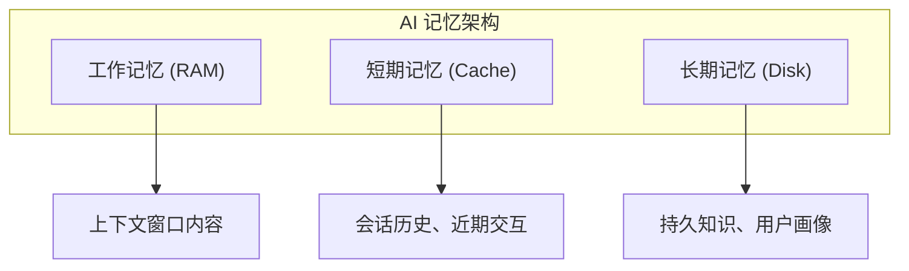

## 4.2 记忆架构设计

### 4.2.1 认知科学的启发

人类的记忆系统是多层次的：工作记忆负责当前任务，长期记忆存储持久知识。AI 系统的记忆架构可以借鉴这一模型。

人类记忆的主要分类：
- **工作记忆**：容量有限，持续时间短，支持当前思维
- **长期记忆**：容量大，持续时间长，存储知识和经验
  - **语义记忆**：事实和概念（"巴黎是法国首都"）
  - **情景记忆**：具体经历和事件（"昨天我去了巴黎"）
  - **程序记忆**：技能和方法（"如何骑自行车"）

### 4.2.2 人工智能记忆架构的层次

#### 类操作系统记忆管理

最新的研究（如 MemGPT）提出了类操作系统的记忆管理隐喻，将上下文窗口视为**主内存**，将外部存储视为**磁盘**。

- **显式分页**：系统在主存和磁盘之间主动交换数据
- **中断机制**：当上下文占满时触发"内存管理中断"，决定哪些信息换出到磁盘
- **读写接口**：模型通过特定的工具调用（API）来读写外部记忆，而非被动接收检索结果

这种架构允许智能体处理看似"无限"的上下文任务，只要当前活跃集（Working Set）不超过窗口限制。

### 4.2.3 语义记忆与情景记忆

借鉴认知科学，长期记忆可进一步细分：

**语义记忆**

存储抽象的事实和概念，不依附于特定事件。

应用示例：
- 用户偏好：用户喜欢简洁的回复风格
- 领域知识：公司产品的技术规格
- 规则约束：业务的合规要求

实现方式：
- 结构化存储中的事实表
- 向量数据库中的知识片段
- 知识图谱中的实体和关系

**情景记忆**

存储具体的事件和经历，包含时间、地点等上下文。

应用示例：
- 历史对话：用户上周询问过产品 A 的价格
- 操作记录：用户在某日完成了某项配置
- 问题解决：过去类似问题的解决方案

实现方式：
- 时序数据库中的事件记录
- 带时间戳的向量存储
- 检索时考虑时间相关性

### 4.2.4 记忆架构设计实践

**设计原则**

1. **分层分离**：不同类型记忆使用不同存储策略
2. **访问效率**：热数据快速访问，冷数据按需加载
3. **一致性保证**：确保记忆内容不相互矛盾
4. **隐私保护**：敏感信息需要特殊处理

**典型架构示例**

| 层次 | 存储技术 | 更新策略 | 访问模式 |
|------|----------|----------|----------|
| 工作记忆 | 内存/上下文 | 每次请求 | 全量加载 |
| 短期记忆 | Redis | 会话结束 | 最近 N 条 |
| 语义记忆 | 向量数据库 | 增量更新 | 语义检索 |
| 情景记忆 | 时序数据库 | 追加写入 | 时间+语义 |

### 4.2.5 记忆管理机制

**记忆提取**

决定从长期记忆中提取什么内容到工作记忆：
- 基于语义相似度（Retrieve）
- 基于时间相关性（Recency）
- 基于重要性评分（Importance）- *重要信息优先保留*
- 组合多种条件

**记忆巩固**

决定将工作记忆中的什么内容写入长期记忆：
- 显式保存：用户明确要求记住
- 重要性判断：自动识别重要信息（如 Reflection 机制）
- 摘要压缩：提取关键内容存储
- 定期回顾：对已有记忆进行整理

**记忆遗忘**

管理长期记忆的容量和时效：
- **遗忘曲线**：模拟人类遗忘规律，随时间降低记忆权重
- **使用频率（LRU）**：不常用的记忆优先淘汰
- **主动清理**：按策略删除过时信息

### 4.2.6 记忆架构的挑战

**一致性问题**

当信息更新时，如何确保所有相关记忆保持一致？例如用户名称变更后，历史记录中的引用如何处理。

**相关性问题**

如何判断过去的记忆与当前任务的相关性？语义相似不等于真正相关。

**规模问题**

随着记忆量增加，检索效率和存储成本如何控制？

**安全问题**

如何保护敏感记忆不被不当访问或泄露？

这些挑战没有万能解法，需要根据具体应用场景权衡取舍。
