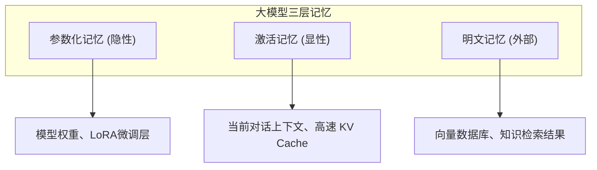

## 4.2 记忆架构设计

### 4.2.1 认知科学的启发

人类的记忆系统是多层次的：工作记忆负责当前任务，长期记忆存储持久知识。AI 系统的记忆架构可以借鉴这一模型。

人类记忆的主要分类：
- **工作记忆**：容量有限，持续时间短，支持当前思维
- **长期记忆**：容量大，持续时间长，存储知识和经验
  - **语义记忆**：事实和概念（“巴黎是法国首都”）
  - **情景记忆**：具体经历和事件（“昨天我去了巴黎”）
  - **程序记忆**：技能和方法（“如何骑自行车”）

### 4.2.2 大模型三层记忆建模

突破以往只分“长期”与“短期”的粗粒度，从基础模型理论出发，记忆应当被系统性地划分为三层：

1. **参数化记忆（隐性记忆）**：通过训练或微调固化在模型权重中的知识。读取极快，但写入成本极高（类似人类的肌肉记忆）。可以进一步分为“内置参数记忆”（出厂权重）和“外置参数记忆”（随用户交互动态低秩更新的偏好与事实）。
2. **激活记忆（显性记忆）**：例如推理过程中产生的高速 KV Cache。它暂存在显存中，读写速度居中，用于维持当前对话的极速响应，随时可丢弃或常驻。
3. **明文记忆（外部记忆）**：可显式读取的外部存储（如知识库）。按常规检索逻辑维护，容量大、更新灵活，但需要重新编码和上下文拼接计算。

#### 短期记忆：对话历史

短期记忆主要用于维持当前会话（Session）的连贯性，最典型的形态就是**对话历史**（Conversation History）。
在多轮对话中，如果模型不了解前几轮的语境，就无法正确解析“它能做到吗？”这类包含代词的后续问题。

- **存储介质**：通常存储在 Redis 等内存数据库中，以 Session ID 为键隔离。
- **生命周期**：随会话开始而建立，随会话超时（如 30 分钟无交互）或显式结束而销毁/持久化。
- **上下文注入**：短期记忆通常采用先进先出（FIFO）或滑动窗口的形式注入上下文，这是最简单也最必须的上下文机制。

*(注：对话历史不断膨胀会很快耗尽上下文窗口，具体的压缩与截断算法将在 第 6 章：[6.3 对话历史管理](../06_compress/6.3_conversation_history.md) 详细探讨。本章主要关注其架构定位。)*

#### 长期记忆与类操作系统管理

最新的研究（如 MemGPT）提出了类操作系统的长期记忆管理隐喻，将上下文窗口视为**主内存**，将外部存储视为**磁盘**。

- **显式分页**：系统在主存和磁盘之间主动交换数据
- **中断机制**：当上下文占满时触发“内存管理中断”，决定哪些信息换出到磁盘
- **读写接口**：模型通过特定的工具调用（API）来读写外部记忆，而非被动接收检索结果

这种架构允许智能体处理看似“无限”的上下文任务，只要当前活跃集（Working Set）不超过窗口限制。

### 4.2.3 语义记忆与情景记忆

借鉴认知科学，长期记忆可进一步细分：

**语义记忆**

存储抽象的事实和概念，不依附于特定事件。

应用示例：
- 用户偏好：用户喜欢简洁的回复风格
- 领域知识：公司产品的技术规格
- 规则约束：业务的合规要求

实现方式：
- 结构化存储中的事实表
- 向量数据库中的知识片段
- 知识图谱中的实体和关系

**情景记忆**

存储具体的事件和经历，包含时间、地点等上下文。

应用示例：
- 历史对话：用户上周询问过产品 A 的价格
- 操作记录：用户在某日完成了某项配置
- 问题解决：过去类似问题的解决方案

实现方式：
- 时序数据库中的事件记录
- 带时间戳的向量存储
- 检索时考虑时间相关性

### 4.2.4 工程落地的五层记忆架构（MemOS）

为了让复杂的记忆操作对应用开发者透明，前沿的记忆工程实践（如 MemOS）提出了从底层存储到上层应用的五层架构：

1. **存储层（Storage）**：为各类记忆量身定制存储媒介（如图+向量混合存储），解决高效共享与持久化。
2. **治理层（Governance）**：保障记忆的安全与一致性。包括全生命周期管理、幻觉评估、版本控制、权限与隐私隔离等。
3. **调度层（Scheduling）**：记忆系统的内核。通过动态行为预测与预加载，将所需记忆在任务前就置于“就绪（Ready）”状态，确保最佳读写效率。
4. **应用层（Application）**：把复杂的记忆操作流程对开发者完全屏蔽，提供标准 API 服务（如 Memory-as-a-Service）。
5. **解码层（Decoding）**：大模型结合已调度的记忆上下文进行最终的推理生成。

### 4.2.5 记忆架构设计实践

**设计原则**

1. **分层分离**：不同类型记忆使用不同存储策略
2. **访问效率**：热数据快速访问，冷数据按需加载
3. **一致性保证**：确保记忆内容不相互矛盾
4. **隐私保护**：敏感信息需要特殊处理

**典型架构示例**

| 层次 | 存储技术 | 更新策略 | 访问模式 |
|------|----------|----------|----------|
| 工作记忆 | 内存/上下文 | 每次请求 | 全量加载 |
| 短期记忆 | Redis | 会话结束 | 最近 N 条 |
| 语义记忆 | 向量数据库 | 增量更新 | 语义检索 |
| 情景记忆 | 时序数据库 | 追加写入 | 时间+语义 |

### 4.2.5 记忆管理机制

**记忆提取**

决定从长期记忆中提取什么内容到工作记忆：
- 基于语义相似度（Retrieve）
- 基于时间相关性（Recency）
- 基于重要性评分（Importance）- *重要信息优先保留*
- 组合多种条件

**记忆巩固**

决定将工作记忆中的什么内容写入长期记忆：
- 显式保存：用户明确要求记住
- 重要性判断：自动识别重要信息（如 Reflection 机制）
- 摘要压缩：提取关键内容存储
- 定期回顾：对已有记忆进行整理

**记忆遗忘**

管理长期记忆的容量和时效：
- **遗忘曲线**：模拟人类遗忘规律，随时间降低记忆权重
- **使用频率（LRU）**：不常用的记忆优先淘汰
- **主动清理**：按策略删除过时信息

### 4.2.6 记忆架构的挑战

**一致性问题**

当信息更新时，如何确保所有相关记忆保持一致？例如用户名称变更后，历史记录中的引用如何处理。

**相关性问题**

如何判断过去的记忆与当前任务的相关性？语义相似不等于真正相关。

**规模问题**

随着记忆量增加，检索效率和存储成本如何控制？

**安全问题**

如何保护敏感记忆不被不当访问或泄露？

这些挑战没有万能解法，需要根据具体应用场景权衡取舍。
