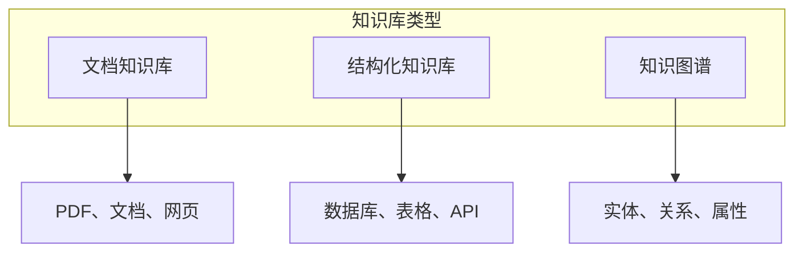
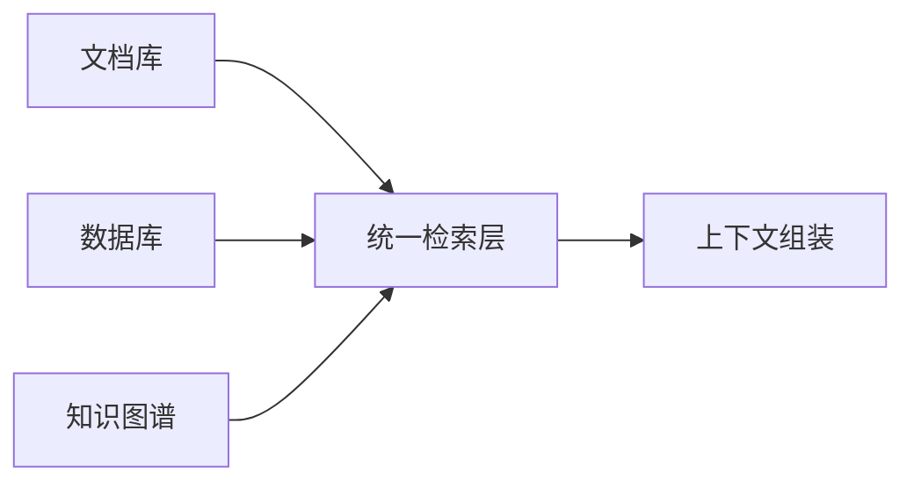

## 4.3 知识库构建与管理

### 4.3.1 知识库的定义与价值

**知识库**是组织化的信息集合，专门用于为 AI 系统提供领域知识支持。与通用存储不同，知识库经过精心设计和优化，以支持高效的知识检索和利用。

知识库的核心价值：
- **弥补模型知识空白**：提供模型训练数据中没有的信息
- **保证信息时效性**：包含最新的事实和数据
- **实现领域深度**：提供特定领域的专业知识
- **确保信息权威性**：使用经过验证的可靠来源

### 4.3.2 知识库的类型

**文档知识库**

存储非结构化文档内容，是最常见的知识库形式。
- 内容：产品文档、技术手册、FAQ、博客文章
- 处理：文档解析 → 分块 → 向量化 → 索引
- 检索：基于语义相似度检索相关片段

**结构化知识库**

存储结构化数据，支持精确查询。
- 内容：产品数据库、用户信息、配置数据
- 处理：数据建模 → Schema 设计 → 索引优化
- 检索：SQL 查询或结构化 API

**知识图谱**

存储实体及其关系，支持关系推理。
- 内容：实体、属性、关系的三元组
- 处理：实体提取 → 关系抽取 → 图构建
- 检索：图遍历、路径查询

### 4.3.3 知识库构建流程

#### 阶段一：数据收集

收集构建知识库的原始数据：
- 内部文档：产品文档、技术规范、内部知识库
- 外部资源：公开文档、API 文档、行业标准
- 生成内容：FAQ 整理、知识提炼

数据收集注意事项：
- 确保数据来源可靠
- 清晰的版权和使用授权
- 记录数据来源和更新时间

#### 阶段二：数据处理

将原始数据转换为可用格式：

**文档解析**
- PDF 提取：表格、图片、文本
- 网页清洗：移除广告和导航
- 格式标准化：统一为 Markdown 或纯文本

**文本分块 (Text Chunking)**

分块策略直接决定了检索的粒度和质量（关于分块策略的详细讨论请参见 [5.2 文档分块策略](../05_select/5.2_chunking.md)）。常用的三种分块策略：

1.  **固定大小分块 (Fixed-size Chunking)**
    *   **原理**：设定一个固定的 Token 数量（如 500），将文本按顺序切分。通常会设置重叠（Overlap，如 50 Token）以保持上下文连贯。
    *   **优点**：计算简单，易于实现，索引构建速度快。
    *   **缺点**：可能会在句子或段落中间切断，破坏语义完整性。
    *   **适用**：对语义完整性要求不高的场景，或作为基准方案。

2.  **递归字符分块 (Recursive Character Chunking)**
    *   **原理**：使用一组分隔符（如 `\n\n`, `\n`, `.`, ` `）按优先级递归尝试切分。优先使用段落分隔符，如果切分后仍超过最大长度，则尝试句子分隔符，以此类推。
    *   **优点**：尽可能保持了段落和句子的完整性，语义保留较好。
    *   **缺点**：实现稍复杂，对于无明显标点或格式的文本效果一般。
    *   **适用**：大多数文档类知识库的首选方案（如 LangChain 默认策略）。

3.  **语义分块 (Semantic Chunking)**
    *   **原理**：利用嵌入模型计算相邻句子的语义相似度。当相邻句子的相似度突降（低于阈值）时，认为话题发生了转换，在此处进行切分。
    *   **优点**：切分出的块具有极高的语义纯度，检索相关性最强。
    *   **缺点**：计算成本高（需要大量模型推理），构建速度慢。
    *   **适用**：对检索精度要求极高，且对构建成本不敏感的场景。

**元数据标注**
- 来源标记
- 时间戳
- 分类标签
- 重要性权重

#### 阶段三：向量化与索引

将处理后的内容转换为可检索形式：

**嵌入生成**
- 选择合适的嵌入模型
- 批量处理提高效率
- 考虑多语言支持

**索引构建**
- 向量索引：HNSW、IVF 等算法
- 倒排索引：支持关键词检索
- 混合索引：结合多种方法

#### 阶段四：质量验证

验证知识库的质量：
- 检索测试：验证典型查询的检索效果
- 覆盖测试：确认关键知识都被包含
- 准确性测试：抽样验证内容正确性

### 4.3.4 知识库维护

知识库不是一次性工程，需要持续维护：

| 维护任务 | 频率 | 目的 |
|----------|------|------|
| 内容更新 | 按需/定期 | 保持信息时效性 |
| 索引重建 | 定期 | 优化检索性能 |
| 质量审核 | 定期 | 发现和修复问题 |
| 反馈整合 | 持续 | 基于使用改进 |

### 4.3.5 多源知识整合

实际系统通常需要整合多个知识源：

整合挑战：
- **格式统一**：不同来源的内容格式不同
- **优先级管理**：来源之间可能有冲突
- **一致性维护**：保持信息的一致性

整合策略：
- 建立统一的检索接口
- 定义清晰的优先级规则
- 实现冲突检测和处理机制

### 4.3.6 知识库最佳实践

**1. 从核心开始**

先覆盖最常用、最重要的知识。不要试图一开始就构建一个包罗万象的知识库，而是识别用户最频繁查询的问题和场景，优先确保这些核心内容的质量和覆盖度。核心知识往往只占全部内容的20%，却能解决80%的查询需求。

**2. 质量优先**

高质量的小知识库胜过低质量的大知识库。每一条进入知识库的内容都应经过审核：信息是否准确？表述是否清晰？是否有歧义？低质量内容不仅无法帮助用户，还会降低整个系统的可信度，导致模型生成错误或矛盾的回答。

**3. 持续迭代**

基于实际使用反馈不断改进。知识库构建不是一次性项目，而是持续演进的过程。收集用户的查询日志，分析哪些问题检索失败或答案不满意，针对性地补充和优化内容。每一次用户交互都是改进知识库的机会。

**4. 版本管理**

维护知识库的版本历史。与代码库一样，知识库也需要版本控制。这样可以追踪内容变更、回滚错误更新、对比不同版本的效果。对于企业知识库，版本管理还有助于合规审计和问题追溯。

**5. 监控使用**

跟踪知识库的使用情况和效果。建立关键指标：检索成功率、用户满意度、知识覆盖度等。定期分析这些指标，发现知识空白和质量问题。数据驱动的优化比主观判断更有效。
