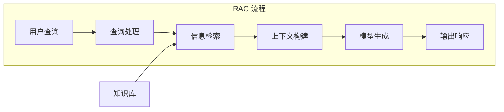

## 5.1 检索增强生成原理

### 5.1.1 检索增强生成的定义与动机

**检索增强生成**（Retrieval-Augmented Generation，RAG）是一种将信息检索与语言模型生成相结合的技术。它允许模型在生成答案时参考外部知识源，从而克服模型知识的局限性。

RAG 解决的核心问题：
- **知识时效性**：模型训练数据有截止日期，无法获知最新信息
- **知识准确性**：模型可能产生幻觉，检索提供事实依据
- **知识专业性**：通用模型可能缺乏特定领域的深度知识
- **知识可控性**：可以精确控制模型能够访问的知识范围

### 5.1.2 检索增强生成的基本架构

图 5-1：RAG 流程

**标准 RAG 流程**：

1. **查询处理**：理解和转换用户查询
2. **信息检索**：从知识库检索相关内容
3. **上下文构建**：将检索内容组装到提示词中
4. **模型生成**：模型基于增强的上下文生成答案
5. **输出响应**：返回生成的答案

### 5.1.3 检索增强生成的技术组件

一个完整的 RAG 系统包含以下核心组件：

| 组件 | 功能 | 关键技术 |
|------|------|----------|
| 文档处理器 | 解析和分块文档 | 分块算法、元数据提取 |
| 嵌入模型 | 将文本转换为向量 | 语义嵌入模型 |
| 向量存储 | 存储和索引向量 | 向量数据库 |
| 检索器 | 执行相似性搜索 | ANN 算法 |
| 重排序器 | 优化检索结果排序 | 交叉编码器 |
| 上下文组装器 | 构建最终提示词 | 模板、格式化 |

### 5.1.4 检索增强生成与模型能力的关系

RAG 不是替代模型能力，而是增强模型能力：

- **模型提供**：语言理解、推理、生成能力
- **RAG 提供**：事实依据、专业知识、最新信息

实践表明，RAG 配合高能力模型效果最好。模型需要足够的理解和推理能力，才能有效利用检索到的信息。

### 5.1.5 检索增强生成的优势与局限

**优势**：
- 显著减少幻觉，提高事实准确性
- 支持知识的实时更新
- 知识来源可追溯，增强可信度
- 无需重新训练模型

**局限**：
- 检索质量直接影响最终效果
- 增加了系统复杂度和延迟
- 对于需要深度推理的问题效果有限
- **阻断式延迟瓶颈**：传统的 RAG 呈现“被动式阻断检索”——用户提问 -> 检索 -> 拼接 -> 推理。这种串行流程极大拉长了首 Token 延迟，尤其是大并发下，算力浪费与响应等待尤为明显。

### 5.1.6 从“被动阻断”到“主动式全时调度”

面对传统 RAG 的串行阻断式延迟，前沿工程探索出一种突破性策略：**异步预加载（如 Memory Cube 机制）**。

与其让用户思考、打字、阅读的“碎片空档时间”白白流逝，不如将记忆管理、调度与预热工作化整为零，嵌入每一个空隙。通过预测用户意图，系统在后台并行地提前完成记忆检索和组合操作。当用户真正发出查询时，所需的增强上下文已经处于“就绪（Ready）”状态，只需一次轻量调用即可极速交付。

这标志着 RAG 系统从“请求即时检索”向“全时异步调度”的重大演进。

### 5.1.7 检索增强生成的发展阶段

RAG 技术正在快速演进：

**第一代：朴素 RAG**
- 简单的向量相似性检索
- 固定的分块和检索策略
- 直接拼接检索结果

**第二代：高级 RAG**
- 引入重排序和混合检索
- 优化的分块和嵌入策略
- 查询增强和结果后处理

**第三代：模块化 RAG**
- 灵活组合各种 RAG 技术
- 自适应检索策略
- 与智能体系统集成

当前实践中，高级 RAG 技术已经成为标准配置，而模块化 RAG 正在成为新的发展方向。后续章节将详细介绍这些关键技术。
