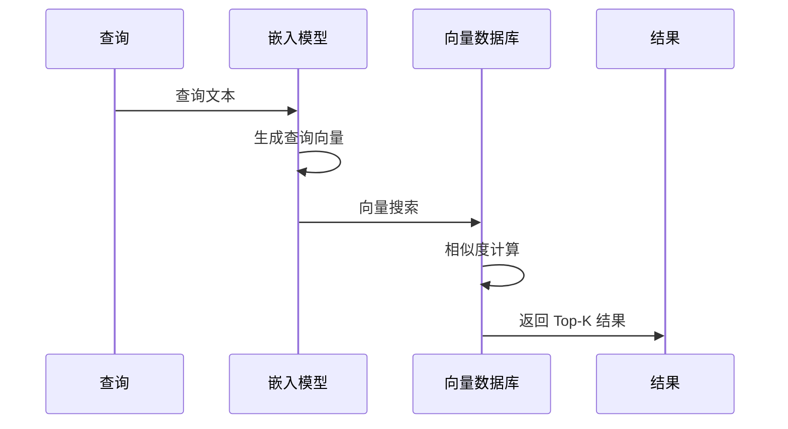

## 5.3 嵌入模型与语义搜索

### 5.3.1 嵌入的基本概念

**嵌入**（Embedding）是将文本转换为数值向量的过程。语义相近的文本在向量空间中距离也相近，这是语义搜索的数学基础。

嵌入模型的核心任务：将任意长度的文本映射到固定维度的向量空间，保持语义相似性。

### 5.3.2 嵌入模型的工作原理

图 5-4：嵌入模型工作原理

主要步骤：
1. **分词**：将文本切分为 Token
2. **编码**：通过 Transformer 编码器获取上下文表示
3. **池化**：将多个 Token 表示合并为单一向量
4. **归一化**：可选，将向量归一化为单位长度

### 5.3.3 嵌入模型类型对比（示意）

嵌入模型与参数迭代很快，下面按“类型”给出对比视角，便于做选型决策（具体模型名、维度与最大长度以各厂商/开源项目文档为准）。

| 类型 | 维度（常见量级） | 最大长度（常见量级） | 特点 |
|------|------------------|----------------------|------|
| 商用通用嵌入模型 | 千级 | 千到万级 Token | 综合表现稳定，生态与工具链成熟 |
| 商用高精度嵌入模型 | 更高维度 | 千到万级 Token | 更高质量，成本与延迟更高 |
| 开源中文/多语言嵌入模型 | 千级 | 百到千级 Token（不等） | 便于本地部署与可控性，需自建评测 |
| 指令式/任务特化嵌入模型 | 千级 | 百到千级 Token（不等） | 在特定检索范式（如 query/doc 前缀）下更稳健 |

### 5.3.4 嵌入模型选择因素

**质量需求**

- 高质量场景：选择能力更强的模型
- 一般场景：平衡模型可能足够

**语言支持**

- 纯中文：BGE 系列表现突出
- 多语言：BGE-M3、Cohere 等

**上下文长度**

- 长文档检索：需要支持更长输入的模型
- 短查询：大多数模型都能胜任

**成本与性能**

- 云服务：按调用计费，需要考虑成本
- 本地部署：需要考虑硬件资源

### 5.3.5 语义搜索实现

**相似度度量**

常用的相似度计算方法：

| 方法 | 公式 | 特点 |
|------|------|------|
| 余弦相似度 | $\cos(\mathbf{A}, \mathbf{B})$ | 最常用，忽略向量长度 |
| 点积 | A · B | 快速计算 |
| 欧氏距离 | \|\|A - B\|\| | 考虑绝对位置 |

余弦相似度最为常用，因为它专注于方向而非长度。

**检索流程**

图 5-5：语义搜索流程

### 5.3.6 嵌入质量优化

**查询增强**

增强查询以提高检索效果：
- 查询扩展：添加同义词或相关术语
- 查询改写：使用 LLM 改写为更好的搜索形式
- 假设文档：生成假设的理想答案，用于检索

**文档增强**

优化文档嵌入：
- 添加标题前缀：将标题拼接到内容前
- 摘要增强：为每个块生成摘要，用摘要嵌入
- 多向量表示：同一内容生成多个嵌入

### 5.3.7 嵌入的局限与对策

**语义鸿沟**

嵌入基于字面语义，可能忽略领域特定含义。

对策：使用领域微调的嵌入模型，或结合关键词搜索。

**跨语言差异**

不同语言的嵌入质量可能不一致。

对策：选择多语言优化的模型，或翻译后检索。

**长尾查询**

罕见表达可能嵌入效果差。

对策：查询扩展，或结合多种检索方式。

### 5.3.8 嵌入模型更新

嵌入模型更新时需要注意：
- 重新生成全部文档嵌入
- 保持查询与文档使用相同模型
- 考虑过渡期的兼容性
