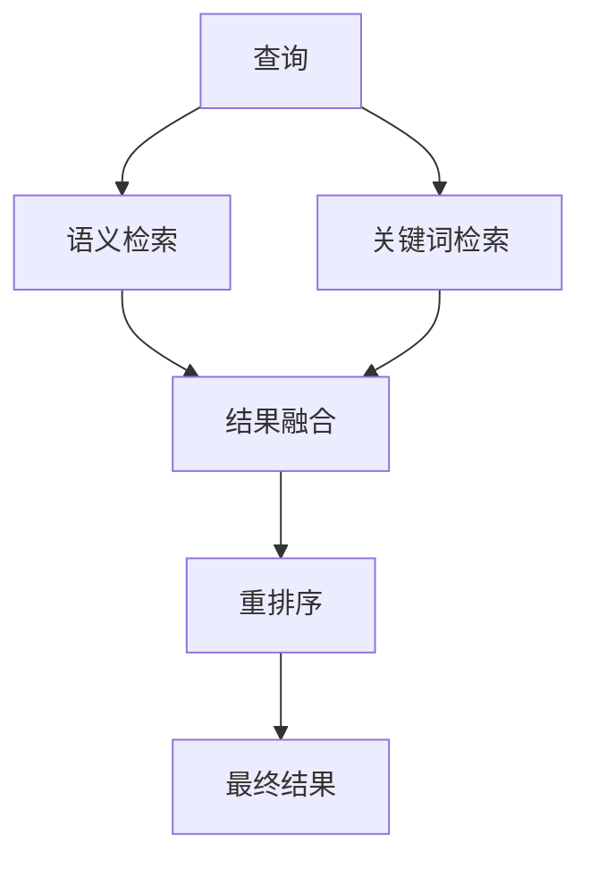

## 5.5 混合检索与高级 RAG

### 混合检索

**混合检索**（Hybrid Search）结合多种检索方法的优势，是当前 RAG 实践的标准配置。

#### 语义检索 vs 关键词检索

| 特性 | 语义检索 | 关键词检索 |
|------|----------|------------|
| 优势 | 理解语义、处理同义词 | 精确匹配、高速 |
| 劣势 | 可能忽略关键词 | 无法处理语义 |
| 典型场景 | 开放式问题 | 专有名词、代码 |

#### 混合检索实现



**分数融合策略**：

**简单加权**
```
融合分数 = α × 语义分数 + (1-α) × 关键词分数
```

**倒数排名融合（RRF）**
```
RRF(d) = Σ 1/(k + rank_i(d))
```

RRF 不依赖原始分数，只使用排名，更加鲁棒。

### 高级 RAG 技术

#### 查询转换

在检索前对查询进行增强：

**查询扩展**

扩大查询覆盖范围：
- 同义词扩展
- 相关术语添加
- 多语言翻译

**查询分解**

将复杂查询拆分：
```
原始查询：比较 A 产品和 B 产品在性能和价格方面的差异
分解为：
- A 产品的性能
- B 产品的性能
- A 产品的价格
- B 产品的价格
```

**假设文档生成（HyDE）**

生成假设的答案，用其嵌入进行检索：
1. 让 LLM 生成假设答案
2. 将假设答案转换为嵌入
3. 用假设答案的嵌入检索

#### 多跳检索

对于需要多步推理的问题，迭代检索：


应用场景：
- 需要背景知识支持的问题
- 涉及多个实体关系的问题

#### 自适应检索

根据查询特点动态调整策略：

**路由机制**

根据查询类型选择不同检索路径：
- 事实查询 → 精确检索
- 概念查询 → 语义检索
- 对比查询 → 多路检索

**无需检索的识别**

并非所有查询都需要检索：
- 常识问题：模型本身知识足够
- 创意任务：不需要外部事实

#### 上下文增强

丰富检索结果的上下文：

**父子块策略**

- 使用小块检索：precision
- 返回大块内容：context

```
小块（检索用）: 200 tokens
大块（返回用）: 1000 tokens
```

**滑动窗口扩展**

检索到某块后，自动包含相邻块。

**元数据增强**

将来源、章节等元数据附加到结果中。

### RAG 评估框架

#### 组件级评估

分别评估 RAG 各组件：

| 组件 | 评估指标 |
|------|----------|
| 检索 | Recall、MRR、NDCG |
| 生成 | 准确性、完整性、一致性 |
| 端到端 | 用户满意度、任务成功率 |

#### 常用评估工具

- **RAGAS**：自动化 RAG 评估框架
- **TruLens**：RAG 质量监控
- **人工评估**：复杂场景仍需人工判断

### RAG 调优策略

**问题诊断**

常见问题及对策：
- 检索不到相关内容 → 优化分块/嵌入
- 检索质量低 → 添加重排序
- 生成答案错误 → 优化提示词，加入约束

**迭代优化**

1. 收集失败案例
2. 分析失败原因
3. 针对性优化
4. 验证效果
5. 持续监控
