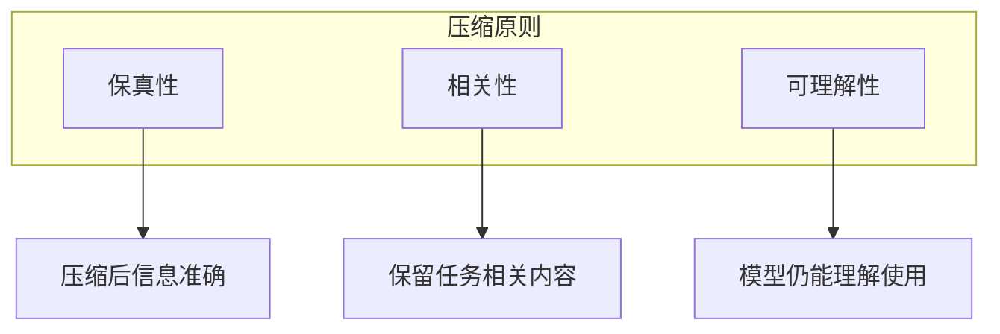
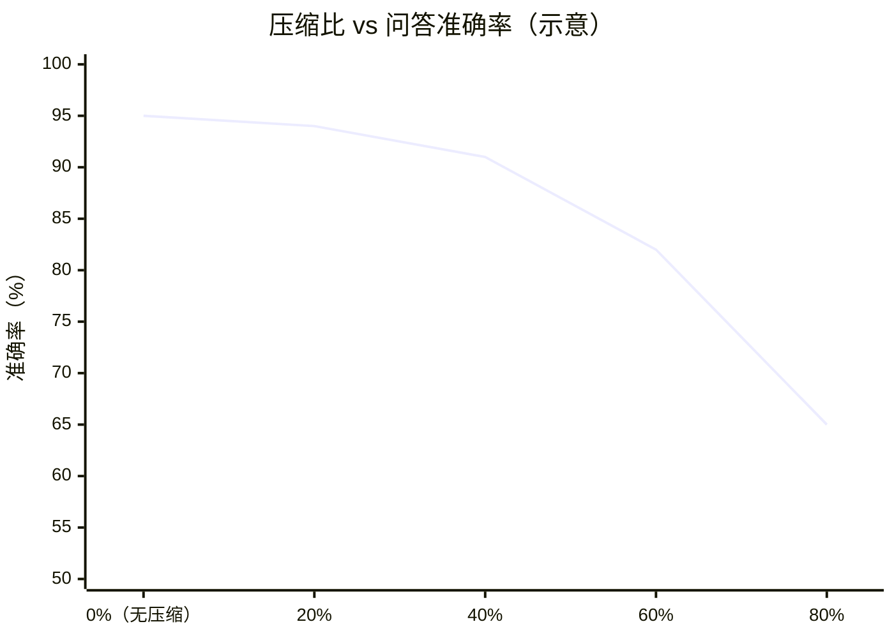

## 6.1 信息密度与压缩原理

### 6.1.1 信息密度的概念

**信息密度**是指单位 Token 中包含的有效信息量。高密度意味着用更少的 Token 传达更多有价值的内容。

```text
信息密度 = 有效信息量 / Token 数量
```

信息密度对上下文工程的影响：
- **容量利用**：高密度上下文能在有限窗口中容纳更多内容
- **成本效率**：更少的 Token 意味着更低的 API 费用
- **处理效率**：更短的上下文带来更快的响应

### 6.1.2 信息的冗余与噪声

上下文中的低效内容主要来自两方面：

**冗余信息**

- 重复表达相同含义
- 过渡性词汇和填充语
- 不必要的修饰和解释

**噪声信息**

- 与任务无关的背景内容
- 过时或错误的信息
- 格式化符号和无意义标记

### 6.1.3 压缩的基本原则



**原则一：信息保真**

压缩不应该损失关键信息。压缩是提炼精华，而非简单截断。

**原则二：任务导向**

根据当前任务决定保留什么。对某个任务重要的信息对另一个可能不重要。

**原则三：可理解性**

压缩结果应该保持连贯，让模型能够正确理解和使用。

### 6.1.4 压缩技术分类

| 类型 | 方法 | 特点 |
|------|------|------|
| 抽取式 | 选择原文中的关键句段 | 保持原文表述 |
| 生成式 | 生成新的精简表述 | 更灵活、更精炼 |
| 结构化 | 转换为结构化格式 | 格式紧凑、易解析 |
| 层次化 | 分级别保留细节 | 按需展开 |

### 6.1.5 压缩与质量的权衡

压缩必然涉及信息的取舍，需要在多个维度上做权衡：

**压缩率 vs 信息完整性**

- 高压缩率：节省空间但可能丢失细节
- 低压缩率：保留更多但占用更多上下文

**通用性 vs 针对性**

- 通用压缩：一次压缩多处复用
- 针对性压缩：针对具体任务定制

**成本 vs 效果**

- 简单压缩（如截断）：成本低但效果有限
- 高级压缩（如 LLM 摘要）：效果好但需要额外成本

### 6.1.6 何时需要压缩

以下场景应考虑压缩：

**1. 上下文接近容量上限**

需要为新内容腾出空间。当任务进展到一定程度，历史信息堆积，接近模型的最大上下文窗口时，必须进行压缩。否则，新的输入将被截断，或者模型性能急剧下降。这是一个硬性技术约束。

**2. 成本敏感场景**

Token 费用是主要顾虑。对于高频调用的生产级应用，Token 消耗直接决定了商业模式的盈利能力。通过压缩输入，可以在不显著牺牲效果的前提下，大幅降低每次调用的成本。长期来看，哪怕 20% 的压缩率也能带来显著的节省。

**3. 延迟敏感场景**

需要快速响应。上下文越长，Time to First Token (TTFT) 越长，总生成时间也可能增加。在实时对话、语音交互等对延迟高度敏感的场景中，保持精简的上下文是低延迟的关键。

**4. 对话历史过长**

多轮对话积累了大量历史。在长会话中，早期的闲聊或已解决的任务细节往往不再重要。保留这些冗余信息不仅浪费 Token，还可能对现在的任务产生噪声干扰。

**5. 检索结果过多**

检索返回了过多内容。RAG 系统检索到的相关文档片段可能很多，如果全部塞入上下文，可能会淹没关键信息。研究表明，模型往往容易忽略处于上下文中间位置的信息，这被称为 **“Lost in the Middle”** 现象[^2]。此时需要对检索结果进行摘要或提取，只保留最核心的证据。

[^2]: Liu, N. F., Lin, K., Hewitt, J., Paranjape, A., Bevilacqua, M., Petroni, F., & Liang, P. (2023). Lost in the Middle: How Language Models Use Long Contexts. arXiv preprint arXiv:2307.03172.

### 6.1.7 压缩比与质量损失对比

压缩率越高，信息损失风险越大。下图展示了不同压缩比对问答准确率影响的**示意趋势**（实际曲线强烈依赖任务类型、压缩方法、评测集与提示词设计）：



*数据说明：示意趋势，不应被视为 LongBench 的通用结论。*

一种常见的经验现象是：在中等压缩率区间，去除冗余可能带来一定“去噪效应”；但当压缩过度时，关键信息更容易丢失，从而导致性能下降。具体拐点需要通过评估集与线上数据验证。

### 6.1.8 压缩效果评估

评估压缩效果需要考虑：

**直接指标**
- 压缩率：压缩后大小 / 原始大小
- Token 节省：减少的 Token 数量

**间接指标**
- 任务效果：压缩后任务完成质量
- 信息保留率：关键信息的覆盖程度

理想的压缩应该在显著降低 Token 数量的同时，保持或只轻微影响任务效果。
