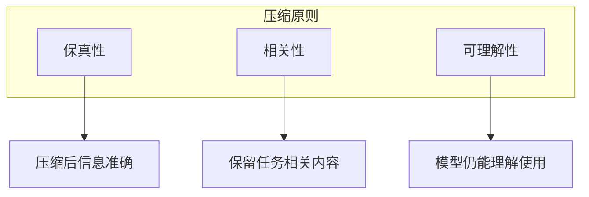

## 6.1 信息密度与压缩原理

### 信息密度的概念

**信息密度**是指单位 Token 中包含的有效信息量。高密度意味着用更少的 Token 传达更多有价值的内容。

```
信息密度 = 有效信息量 / Token 数量
```

信息密度对上下文工程的影响：
- **容量利用**：高密度上下文能在有限窗口中容纳更多内容
- **成本效率**：更少的 Token 意味着更低的 API 费用
- **处理效率**：更短的上下文带来更快的响应

### 信息的冗余与噪声

上下文中的低效内容主要来自两方面：

**冗余信息**

- 重复表达相同含义
- 过渡性词汇和填充语
- 不必要的修饰和解释

**噪声信息**

- 与任务无关的背景内容
- 过时或错误的信息
- 格式化符号和无意义标记

### 压缩的基本原则



**原则一：信息保真**

压缩不应该损失关键信息。压缩是提炼精华，而非简单截断。

**原则二：任务导向**

根据当前任务决定保留什么。对某个任务重要的信息对另一个可能不重要。

**原则三：可理解性**

压缩结果应该保持连贯，让模型能够正确理解和使用。

### 压缩技术分类

| 类型 | 方法 | 特点 |
|------|------|------|
| 抽取式 | 选择原文中的关键句段 | 保持原文表述 |
| 生成式 | 生成新的精简表述 | 更灵活、更精炼 |
| 结构化 | 转换为结构化格式 | 格式紧凑、易解析 |
| 层次化 | 分级别保留细节 | 按需展开 |

### 压缩与质量的权衡

压缩必然涉及信息的取舍，需要在多个维度上做权衡：

**压缩率 vs 信息完整性**

- 高压缩率：节省空间但可能丢失细节
- 低压缩率：保留更多但占用更多上下文

**通用性 vs 针对性**

- 通用压缩：一次压缩多处复用
- 针对性压缩：针对具体任务定制

**成本 vs 效果**

- 简单压缩（如截断）：成本低但效果有限
- 高级压缩（如 LLM 摘要）：效果好但需要额外成本

### 何时需要压缩

以下场景应考虑压缩：

1. **上下文接近容量上限**：需要为新内容腾出空间
2. **成本敏感场景**：Token 费用是主要顾虑
3. **延迟敏感场景**：需要快速响应
4. **对话历史过长**：多轮对话积累了大量历史
5. **检索结果过多**：检索返回了过多内容

### 压缩效果评估

评估压缩效果需要考虑：

**直接指标**
- 压缩率：压缩后大小 / 原始大小
- Token 节省：减少的 Token 数量

**间接指标**
- 任务效果：压缩后任务完成质量
- 信息保留率：关键信息的覆盖程度

理想的压缩应该在显著降低 Token 数量的同时，保持或只轻微影响任务效果。
