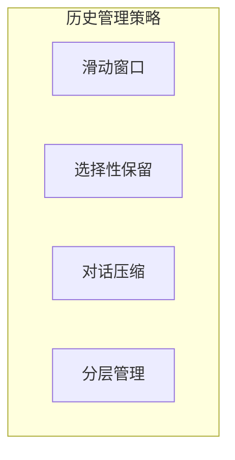

## 6.3 对话历史管理

### 6.3.1 对话历史的挑战

多轮对话场景中，对话历史会持续增长，带来以下挑战：

- **上下文膨胀**：历史越长，占用上下文越多
- **信息稀释**：早期内容的相关性往往下降
- **成本累积**：每轮对话都包含完整历史，成本快速增加
- **性能下降**：过长上下文可能影响模型效果

### 6.3.2 对话历史管理策略



#### 滑动窗口

只保留最近 N 轮对话：

```
保留最近 5 轮：
[轮次 N-4] [轮次 N-3] [轮次 N-2] [轮次 N-1] [轮次 N]
```

**优点**：简单直接，实现容易
**缺点**：可能丢失重要的早期信息

**参数调优**：
- 窗口大小取决于任务特性
- 简单问答：2-5 轮
- 复杂任务：5-10 轮

#### 选择性保留

根据重要性选择保留哪些历史：

**重要性判断依据**：
- 包含任务关键信息
- 用户明确要求记住的内容
- 定义了重要约束或偏好
- 最近的交互

**实现方式**：
- 规则标记：基于关键词或模式
- 模型判断：让 LLM 评估重要性

#### 对话压缩

将冗长的对话历史压缩为摘要：

**即时压缩**

每轮对话后立即压缩：
```
[用户问]: 详细问题内容...
[助手答]: 详细回答内容...
→ 压缩为：用户询问了X，助手回答了Y的关键点
```

**批量压缩**

达到阈值后批量压缩较早的历史：
```
[早期10轮对话] → [压缩摘要]
[最近5轮对话] → [保持原文]
```

**递进压缩**

按时间距离采用不同压缩级别：
- 最近（1-3 轮）：完整保留
- 近期（4-10 轮）：轻度压缩
- 早期（10 轮以上）：重度压缩

#### 分层管理

将对话信息分到不同层次存储：

| 层次 | 内容 | 存储位置 |
|------|------|----------|
| 工作层 | 当前对话上下文 | 上下文窗口 |
| 摘要层 | 对话历史摘要 | 上下文窗口 |
| 事实层 | 提取的关键事实 | 外部记忆 |
| 完整层 | 完整对话历史 | 持久存储 |

### 6.3.3 对话压缩的实现

#### 压缩提示词示例

```
请将以下对话历史压缩为简洁的摘要，保留：
1. 用户的主要需求和约束
2. 重要的决策和结论
3. 需要记住的上下文信息

原始对话：
[对话内容]

请生成不超过 200 字的摘要：
```

#### 信息提取式压缩

将对话转换为结构化信息：

```
从对话中提取：
- 用户目标：...
- 已确定的偏好：...
- 待解决的问题：...
- 当前状态：...
```

### 6.3.4 上下文拼接策略

整合不同来源的历史信息：

```
[系统提示词]
[用户画像/偏好]（从长期记忆）
[会话摘要]（早期历史的压缩）
[最近对话]（保留原文）
[当前问题]
```

### 6.3.5 最佳实践

**1. 结合多种策略构建历史管理体系**

单一策略难以应对复杂场景，推荐组合使用：滑动窗口保留最近的完整对话；压缩技术处理较早的历史；重要信息提取确保关键约束不丢失。例如：保留最近 5 轮原文 + 早期历史压缩摘要 + 提取的用户偏好列表。这种分层策略在控制上下文长度的同时，最大化保留有价值的信息。根据任务特点调整各层的比例。

**2. 始终保留关键锚点信息**

用户明确表达的约束和要求是"锚点"，必须始终保留在上下文中。例如："请用简体中文回复"、"预算不超过 5000 元"、"不要推荐海鲜"。这些信息一旦丢失，模型会给出违背用户意愿的回答，严重影响体验。实现时可以用特殊标记标识锚点信息，确保压缩过程不会删除它们。宁可多保留一些锚点，也不要冒丢失关键约束的风险。

**3. 确保压缩后内容的自然过渡**

压缩后的摘要应该与当前对话自然衔接，避免风格突兀。使用第一人称还是第三人称？是口语化还是正式表达？压缩摘要的风格应与原始对话保持一致。突兀的风格切换会让模型"困惑"，影响后续生成质量。在压缩提示词中明确要求保持风格一致，必要时提供示例。

**4. 保持完整历史的可恢复性**

虽然在上下文中使用压缩版本，但完整的对话历史应该保存在持久化存储中。这样在需要时可以回溯——例如用户投诉某次回答不当，需要完整上下文来分析原因；或者用户要求"回到之前讨论的那个方案"，需要恢复详细信息。将完整历史与压缩版本关联存储，建立索引便于快速检索。

**5. 持续监控压缩对对话质量的影响**

压缩策略不是设置后就不管的"一次性配置"，需要持续监控效果。观察指标包括：用户是否需要重复说过的信息？模型是否遗忘了早期约束？对话连贯性如何？建立反馈机制，当检测到质量下降时自动调整压缩参数。定期审查压缩效果，随着对话模式变化优化策略。

### 6.3.6 实战案例：电商客服对话管理（示意）

以下示例用于说明一种对话历史管理的实现思路，生产环境需根据并发、权限、合规与成本要求进行改造。

#### 场景描述

用户咨询退换货，对话可能持续 20+ 轮，涉及订单查询、问题确认、方案协商等多个阶段。

#### 完整实现

```python
from dataclasses import dataclass, asdict
from typing import List, Optional
import json
import sqlite3

@dataclass
class Message:
    role: str  # "user" 或 "assistant"
    content: str
    is_anchor: bool = False  # 是否为锚点信息
    
    def to_dict(self):
        return asdict(self)
    
    @staticmethod
    def from_dict(data):
        return Message(**data)

class ConversationManager:
    def __init__(self, session_id: str, db_path="chat.db", max_recent=5):
        self.session_id = session_id
        self.db_path = db_path
        self.messages: List[Message] = []
        self.anchors: List[str] = []
        self.summary: str = ""
        self.max_recent = max_recent
        self._init_db()
        self.load_history()

    def _init_db(self):
        """初始化 SQLite 数据库表结构"""
        with sqlite3.connect(self.db_path) as conn:
            conn.execute("""
                CREATE TABLE IF NOT EXISTS sessions (
                    session_id TEXT PRIMARY KEY,
                    summary TEXT,
                    anchors TEXT,
                    updated_at TIMESTAMP DEFAULT CURRENT_TIMESTAMP
                )
            """)
            conn.execute("""
                CREATE TABLE IF NOT EXISTS messages (
                    id INTEGER PRIMARY KEY AUTOINCREMENT,
                    session_id TEXT,
                    role TEXT,
                    content TEXT,
                    is_anchor BOOLEAN,
                    created_at TIMESTAMP DEFAULT CURRENT_TIMESTAMP,
                    FOREIGN KEY(session_id) REFERENCES sessions(session_id)
                )
            """)

    def load_history(self):
        """从数据库加载历史"""
        with sqlite3.connect(self.db_path) as conn:
            # 加载会话元数据（摘要和锚点）
            cursor = conn.execute(
                "SELECT summary, anchors FROM sessions WHERE session_id = ?", 
                (self.session_id,)
            )
            row = cursor.fetchone()
            if row:
                self.summary = row[0]
                self.anchors = json.loads(row[1]) if row[1] else []

            # 加载最近的消息
            # 注意：实际生产中可能只需要加载最近 N 条，早期的已压缩
            cursor = conn.execute(
                """
                SELECT role, content, is_anchor FROM messages 
                WHERE session_id = ? 
                ORDER BY created_at ASC
                """, 
                (self.session_id,)
            )
            self.messages = [Message(*r) for r in cursor.fetchall()]

    def save_snapshot(self):
        """保存当前状态到数据库"""
        with sqlite3.connect(self.db_path) as conn:
            # 更新会话元数据
            conn.execute(
                """
                INSERT OR REPLACE INTO sessions (session_id, summary, anchors)
                VALUES (?, ?, ?)
                """,
                (self.session_id, self.summary, json.dumps(self.anchors))
            )
            
            # 简单的全量保存（生产环境应改为增量保存）
            conn.execute("DELETE FROM messages WHERE session_id = ?", (self.session_id,))
            for msg in self.messages:
                conn.execute(
                    """
                    INSERT INTO messages (session_id, role, content, is_anchor)
                    VALUES (?, ?, ?, ?)
                    """,
                    (self.session_id, msg.role, msg.content, msg.is_anchor)
                )

    def add_message(self, role: str, content: str):
        # ... (与之前逻辑相同：检测锚点、添加消息) ...
        is_anchor = self._detect_anchor(content)
        msg = Message(role, content, is_anchor)
        self.messages.append(msg)
        
        if is_anchor:
            self.anchors.append(content)
        
        # 实时保存（或采用异步批量保存）
        self.save_snapshot() 
        
        # 触发压缩检查
        if len(self.messages) > self.max_recent * 2:
            self._compress_history()
            self.save_snapshot() # 压缩后再次保存更新状态
    
    def _detect_anchor(self, content: str) -> bool:
        # ... (同上) ...
        anchor_patterns = ["订单号", "手机号", "必须", "预算"]
        return any(p in content for p in anchor_patterns)

    def _compress_history(self):
        # ... (压缩逻辑同上) ...
        # 可选：实现将旧消息归档到冷存储或仅从热数据中移除
        pass

    def build_context(self) -> str:
        # ... (构建上下文逻辑同上) ...
        parts = []
        if self.anchors: parts.append(f"【关键约束】\n{self.anchors}")
        if self.summary: parts.append(f"【历史摘要】\n{self.summary}")
        recent = "\n".join([f"{m.role}: {m.content}" for m in self.messages[-self.max_recent:]])
        parts.append(f"【最近对话】\n{recent}")
        return "\n\n".join(parts)
```

#### 实际效果

**20 轮对话后的上下文示例**：

```
【关键约束】
- 订单号：2024010512345
- 不接受换货，只要退款
- 必须今天处理完

【历史摘要】
用户购买的蓝牙耳机存在左耳无声问题，已确认在保修期内。
用户尝试过重置配对但未解决。客服已记录问题，准备发起退款。

【最近对话】
user: 退款多久到账？
assistant: 审核通过后3-5个工作日到账。
user: 太慢了，能加快吗？
assistant: 我帮您申请加急处理，预计1-2个工作日。
user: 好的，那就这样吧。
```

#### 踩坑经验

1. **订单号必须作为锚点** — 曾因压缩丢失订单号，导致后续无法查询，用户需要重复提供
2. **用户情绪需要记录** — "用户表达了不满"这类信息应保留，影响后续安抚策略
3. **压缩时机要对** — 不要在用户等待回复时压缩，会增加延迟；应在对话间隙异步执行
4. **保留否定约束** — "不要推荐 X"比"推荐 Y"更容易被压缩丢失，需特殊标记
