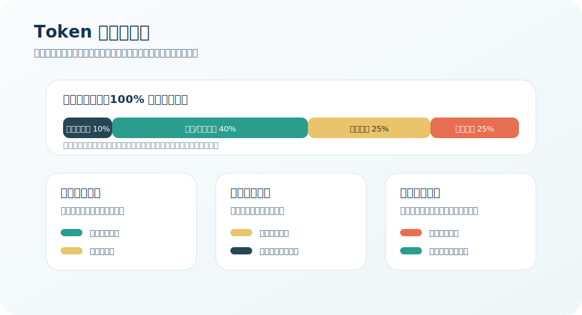
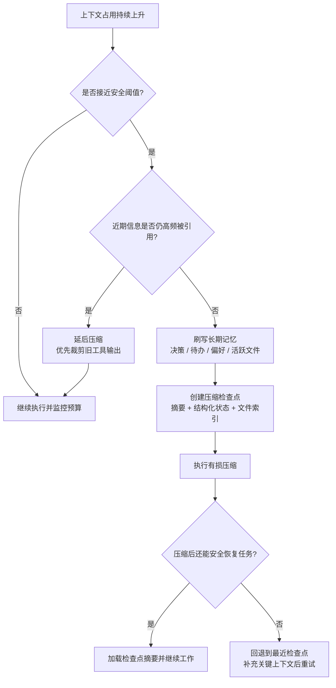

## 6.4 上下文窗口优化策略

### 6.4.1 上下文预算管理

像管理预算一样管理上下文容量，是优化的基础方法。

#### 预算分配

为不同组成部分预先分配 Token 预算：

| 组成部分 | 典型预算占比 | 说明 |
|----------|--------------|------|
| 系统提示词 | 5-15% | 尽量精简 |
| 知识/检索内容 | 30-50% | 核心信息区 |
| 对话历史 | 20-30% | 动态调整 |
| 输出预留 | 15-25% | 确保足够空间 |

*注：以上占比为常见起点，实际分配需结合任务类型、模型上下文长度、工具调用开销与期望输出长度进行调整。*



图 6-5：Token 预算堆叠图

#### 动态调整

根据任务特点动态调整分配：
- 知识密集任务：增加检索内容预算
- 多轮对话任务：增加历史预算
- 长文生成任务：增加输出预留

### 6.4.2 系统提示词优化

系统提示词是最稳定的上下文部分，应该优化到最精简。

#### 精简策略

**删除冗余**
- 移除重复说明
- 合并相似指令
- 使用简洁表达

**结构化表达**
- 使用列表替代段落
- 使用表格组织规则
- 采用编号便于引用

**模板复用**
- 将通用部分模板化
- 动态部分参数化
- 条件加载可选内容

#### 提示词压缩技术

**人工精简**

最直接有效，逐字审查每句话的必要性。

**LLM 辅助压缩**

让模型帮助精简：
```text
请将以下系统提示词压缩到 500 Token 以内，保持所有关键指令：
[原始提示词]
```

**符号化表达**

用简洁符号替代冗长说明：
```text
原文：如果用户没有明确指定格式，请使用 Markdown 格式输出
精简：默认格式=Markdown
```

### 6.4.3 检索内容优化

检索内容往往占用大量上下文，是优化重点。

#### 精准检索

- 提高检索精度，减少无关结果
- 使用重排序过滤低相关内容
- 根据置信度阈值截断结果

#### 检索后压缩

对检索结果进行二次压缩：
- 提取与查询相关的片段
- 生成针对性摘要
- 合并重复信息

#### 渐进式检索

按需检索，而非一次全部加载：
1. 先用少量关键信息回答
2. 如果需要更多细节再补充检索
3. 避免预防性的大量检索

### 6.4.4 格式优化

格式选择影响 Token 效率。

#### 结构化格式对比

| 格式 | Token 效率 | 可读性 | 适用场景 |
|------|------------|--------|----------|
| 纯文本 | 高 | 一般 | 连续内容 |
| Markdown | 中 | 好 | 结构化文档 |
| JSON | 低 | 中 | 数据交换 |
| XML | 最低 | 高 | 明确边界 |

#### 格式优化建议

- 非必要不使用嵌套结构
- 属性名尽量简短
- 避免冗长的 key 名称
- 考虑自定义简洁格式

### 6.4.5 缓存与复用

减少重复内容的传输和计算。

#### 提示词缓存

许多模型支持 Prompt 缓存机制，这是优化成本和延迟的最有效手段之一。

**经济学原理**：
- **存活时间（TTL）**：缓存通常有较短的生命周期（根据不同供应商差异，可能有约 5 分钟的生存时间），每次缓存命中都会刷新该计时。
- **成本不对称性**：写入缓存（计算 KV Cache 并存入高速显存）通常比常规输入 Token 更贵（可能有 25% 溢价），但在随后的请求中读取缓存却能获得极大的折扣（如高达 90% 的降价）。频繁且连续的交互能够极大地放大这种收益。

**架构级最佳实践**：

为最大化缓存命中率，系统设计需要严格保持“前缀一致性”。
- **使用消息，而非修改系统提示词**：绝对不要将会变化的上下文（如当前时间、随时更新的文件状态）写入系统提示词（System Prompt）。正确的做法是保持系统提示词绝对冻结，并使用特定的标记形式将动态数据放入最新的用户消息中。
- **延迟加载工具**：不要在中途动态添加或删除可用工具，这会改变前缀并使得迄今为止的全部缓存由于错位而失效。最佳做法是：始终将所有可用工具的轻量级“存根（Stubs，只包含名称和基础描述）”组装给模型，当模型尝试并确实需要调用时，再通过主动的检索工具获取该工具的完整参数要求，并将其作为附加消息传入。
- **跨模式保持工具稳定**：如果系统拥有诸如”计划模式”与”执行模式”，不要在模式切换时尝试通过增删工具列表来加以限制。应保持全量的工具定义始终不变，仅仅通过添加一条普通的前置消息来指示模型改变其行为（如”你现在进入了计划模式，请只读而不要使用修改源代码的任何动作”）。

#### 各场景的缓存收益分析

不同应用场景中，前缀缓存的收益差异显著：

- **复杂系统提示词**：智能体、客服机器人和 RAG 管道通常携带数千 Token 的系统提示词，每次请求完全一致。前缀缓存可跳过这些 Token 的 Prefill 计算，TTFT 降幅可达 50% 以上
- **代码补全与生成**：需要将当前文件的数千行代码作为共享上下文，前缀缓存可避免对未修改的代码行重复计算
- **文档摘要与问答**：文档内容在多次提问中保持不变，仅用户问题变化。将文档放在提示词前部、问题放在末尾，即可最大化缓存复用
- **多轮对话**：聊天模板在每轮中回传所有历史消息，前缀缓存的收益随对话轮次递增——第 N 轮对话可复用前 N-1 轮的所有 KV 缓存

设计上下文时应始终考虑缓存特性：将频繁变化的内容（如用户输入、最新检索结果）放在提示词末尾，将稳定内容（如系统提示词、工具定义）放在前部。这一原则不仅适用于单轮请求，在多轮对话和智能体工作流中同样关键。

#### 预计算

对于频繁使用的内容预先计算：
- 预生成摘要并存储
- 检索结果预处理
- 通用模板预填充

### 6.4.6 监控与调优

#### 监控指标

- Token 使用分布：各部分占比
- 使用效率：有效信息/总 Token
- 边界情况：接近上限的频率
- 成本追踪：Token 费用趋势

#### 持续优化

1. 建立基准线
2. 识别最大消耗点
3. 针对性优化
4. 验证效果
5. 持续监控

上下文优化是一个持续的过程，需要在效果和效率之间找到最佳平衡点。

### 6.4.7 长任务场景的高级压缩策略

对于执行跨越数十分钟到数小时的长期任务（如大规模代码迁移或全面的研究项目），需要专门的技术来解决上下文窗口限制。以下介绍两种核心技术：

#### 紧凑化技术

Compaction 是一种在上下文接近窗口限制时，将对话内容进行摘要，并以摘要重新初始化新上下文窗口的实践。

**核心思路**：高保真地提炼上下文窗口的内容，使智能体能够以最小的性能损失继续工作。

**实现要点**：
- 将消息历史传递给模型进行总结和压缩
- 保留架构决策、未解决的问题和实现细节
- 丢弃冗余的工具输出或消息
- 用压缩后的上下文加上最近访问的文件继续工作

**分叉操作与缓存复用**：
在执行压缩任务本身时，一个关键的优化设计是将压缩请求作为当前会话的“分叉（Fork操作）”。即在压缩请求中，**绝对完整地复用** 原会话那一长串稳定的系统提示词、知识库和全部的工具定义作为前缀，仅将对话消息部分替换为原消息副本以及“请总结上述对话”的指令消息。由于系统环境前缀通常占据了会话绝大比例的内容空间且完全一致，这种分叉形式能够 100% 命中先前的缓存，使得处理数万 Token 的基础设施开销变得极为廉价。

**压缩的艺术**：关键在于选择保留什么与丢弃什么。过于激进的压缩可能导致丢失细微但关键的上下文信息。

> **最佳实践**：从最大化召回（recall）开始，确保压缩提示词捕获了跟踪中的每一条相关信息，然后迭代改进精度以消除多余内容。

#### 结构化笔记

结构化笔记是一种 Agent 定期将笔记持久化到上下文窗口外部存储的技术。这些笔记在后续需要时被拉回上下文窗口。

**工作方式**：
- 智能体创建待办事项列表或维护 `NOTES.md` 文件
- 用于跟踪复杂任务的进展
- 保持关键上下文和依赖关系，否则这些信息会在大量工具调用中丢失

**实际案例（思路说明）**：在长时间交互任务中，智能体可以通过持续维护结构化笔记来跟踪关键状态（例如计数器、已完成步骤与下一步目标）。当上下文被重置后，读取笔记即可恢复工作状态并继续执行。

**选择策略的指南**：

| 技术 | 适用场景 |
|------|----------|
| Compaction | 需要大量来回交互的任务 |
| Structured Note-taking | 有明确里程碑的迭代开发 |
| 子智能体架构 | 需要并行探索的复杂研究分析 |

### 6.4.8 压缩前的记忆刷写与检查点

在长时程智能体任务中，压缩是不可避免的有损操作。为降低信息损失，生产级系统通常在压缩前执行 **记忆刷写（Memory Flush）**，并建立 **压缩检查点（Compaction Checkpoint）** 以支持任务恢复。

#### 记忆刷写

当上下文占用接近窗口限制的某个阈值（如 75%）时，系统在执行压缩前先触发一次记忆刷写：将需要长期保留的关键信息（决策、偏好、待办事项）写入外部持久化存储（如本地 Markdown 文件或数据库），确保这些信息不会在压缩过程中丢失。

```text
上下文接近阈值 → 刷写关键记忆到外部存储 → 执行有损压缩 → 继续工作
```

这种“先存后压”的策略已被多个生产级智能体采用。其核心配置通常包括：刷写触发阈值、写入目标路径、以及哪些类型的信息需要优先保留。

将这三者串起来看，核心不是“上下文满了就压缩”，而是先判断能否继续保留原窗口，再决定是否先刷写记忆并建立检查点：



图 6-6：压缩、记忆刷写与检查点决策流

#### 压缩检查点

对于可能运行数小时的任务，仅靠压缩摘要可能不足以恢复完整的工作状态。压缩检查点在每次压缩时额外保存：

- **压缩摘要**：对话历史的精简版本
- **结构化状态**：当前的任务进度、待办清单、已完成步骤
- **活跃文件列表**：最近读写的文件路径和关键片段

当任务需要恢复时（如会话中断后重启），系统可以从最近的检查点加载状态，而不是从零开始。这种机制对于跨越多次压缩的超长任务尤为关键。

#### 工具输出的分层裁剪

长时程任务中，工具执行结果（如编译日志、API 响应）会随时间大量积累。分层裁剪策略按时间衰减处理这些输出：

| 时间距离 | 裁剪策略 | 示例 |
|---------|---------|------|
| 最近 3 轮 | 完整保留 | 最新的命令输出全文 |
| 4-10 轮前 | 软裁剪（保留首尾） | 前 1500 字符 + 后 1500 字符 |
| 10 轮以前 | 硬清空 | `[旧工具结果已清空]` 占位符 |

这种裁剪只作用于传递给模型的上下文，磁盘上的完整执行结果不受影响，后续仍可通过检索访问。结合提示词缓存的 TTL 机制，系统还可以在缓存过期后自动触发裁剪，降低重新缓存的成本。

### 6.4.9 智能体上下文缩减策略（案例思路）

在一些生产级智能体的开发中，为了应对超长任务和复杂工具调用，常会演化出一些专门的上下文缩减策略。

（关于相关思路的进一步讨论，请参见 [13.5 案例分析：全自主智能体架构（示意）](../13_cases/13.5_generalist_agent.md)）

#### 1. 双重工具结果

将工具执行结果分为“完整版”和“紧凑版”两种形式...

#### 2. 陈旧结果压缩

随着对话进行，早期结果被替换为摘要...

#### 3. 基于结构的轨迹摘要

即便使用摘要，也强制使用结构化 Schema...
