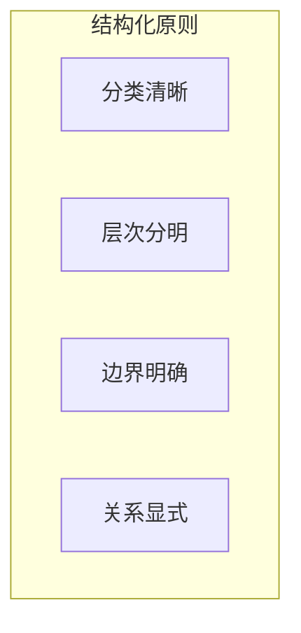

## 7.1 结构化上下文设计

### 7.1.1 为什么需要结构化

将上下文组织成清晰的结构具有多重好处：

1. **消除歧义**：明确区分不同类型的内容
2. **提升理解**：帮助模型快速定位和理解信息
3. **便于维护**：结构化内容更容易更新和管理
4. **支持模块化**：各部分可独立修改和测试

### 7.1.2 结构化的基本原则



**分类清晰**

将内容按功能分类：指令、知识、示例、约束等。每类内容有明确的角色和用途。

**层次分明**

建立清晰的层级结构，重要的高层信息在前，支撑的细节信息在后。

**边界明确**

不同类型的内容之间有清晰的边界，不相互混淆。

**关系显式**

当存在内容之间的关系时，显式标明而非依赖模型推断。

### 7.1.3 上下文的典型结构

一个良好结构化的上下文通常包含以下层次：

```
┌─────────────────────────────────┐
│         系统层 (System)          │
│  角色定义、行为准则、核心约束      │
├─────────────────────────────────┤
│         知识层 (Knowledge)       │
│  参考文档、领域知识、事实数据      │
├─────────────────────────────────┤
│         任务层 (Task)            │
│  当前任务说明、输出要求、示例      │
├─────────────────────────────────┤
│         交互层 (Interaction)     │
│  对话历史、用户输入              │
└─────────────────────────────────┘
```

每一层有不同的特性：

| 层次 | 稳定性 | 更新频率 | 来源 |
|------|--------|----------|------|
| 系统层 | 高 | 版本更新 | 开发者 |
| 知识层 | 中 | 按需检索 | 知识库 |
| 任务层 | 中 | 按任务变化 | 配置/动态 |
| 交互层 | 低 | 每轮对话 | 用户 |

### 7.1.4 结构化的实现方式

#### 使用分隔符

最简单的结构化方式是使用分隔符：

```
### 系统指令 ###
你是一个专业的技术顾问...

### 参考资料 ###
以下是相关的产品文档：...

### 用户问题 ###
请问如何配置...
```

常用分隔符：
- Markdown 标题：`### 标题 ###`
- 分隔线：`---` 或 `===`
- 块标记：`[BEGIN]...[END]`

#### 使用标签

更结构化的方式是使用标签（详见 7.2 节）。

#### 使用 JSON/YAML

对于复杂配置或需要程序处理的场景：

```json
{
  "role": "技术顾问",
  "constraints": ["只回答技术问题", "使用中文"],
  "knowledge": { ... }
}
```

### 7.1.8 结构设计的考量

**信息位置**

不同位置的信息被模型关注的程度不同：
- 开头和结尾的信息通常更受关注
- 中间的长内容可能被忽视（"中间丢失"问题）

策略：
- 最重要的指令放在开头
- 关键约束可以在结尾重申
- 长知识块放在中间

**冗余与精简**

结构化标记本身也占用 Token。需要在清晰度和效率之间平衡。

策略：
- 使用简洁的标记
- 避免过深的嵌套
- 必要时合并相似类别

**模型适配**

不同模型对结构的理解能力不同，需要测试和调整。

### 7.1.9 结构化的效果验证

验证结构化设计效果的方法：

1. **指令遵循测试**：检查模型是否正确理解和执行结构化指令
2. **信息定位测试**：检查模型能否准确引用不同区块的信息
3. **边界测试**：检查模型是否正确区分不同类型的内容
