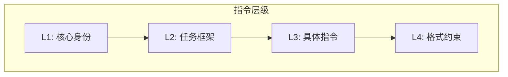

## 7.2 XML 标签与指令分层

### 7.2.1 XML 标签的优势

XML 标签是结构化上下文的强大工具，被 Anthropic 等公司推荐使用：

- **边界清晰**：标签明确标识内容的开始和结束
- **可嵌套**：支持层级结构
- **自描述**：标签名称说明内容类型
- **模型友好**：主流模型都能很好理解

### 7.2.2 基本用法

```xml
<system_instructions>
你是一个专业的数据分析师，擅长解读商业数据。
</system_instructions>

<context>
以下是本季度的销售数据：
...
</context>

<user_query>
请分析销售趋势并给出建议。
</user_query>
```

### 7.2.3 常用标签体系

| 标签 | 用途 | 示例 |
|------|------|------|
| `<instructions>` | 核心指令 | 任务说明、行为规范 |
| `<context>` | 背景信息 | 知识、文档、数据 |
| `<examples>` | 示例内容 | 输入输出示例 |
| `<constraints>` | 约束条件 | 限制、禁止事项 |
| `<format>` | 格式要求 | 输出格式说明 |
| `<user_input>` | 用户输入 | 当前请求 |

### 7.2.4 嵌套结构

复杂场景可以使用嵌套标签：

```xml
<system>
  <role>你是一个代码审查助手</role>
  <capabilities>
    <item>代码质量分析</item>
    <item>安全漏洞检测</item>
    <item>性能优化建议</item>
  </capabilities>
  <constraints>
    <item>只分析提交的代码</item>
    <item>不执行代码</item>
  </constraints>
</system>

<code_to_review language="python">
def calculate_sum(numbers):
    return sum(numbers)
</code_to_review>
```

### 7.2.5 指令分层设计

使用标签实现指令的分层组织：



**L1: 核心身份**

定义模型的基本角色和身份：
```xml
<identity>
你是 TechCorp 的官方客服助手。
</identity>
```

**L2: 任务框架**

定义任务的整体框架和边界：
```xml
<task_framework>
帮助用户解决产品使用问题。
可以查询订单状态、解答产品功能疑问。
涉及退款等敏感操作需要转人工。
</task_framework>
```

**L3: 具体指令**

当前交互的具体指令：
```xml
<current_task>
用户询问产品 X 的使用方法，请提供详细步骤。
</current_task>
```

**L4: 格式约束**

输出的格式要求：
```xml
<output_format>
使用编号列表，每步骤不超过 50 字。
</output_format>
```

### 7.2.6 标签使用最佳实践

**命名规范**

- 使用 snake_case 或 kebab-case
- 名称应自描述
- 保持命名一致性

**避免过度嵌套**

- 一般不超过 3 层嵌套
- 过深的结构增加复杂度

**平衡结构与成本**

- 标签本身消耗 Token
- 简单场景可使用简洁标记

**闭合标签**

- 确保所有标签正确闭合
- 避免遗漏或错配

### 7.2.7 与其他格式的配合

XML 标签可以与其他格式混用：

```xml
<instructions>
请根据以下 JSON 配置生成报告：
</instructions>

<config>
{
  "report_type": "monthly",
  "include_charts": true
}
</config>

<output_format>
使用 Markdown 格式输出报告。
</output_format>
```

### 7.2.8 标签的动态使用

在程序中动态构建带标签的上下文：

```python
def build_context(role, knowledge, query):
    return f"""
<role>{role}</role>
<knowledge>{knowledge}</knowledge>
<query>{query}</query>
"""
```

这种方式便于模块化管理和测试各个组成部分。
