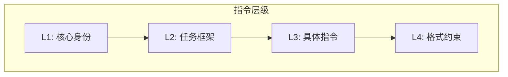

## 7.2 XML 标签与指令分层

### 7.2.1 XML 标签的优势

XML 风格标签是一种常见的结构化上下文方式，在业界实践中被广泛采用：

- **边界清晰**：标签明确标识内容的开始和结束
- **可嵌套**：支持层级结构
- **自描述**：标签名称说明内容类型
- **模型友好**：主流模型都能很好理解

### 7.2.2 基本用法

```xml
<system_instructions>
你是一个专业的数据分析师，擅长解读商业数据。
</system_instructions>

<context>
以下是本季度的销售数据：
...
</context>

<user_query>
请分析销售趋势并给出建议。
</user_query>
```

### 7.2.3 常用标签体系

| 标签 | 用途 | 示例 |
|------|------|------|
| `<instructions>` | 核心指令 | 任务说明、行为规范 |
| `<context>` | 背景信息 | 知识、文档、数据 |
| `<examples>` | 示例内容 | 输入输出示例 |
| `<constraints>` | 约束条件 | 限制、禁止事项 |
| `<format>` | 格式要求 | 输出格式说明 |
| `<user_input>` | 用户输入 | 当前请求 |

### 7.2.4 嵌套结构

复杂场景可以使用嵌套标签：

```xml
<system>
  <role>你是一个代码审查助手</role>
  <capabilities>
    <item>代码质量分析</item>
    <item>安全漏洞检测</item>
    <item>性能优化建议</item>
  </capabilities>
  <constraints>
    <item>只分析提交的代码</item>
    <item>不执行代码</item>
  </constraints>
</system>

<code_to_review language="python">
def calculate_sum(numbers):
    return sum(numbers)
</code_to_review>
```

### 7.2.5 指令分层设计

使用标签实现指令的分层组织：



图 7-2：指令层级结构

**L1: 核心身份**

定义模型的基本角色和身份：
```xml
<identity>
你是 TechCorp 的官方客服助手。
</identity>
```

**L2: 任务框架**

定义任务的整体框架和边界：
```xml
<task_framework>
帮助用户解决产品使用问题。
可以查询订单状态、解答产品功能疑问。
涉及退款等敏感操作需要转人工。
</task_framework>
```

**L3: 具体指令**

当前交互的具体指令：
```xml
<current_task>
用户询问产品 X 的使用方法，请提供详细步骤。
</current_task>
```

**L4: 格式约束**

输出的格式要求：
```xml
<output_format>
使用编号列表，每步骤不超过 50 字。
</output_format>
```

### 7.2.6 标签使用最佳实践

**1. 建立一致的命名规范**

标签命名应该遵循统一的规范。常用的命名风格有两种：snake_case 使用下划线连接单词（如 `user_input`、`search_results`）；kebab-case 使用连字符连接单词（如 `user-input`、`search-results`）。选择哪种风格不重要，重要的是全团队保持一致。标签名称应当自描述，让人一看就知道里面是什么内容——好的命名如 `search_results`、`error_message`；模糊的命名如 `data`、`content` 应该避免。建立团队标签词汇表，新增标签前先查询是否有现成的可复用，避免 `user_input`、`userInput`、`input` 混用的混乱局面。

**2. 控制嵌套层级避免复杂度失控**

XML 标签支持无限嵌套，但过深的嵌套会增加认知负担和出错概率。一般建议不超过 3 层嵌套；如果发现需要更深层级，应重新审视设计是否合理。过深嵌套的常见问题：标签闭合容易出错、模型理解准确率下降、人工维护困难。如果内容本身具有复杂层级，考虑使用扁平化设计配合属性标记，或将不同层级拆分到独立的上下文块中。

**3. 平衡结构清晰与 Token 成本**

标签本身会消耗 Token——每对开闭标签会带来额外开销（具体取决于分词器与标签命名长度）。在简单场景中，过度结构化可能得不偿失。例如只有一段参考文本时，用 `--- 参考资料 ---` 这样的简洁分隔符可能比 `<reference_material>...</reference_material>` 更高效。评估标准是：结构化带来的理解准确率提升是否值得额外的 Token 成本。复杂场景（多个数据源、多层指令）值得投入；简单场景保持简洁。

**4. 确保标签正确闭合防止解析歧义**

未闭合或错配的标签会导致模型对上下文边界的理解混乱。建立严格的检查机制：使用代码自动验证标签配对；在模板中使用变量插值而非手动拼接；测试时专门覆盖标签边界情况。常见错误包括：复制粘贴时遗漏闭合标签、嵌套层级错乱导致闭合顺序颠倒、标签名拼写不一致。出问题时模型不会报错，只会默默产生不可预期的输出。

### 7.2.7 与其他格式的配合

XML 标签可以与其他格式混用：

```xml
<instructions>
请根据以下 JSON 配置生成报告：
</instructions>

<config>
{
  "report_type": "monthly",
  "include_charts": true
}
</config>

<output_format>
使用 Markdown 格式输出报告。
</output_format>
```

### 7.2.8 标签的动态使用

在程序中动态构建带标签的上下文：

```python
def build_context(role, knowledge, query):
    return f"""
<role>{role}</role>
<knowledge>{knowledge}</knowledge>
<query>{query}</query>
"""
```

这种方式便于模块化管理和测试各个组成部分。
