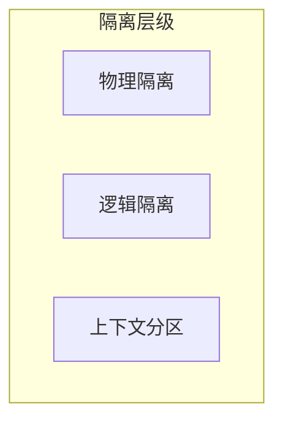
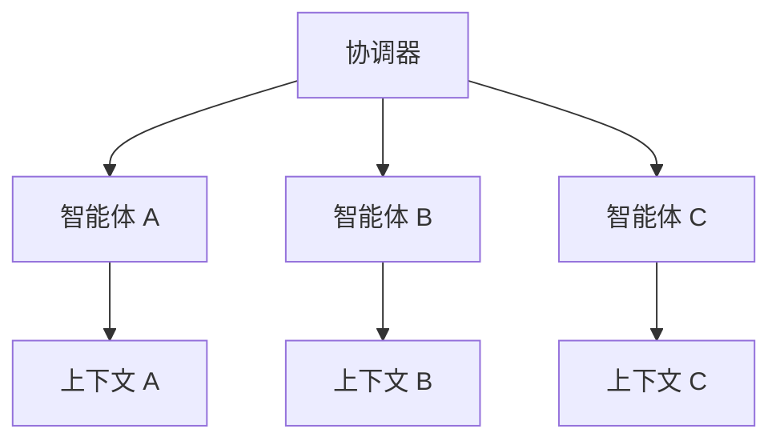

## 7.4 多任务上下文隔离

### 7.4.1 多任务场景的挑战

复杂系统常常需要在同一交互中处理多个任务或子任务。这带来几个挑战：

- **任务混淆**：不同任务的上下文相互干扰
- **优先级冲突**：不同任务可能有矛盾的要求
- **状态管理**：需要追踪多个任务的进展

### 7.4.2 任务隔离的必要性

任务隔离确保：
- 每个任务有独立的上下文环境
- 任务之间的干扰最小化
- 便于独立调试和优化

### 7.4.3 隔离策略



#### 物理隔离

完全独立的调用，每个任务单独处理：

```
任务 A → 独立 API 调用 → 结果 A
任务 B → 独立 API 调用 → 结果 B
任务 C → 独立 API 调用 → 结果 C
```

**优点**：完全隔离，无干扰
**缺点**：无法共享上下文，成本可能更高

**适用场景**：
- 任务完全独立
- 对隔离要求极高
- 可并行执行

#### 逻辑隔离

在同一调用中使用结构隔离不同任务：

```xml
<task_1>
<description>分析销售数据</description>
<context>销售表格数据...</context>
<requirements>输出增长趋势</requirements>
</task_1>

<task_2>
<description>生成营销建议</description>
<context>竞品分析报告...</context>
<requirements>输出 3 条建议</requirements>
</task_2>
```

**优点**：可共享部分上下文，效率较高
**缺点**：仍可能相互影响

**适用场景**：
- 任务有共享背景
- 需要统一协调
- 输出有关联性

#### 上下文分区

将上下文划分为不同区域，按需暴露给不同任务：

```
共享区域：通用规则、基础知识
任务 A 区域：A 专属数据和指令
任务 B 区域：B 专属数据和指令
```

### 7.4.4 多智能体场景的隔离

在多智能体系统中，任务隔离更为重要：



设计要点：
- 每个智能体有独立的上下文
- 协调器管理信息在智能体间的流动
- 避免"上下文膨胀"——不传递不必要的信息

### 7.4.5 上下文传递控制

在任务或智能体之间传递信息时需要控制：

**最小信息原则**

只传递必要的信息，避免冗余：

```
从任务 A 传递到任务 B：
❌ 完整对话历史
✓ 任务 A 的结论摘要
```

**显式接口**

定义清晰的信息传递接口：

```
任务输出格式：
{
  "conclusion": "...",
  "key_facts": [...],
  "next_task_hints": [...]
}
```

**过滤机制**

根据下游任务需求过滤信息：

```
if downstream_task == "summarize":
    pass_context = extract_key_points(full_context)
elif downstream_task == "analyze":
    pass_context = full_context
```

### 7.4.6 隔离的实现模式

#### 会话分离

不同任务使用不同会话 ID：

```
任务 A → session_id: "task_a_001"
任务 B → session_id: "task_b_001"
```

#### 命名空间

在同一上下文中使用命名空间隔离：

```xml
<namespace name="task_a">
  <!-- 任务 A 专属内容 -->
</namespace>

<namespace name="task_b">
  <!-- 任务 B 专属内容 -->
</namespace>
```

#### 作用域控制

明确指定指令的作用范围：

```
以下规则仅适用于分析任务：
- ...

以下规则仅适用于生成任务：
- ...
```

### 7.4.7 最佳实践

1. **默认隔离**：默认采用隔离设计，按需共享

2. **清晰边界**：明确定义任务边界和接口

3. **最小共享**：只共享真正需要的上下文

4. **显式传递**：信息传递应该显式且可控

5. **独立测试**：每个隔离单元可独立测试
