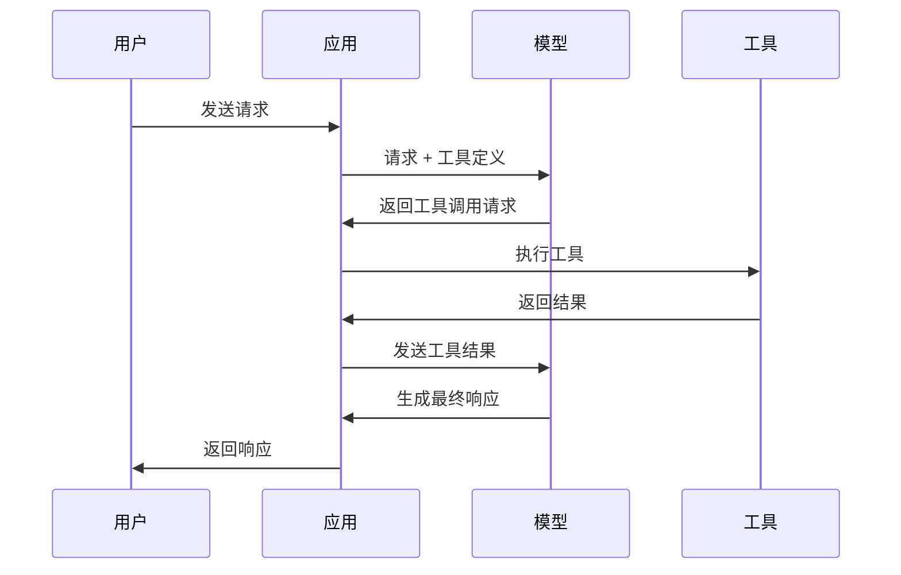

## 8.1 函数调用机制

### 8.1.1 什么是函数调用

**函数调用**（Function Calling）是让大语言模型能够决定调用外部函数的能力。模型不直接执行函数，而是生成结构化的函数调用请求，由应用程序执行实际调用。



### 8.1.2 函数调用的价值

函数调用使模型能够：
- **获取实时数据**：查询天气、股价、新闻
- **执行计算**：进行精确的数学运算
- **操作系统**：读写文件、发送请求
- **访问服务**：调用 API、查询数据库

### 8.1.3 工作原理

#### 工具定义

首先向模型描述可用的工具：

```json
{
  "name": "get_weather",
  "description": "获取指定城市的天气信息",
  "parameters": {
    "type": "object",
    "properties": {
      "city": {
        "type": "string",
        "description": "城市名称"
      },
      "unit": {
        "type": "string",
        "enum": ["celsius", "fahrenheit"],
        "description": "温度单位"
      }
    },
    "required": ["city"]
  }
}
```

#### 模型决策

模型根据用户请求决定是否需要调用工具：

```text
用户：北京今天天气怎么样？

模型决策：需要调用 get_weather 工具
工具调用：get_weather(city="北京", unit="celsius")
```

#### 结果处理

应用执行工具，将结果返回给模型：

```json
{
  "role": "tool",
  "content": "{\"temperature\": 25, \"condition\": \"晴\"}",
  "tool_call_id": "call_123"
}
```

#### 生成响应

模型根据工具结果生成最终答案：

```text
北京今天天气晴朗，气温 25 摄氏度，适合户外活动。
```

### 8.1.4 模型支持情况（概览）

不同厂商与不同模型版本对工具调用的支持细节差异较大，且会随版本迭代变化。这里给出一个按“类型”划分的概览（以各平台最新文档为准）：

| 模型类型 | 函数调用支持 | 典型特点 |
|----------|--------------|----------|
| 商用闭源通用模型 | 通常原生支持 | 协议与参数更统一，工具生态成熟 |
| 商用多模态模型 | 通常原生支持 | 可能支持与多模态输入绑定的工具流程 |
| 开源模型 | 视实现而定 | 可能需要特定指令微调/框架适配，兼容性需压测 |

### 8.1.5 调用模式

#### 自动模式

模型自主决定是否调用：
```json
{"tool_choice": "auto"}
```

#### 强制模式

强制模型调用特定工具：
```json
{"tool_choice": {"type": "function", "function": {"name": "get_weather"}}}
```

#### 禁用模式

禁止工具调用：
```json
{"tool_choice": "none"}
```

### 8.1.6 并行调用

现代模型支持在单次响应中调用多个工具：

```text
用户：告诉我北京和上海的天气

模型响应包含：
- get_weather(city="北京")
- get_weather(city="上海")
```

应用可以并行执行这些调用，提高效率。

### 8.1.7 函数调用与上下文工程

函数调用在上下文中的体现：

1. **工具定义**：作为上下文的一部分传递给模型
2. **调用记录**：工具调用历史成为对话上下文
3. **结果整合**：工具结果需要合适地组织到上下文中

工具定义占用 Token，需要在能力丰富性和上下文效率之间平衡。
