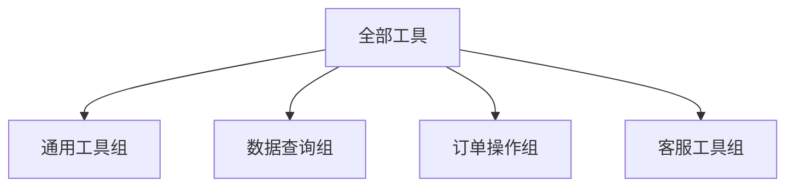

## 8.2 工具定义与设计

### 8.2.1 优秀工具定义的特征

一个优秀的工具定义应该：
- **清晰明确**：模型能准确理解工具的用途
- **参数完整**：所有必要参数都有定义
- **易于使用**：参数设计简洁合理
- **文档充分**：描述和示例足够详细

### 8.2.2 工具定义结构

```json
{
  "name": "search_products",
  "description": "在产品数据库中搜索商品",
  "parameters": {
    "type": "object",
    "properties": {
      "query": {
        "type": "string",
        "description": "搜索关键词"
      },
      "category": {
        "type": "string",
        "enum": ["electronics", "clothing", "books"],
        "description": "产品类别"
      },
      "price_max": {
        "type": "number",
        "description": "最高价格限制"
      },
      "sort_by": {
        "type": "string",
        "enum": ["price", "rating", "newest"],
        "default": "rating",
        "description": "排序方式"
      }
    },
    "required": ["query"]
  }
}
```

### 8.2.3 设计原则

#### 原则一：单一职责

每个工具只做一件事，避免功能过于复杂：

```
❌ 不好：process_order(action, ...)  # 可创建、更新、取消
✓ 好：create_order(...)、update_order(...)、cancel_order(...)
```

#### 原则二：参数设计清晰

参数应该直观、类型明确：

```
❌ 不好：date="20260301"  # 字符串，格式不清
✓ 好：date="2026-03-01"  # ISO 格式，有说明
```

#### 原则三：提供足够的描述

描述应该帮助模型理解何时以及如何使用：

```json
{
  "name": "calculate_shipping",
  "description": "计算订单的运费。当用户询问运费或下单时需要计算运费时调用。需要提供收货地址和商品重量。"
}
```

#### 原则四：合理使用枚举

受限的参数使用枚举限制：

```json
{
  "priority": {
    "type": "string",
    "enum": ["low", "medium", "high"],
    "description": "任务优先级"
  }
}
```

### 8.2.4 常见工具类型

| 类型 | 示例 | 特点 |
|------|------|------|
| 查询类 | 搜索、获取信息 | 只读，无副作用 |
| 操作类 | 创建、更新、删除 | 有副作用，需确认 |
| 计算类 | 数学运算、转换 | 确定性输出 |
| 通信类 | 发送邮件、消息 | 外部影响 |

### 8.2.5 工具数量的权衡

工具数量影响效果和成本：

- **太少**：能力受限
- **太多**：模型选择困难、Token 开销大

建议：
- 核心场景所需工具优先
- 动态加载相关工具
- 按场景分组管理

### 8.2.6 工具分组策略

将工具按功能分组，动态加载：



根据对话场景选择加载哪个工具组。

### 8.2.7 工具文档最佳实践

**描述模板**

```
[用途]。当[触发条件]时调用。[返回内容概述]。
```

示例：
```
获取用户的订单历史。当用户询问过去的订单或购买记录时调用。返回订单列表，包含订单号、日期、金额和状态。
```

**参数说明**

每个参数都应有清晰的描述，必要时给出示例：

```json
{
  "phone": {
    "type": "string",
    "description": "用户手机号码，格式如 13812345678"
  }
}
```

### 8.2.8 工具测试

工具定义需要测试：

1. **理解测试**：模型是否能正确理解何时调用
2. **参数测试**：参数提取是否准确
3. **边界测试**：模糊情况如何处理
4. **拒绝测试**：无关请求是否不会调用
