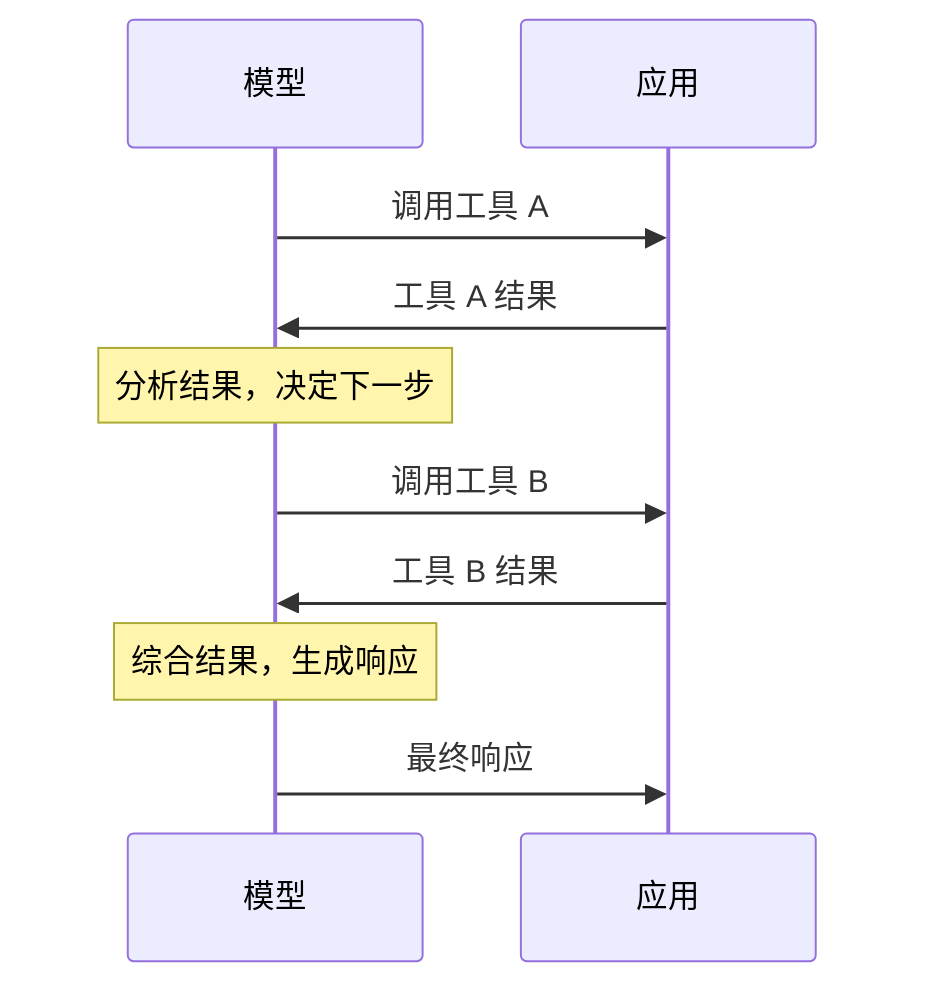
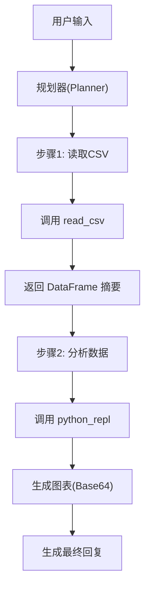

## 8.3 工具执行与结果处理

### 8.3.1 工具执行流程


图 8-3：工具执行流程

### 8.3.2 参数验证

在执行前验证参数的有效性：

```python
def validate_params(tool_name, params, schema):
    # 检查必需参数
    for required in schema.get("required", []):
        if required not in params:
            raise ValueError(f"缺少必需参数: {required}")
    
    # 检查参数类型
    for key, value in params.items():
        expected_type = schema["properties"][key]["type"]
        if not isinstance(value, TYPE_MAP[expected_type]):
            raise TypeError(f"参数 {key} 类型错误")
    
    # 检查枚举值
    for key, value in params.items():
        if "enum" in schema["properties"][key]:
            if value not in schema["properties"][key]["enum"]:
                raise ValueError(f"参数 {key} 值无效")
```

### 8.3.3 执行策略

#### 同步执行

简单场景，等待执行完成：

```python
result = execute_tool(tool_name, params)
```

#### 异步执行

IO 密集型或耗时操作：

```python
async def execute_tools(tool_calls):
    tasks = [execute_tool_async(tc) for tc in tool_calls]
    results = await asyncio.gather(*tasks)
    return results
```

#### 超时控制

防止工具执行无限等待：

```python
try:
    result = await asyncio.wait_for(
        execute_tool(tool_name, params),
        timeout=30.0
    )
except asyncio.TimeoutError:
    result = {"error": "执行超时"}
```

### 8.3.4 结果格式化

将工具结果格式化为模型易理解的形式：

**简洁输出**

```json
{
  "status": "success",
  "data": {
    "temperature": 25,
    "condition": "晴"
  }
}
```

**包含上下文**

```json
{
  "query": "北京天气",
  "result": {
    "city": "北京",
    "temperature": 25,
    "condition": "晴",
    "humidity": 45
  },
  "data_time": "2026-03-01 10:00"
}
```

### 8.3.5 错误处理

工具执行可能失败，需要优雅处理：

#### 错误类型分类

| 错误类型 | 处理方式 | 反馈给模型 |
|----------|----------|------------|
| 参数错误 | 不执行 | 说明具体问题 |
| 执行失败 | 记录日志 | 返回错误信息 |
| 超时 | 终止执行 | 建议稍后重试 |
| 权限不足 | 拒绝执行 | 说明权限要求 |

#### 错误信息模板

```json
{
  "status": "error",
  "error_type": "execution_failed",
  "message": "无法连接到天气服务",
  "suggestion": "请稍后再试或换一个城市查询"
}
```

### 8.3.6 结果注入上下文

工具结果需要正确注入对话上下文：

```json
{
  "role": "assistant",
  "content": null,
  "tool_calls": [{
    "id": "call_abc123",
    "type": "function",
    "function": {
      "name": "get_weather",
      "arguments": "{\"city\": \"北京\"}"
    }
  }]
},
{
  "role": "tool",
  "tool_call_id": "call_abc123",
  "content": "{\"temperature\": 25, \"condition\": \"晴\"}"
}
```

### 8.3.7 结果压缩

工具返回大量数据时可能需要压缩：

```python
def compress_result(result, max_tokens=500):
    if count_tokens(result) > max_tokens:
        # 提取关键信息
        return summarize(result)
    return result
```

### 8.3.8 多轮工具调用

复杂任务可能需要多轮工具调用：



图 8-4：多轮工具调用流程

每轮结果都成为上下文的一部分，影响后续决策。

### 8.3.9 安全考虑

工具执行涉及安全风险：

1. **输入验证**：防止注入攻击
2. **权限控制**：验证操作权限
3. **操作审计**：记录敏感操作
4. **确认机制**：危险操作需人工确认

### 8.3.10 高级工具执行技术

随着智能体需要使用的工具数量增长，传统的工具调用方式面临挑战。以下介绍两项高级技术：

#### 工具搜索工具

**问题**：当连接多个 MCP 服务器时，工具定义可能消耗大量 Token（规模取决于工具数量、Schema 复杂度与描述长度）：

**解决方案**：不预加载所有工具，而是按需发现。

```json
{
  "tools": [
    {"type": "tool_search_tool", "name": "tool_search"},
    {
      "name": "github.createPullRequest",
      "defer_loading": true
    }
  ]
}
```

**效果（常见观察）**：
- 只暴露必要工具可以显著降低上下文开销
- 工具选择更聚焦，误调用与歧义通常会减少

#### 编程式工具调用

**问题**：传统工具调用有两个瓶颈：
1. 中间结果污染上下文（分析 10MB 日志文件，全部进入上下文）
2. 每次调用需要一次推理，开销大

**解决方案**：让模型通过代码编排工具，而非逐个 API 调用。

```python
# 模型生成的编排代码
team = await get_team_members("engineering")
expenses = await asyncio.gather(*[
    get_expenses(m["id"], "Q3") for m in team
])
# 只返回超预算的人员
exceeded = [m for m, e in zip(team, expenses) if sum(e) > limit]
print(json.dumps(exceeded))
```

**效果（常见观察）**：
- 上下文只接收最终结果而非原始数据，通常能显著降低 Token 消耗
- 降低中间结果“污染上下文”的概率，并减少不必要的多轮推理

**使用指南**：

| 技术 | 适用场景 |
|------|----------|
| Tool Search Tool | 工具定义 >10K Token、10+ 工具 |
| Programmatic Tool Calling | 处理大数据集只需摘要、3+ 步依赖工具调用 |

### 8.3.11 工程实战：端到端数据分析助手

以下展示一个完整的数据分析助手工作流，包含规划、执行、结果处理和上下文更新。

**场景**：用户上传 CSV 文件并要求：“分析上季度的销售趋势，并画图展示。”

**流程图**：



图 8-5：端到端数据分析工作流

**关键代码实现逻辑**：

```python
async def run_analysis_agent(user_query, context):
    messages = context + [{"role": "user", "content": user_query}]
    
    # 1. 规划阶段
    plan = await llm.plan(messages)
    # output: 1. read_csv, 2. analyze_trend, 3. plot_chart
    
    results = {}
    
    for step in plan.steps:
        # 2. 执行阶段
        tool_name = step.tool
        tool_args = step.args
        
        try:
            # 3. 结果处理
            # 仅截取前5行数据作为上下文，避免 Token 爆炸
            raw_result = await tools.execute(tool_name, tool_args)
            processed_result = truncate_dataframe(raw_result) 
            
            # 注入当前步骤结果到上下文
            messages.append({
                "role": "function", 
                "name": tool_name, 
                "content": processed_result
            })
            
        except Exception as e:
            # 错误恢复机制
            messages.append({"role": "system", "content": f"工具执行失败: {str(e)}，请尝试其他方法"})
            continue
            
    # 4. 生成最终回复
    final_response = await llm.chat(messages)
    return final_response
```

### 8.3.12 核心指标与评估

在生产环境中，需要关注以下指标来衡量工具执行系统的健康度：

| 指标 | 目标值（示意） | 说明 |
|------|--------|------|
| **执行成功率** | 以基线提升为目标 | 工具调用无异常（Crash/Timeout）的比例 |
| **参数准确率** | 以基线提升为目标 | 模型生成的参数符合 Schema 定义且逻辑正确 |
| **平均延迟** | 取决于工具与 SLO | 工具本身的执行耗时（不含 LLM 推理） |
| **幻觉率** | 越低越好 | 调用了不存在的工具或虚构了参数 |
| **Token 效率** | 越高越好 | 原始工具结果 vs 注入上下文的结果大小 |

**优化建议**：
- 对于高频且低延迟要求的工具（如查天气），使用本地逻辑而非 LLM 规划。
- 对于易错的复杂参数（如 SQL），在 System Prompt 中提供 Few-Shot 示例。
