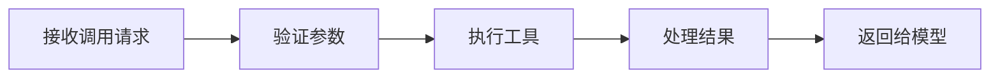
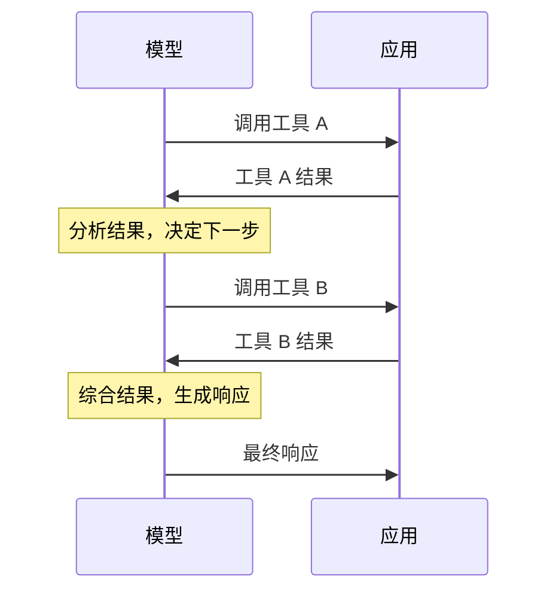

## 8.3 工具执行与结果处理

### 8.3.1 工具执行流程



### 8.3.2 参数验证

在执行前验证参数的有效性：

```python
def validate_params(tool_name, params, schema):
    # 检查必需参数
    for required in schema.get("required", []):
        if required not in params:
            raise ValueError(f"缺少必需参数: {required}")
    
    # 检查参数类型
    for key, value in params.items():
        expected_type = schema["properties"][key]["type"]
        if not isinstance(value, TYPE_MAP[expected_type]):
            raise TypeError(f"参数 {key} 类型错误")
    
    # 检查枚举值
    for key, value in params.items():
        if "enum" in schema["properties"][key]:
            if value not in schema["properties"][key]["enum"]:
                raise ValueError(f"参数 {key} 值无效")
```

### 8.3.3 执行策略

#### 同步执行

简单场景，等待执行完成：

```python
result = execute_tool(tool_name, params)
```

#### 异步执行

IO 密集型或耗时操作：

```python
async def execute_tools(tool_calls):
    tasks = [execute_tool_async(tc) for tc in tool_calls]
    results = await asyncio.gather(*tasks)
    return results
```

#### 超时控制

防止工具执行无限等待：

```python
try:
    result = await asyncio.wait_for(
        execute_tool(tool_name, params),
        timeout=30.0
    )
except asyncio.TimeoutError:
    result = {"error": "执行超时"}
```

### 8.3.4 结果格式化

将工具结果格式化为模型易理解的形式：

**简洁输出**

```json
{
  "status": "success",
  "data": {
    "temperature": 25,
    "condition": "晴"
  }
}
```

**包含上下文**

```json
{
  "query": "北京天气",
  "result": {
    "city": "北京",
    "temperature": 25,
    "condition": "晴",
    "humidity": 45
  },
  "data_time": "2026-03-01 10:00"
}
```

### 8.3.5 错误处理

工具执行可能失败，需要优雅处理：

#### 错误类型分类

| 错误类型 | 处理方式 | 反馈给模型 |
|----------|----------|------------|
| 参数错误 | 不执行 | 说明具体问题 |
| 执行失败 | 记录日志 | 返回错误信息 |
| 超时 | 终止执行 | 建议稍后重试 |
| 权限不足 | 拒绝执行 | 说明权限要求 |

#### 错误信息模板

```json
{
  "status": "error",
  "error_type": "execution_failed",
  "message": "无法连接到天气服务",
  "suggestion": "请稍后再试或换一个城市查询"
}
```

### 8.3.6 结果注入上下文

工具结果需要正确注入对话上下文：

```json
{
  "role": "assistant",
  "content": null,
  "tool_calls": [{
    "id": "call_abc123",
    "type": "function",
    "function": {
      "name": "get_weather",
      "arguments": "{\"city\": \"北京\"}"
    }
  }]
},
{
  "role": "tool",
  "tool_call_id": "call_abc123",
  "content": "{\"temperature\": 25, \"condition\": \"晴\"}"
}
```

### 8.3.7 结果压缩

工具返回大量数据时可能需要压缩：

```python
def compress_result(result, max_tokens=500):
    if count_tokens(result) > max_tokens:
        # 提取关键信息
        return summarize(result)
    return result
```

### 8.3.8 多轮工具调用

复杂任务可能需要多轮工具调用：



每轮结果都成为上下文的一部分，影响后续决策。

### 8.3.9 安全考虑

工具执行涉及安全风险：

1. **输入验证**：防止注入攻击
2. **权限控制**：验证操作权限
3. **操作审计**：记录敏感操作
4. **确认机制**：危险操作需人工确认
