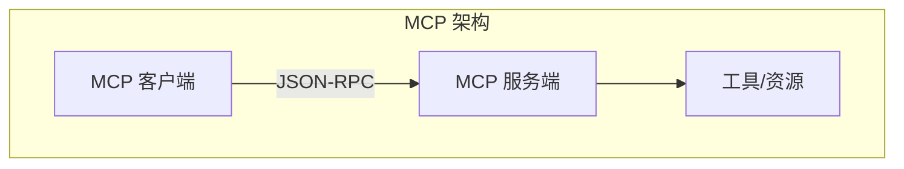

## 8.4 MCP 协议与工具标准化

### 8.4.1 MCP 协议简介

**Model Context Protocol**（MCP）是 Anthropic 提出的开放标准协议，旨在标准化 AI 模型与外部工具、资源的交互方式。

MCP 解决的核心问题：
- 缺乏统一的工具交互标准
- 不同模型/应用的工具集成方式各异
- 工具能力难以复用

### 8.4.2 MCP 架构



**主要组件**：

- **MCP 客户端**：集成到 AI 应用中，发起请求
- **MCP 服务端**：提供工具和资源的接口
- **传输层**：支持多种传输方式（stdio、HTTP）

### 8.4.3 MCP 核心概念

#### 工具（Tools）

可执行的函数，类似于函数调用：

```json
{
  "name": "read_file",
  "description": "读取指定路径的文件内容",
  "inputSchema": {
    "type": "object",
    "properties": {
      "path": {"type": "string"}
    },
    "required": ["path"]
  }
}
```

#### 资源（Resources）

可读取的数据源，如文件、API 端点：

```json
{
  "uri": "file://config.json",
  "name": "配置文件",
  "mimeType": "application/json"
}
```

#### 提示模板（Prompts）

预定义的提示词模板：

```json
{
  "name": "code_review",
  "description": "代码审查提示模板",
  "arguments": [
    {"name": "code", "required": true}
  ]
}
```

### 8.4.4 MCP 的优势

1. **标准化**：统一的协议减少集成成本
2. **可组合**：不同 MCP 服务可以组合使用
3. **跨平台**：同一服务可被不同客户端使用
4. **生态系统**：日益丰富的预构建服务

### 8.4.5 MCP 服务示例

**文件系统服务**

提供文件读写能力：
- `read_file`：读取文件
- `write_file`：写入文件
- `list_directory`：列出目录

**数据库服务**

提供数据库访问：
- `query`：执行查询
- `describe_schema`：获取表结构

**网页服务**

提供网页访问：
- `fetch_url`：获取网页内容
- `search`：搜索网页

### 8.4.6 实现 MCP 服务

简单的 MCP 服务实现框架：

```python
from mcp import Server

server = Server("my-service")

@server.tool()
async def my_tool(param: str) -> str:
    """工具描述"""
    result = process(param)
    return result

@server.resource("config://main")
async def get_config() -> str:
    """获取配置"""
    return load_config()

if __name__ == "__main__":
    server.run()
```

### 8.4.7 MCP 与上下文工程

MCP 影响上下文工程的多个方面：

**工具定义管理**

通过 MCP 服务发现机制动态获取可用工具。

**资源访问**

MCP 资源可以作为上下文的信息源。

**上下文标准化**

MCP 促进了上下文处理方式的标准化。

### 8.4.8 未来展望

MCP 协议正在快速发展：

- 更多模型厂商的支持
- 更丰富的预构建服务生态
- 更完善的安全和权限机制
- 与主流框架的深度集成

MCP 有望成为 AI 工具交互的事实标准，值得关注和投入。
