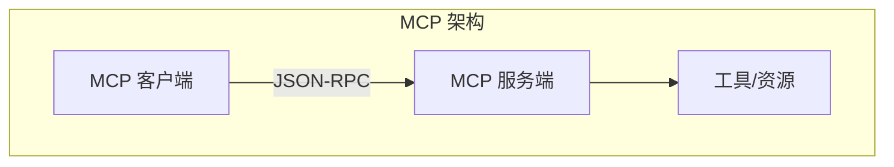

## 8.4 MCP 协议与工具标准化

### 8.4.1 MCP 协议简介

**Model Context Protocol**（MCP）是一种开放协议规范，旨在标准化 AI 模型与外部工具、资源的交互方式。

MCP 解决的核心问题：
- 缺乏统一的工具交互标准
- 不同模型/应用的工具集成方式各异
- 工具能力难以复用

### 8.4.2 MCP 架构



**主要组件**：

- **MCP 客户端**：集成到 AI 应用中，发起请求
- **MCP 服务端**：提供工具和资源的接口
- **传输层**：支持多种传输方式（stdio、HTTP）

### 8.4.3 MCP 核心概念

MCP 协议定义了三种核心原语（Primitives），它们的数据结构遵循协议规范，格式是固定的。这种标准化使得不同实现之间能够互操作——任何符合规范的客户端都能调用任何符合规范的服务端。

#### 工具（Tools）

可执行的函数，类似于函数调用。格式包含 `name`（工具名称）、`description`（描述）和 `inputSchema`（参数定义，遵循 JSON Schema 格式）：

```json
{
  "name": "read_file",
  "description": "读取指定路径的文件内容",
  "inputSchema": {
    "type": "object",
    "properties": {
      "path": {"type": "string"}
    },
    "required": ["path"]
  }
}
```

#### 资源（Resources）

可读取的数据源，如文件、数据库、API 端点等。格式包含 `uri`（资源唯一标识符）、`name`（显示名称），以及可选的 `mimeType`（内容类型）和 `description`：

```json
{
  "uri": "file://config.json",
  "name": "配置文件",
  "mimeType": "application/json"
}
```

#### 提示模板（Prompts）

预定义的提示词模板，便于复用常见的交互模式。格式包含 `name`（模板名称）、`description`（描述），以及可选的 `arguments`（参数列表）：

```json
{
  "name": "code_review",
  "description": "代码审查提示模板",
  "arguments": [
    {"name": "code", "required": true}
  ]
}
```

### 8.4.4 MCP 的优势

1. **标准化**：统一的协议减少集成成本
2. **可组合**：不同 MCP 服务可以组合使用
3. **跨平台**：同一服务可被不同客户端使用
4. **生态系统**：日益丰富的预构建服务

### 8.4.5 MCP 服务示例

**文件系统服务**

提供文件读写能力：
- `read_file`：读取文件
- `write_file`：写入文件
- `list_directory`：列出目录

**数据库服务**

提供数据库访问：
- `query`：执行查询
- `describe_schema`：获取表结构

**网页服务**

提供网页访问：
- `fetch_url`：获取网页内容
- `search`：搜索网页

### 8.4.6 实现 MCP 服务

简单的 MCP 服务实现框架：

```python
from mcp.server.fastmcp import FastMCP

server = FastMCP("my-service")

@server.tool()
async def my_tool(param: str) -> str:
    """工具描述"""
    result = process(param)
    return result

@server.resource("config://main")
async def get_config() -> str:
    """获取配置"""
    return load_config()

if __name__ == "__main__":
    server.run()
```

### 8.4.7 MCP 与上下文工程

MCP 影响上下文工程的多个方面：

**工具定义管理**

通过 MCP 服务发现机制动态获取可用工具。

**资源访问**

MCP 资源可以作为上下文的信息源。

**上下文标准化**

MCP 促进了上下文处理方式的标准化。

### 8.4.8 未来展望

MCP 协议正在快速发展。不同客户端、IDE 与模型平台对 MCP 的支持程度可能不同，且会随版本迭代变化；在做技术选型时建议以对应项目与产品的最新文档为准。

### 8.4.9 实战案例：构建 GitHub MCP Server

以下是一个 GitHub MCP Server 的**示意性**实现，用于展示如何同时提供 Tools、Resources 和 Prompts。

#### 完整代码实现

```python
from mcp.server.fastmcp import FastMCP
import httpx

# 初始化 MCP Server
mcp = FastMCP("github-server")
GITHUB_TOKEN = "your_token_here"  # 实际使用时从环境变量读取；不要硬编码密钥

# ============ Tools：可执行的操作 ============

@mcp.tool()
async def search_repos(query: str, language: str = None) -> str:
    """搜索 GitHub 仓库
    
    Args:
        query: 搜索关键词
        language: 可选，编程语言过滤
    """
    search_query = f"{query} language:{language}" if language else query
    async with httpx.AsyncClient() as client:
        resp = await client.get(
            "https://api.github.com/search/repositories",
            params={"q": search_query, "per_page": 5},
            headers={"Authorization": f"Bearer {GITHUB_TOKEN}"}
        )
        repos = resp.json().get("items", [])
        return "\n".join([
            f"- {r['full_name']} ⭐{r['stargazers_count']}: {r['description']}"
            for r in repos
        ])

@mcp.tool()
async def create_issue(repo: str, title: str, body: str) -> str:
    """在指定仓库创建 Issue
    
    Args:
        repo: 仓库全名，如 owner/repo
        title: Issue 标题
        body: Issue 内容
    """
    async with httpx.AsyncClient() as client:
        resp = await client.post(
            f"https://api.github.com/repos/{repo}/issues",
            json={"title": title, "body": body},
            headers={"Authorization": f"Bearer {GITHUB_TOKEN}"}
        )
        if resp.status_code == 201:
            return f"Issue 创建成功: {resp.json()['html_url']}"
        return f"创建失败: {resp.text}"

# ============ Resources：可读取的数据 ============

@mcp.resource("github://repos/{owner}/{repo}/readme")
async def get_readme(owner: str, repo: str) -> str:
    """获取仓库的 README 内容"""
    async with httpx.AsyncClient() as client:
        resp = await client.get(
            f"https://api.github.com/repos/{owner}/{repo}/readme",
            headers={
                "Authorization": f"Bearer {GITHUB_TOKEN}",
                "Accept": "application/vnd.github.raw"
            }
        )
        return resp.text if resp.status_code == 200 else "README 未找到"

@mcp.resource("github://user/starred")
async def get_starred() -> str:
    """获取用户 Star 的仓库列表"""
    async with httpx.AsyncClient() as client:
        resp = await client.get(
            "https://api.github.com/user/starred",
            headers={"Authorization": f"Bearer {GITHUB_TOKEN}"}
        )
        repos = resp.json()[:10]
        return "\n".join([f"- {r['full_name']}" for r in repos])

# ============ Prompts：预定义模板 ============

@mcp.prompt()
def code_review_prompt(repo: str, pr_number: int) -> str:
    """生成代码审查的提示词模板"""
    return f"""请审查 {repo} 仓库的 PR #{pr_number}。

审查要点：
1. 代码逻辑是否正确
2. 是否有潜在的性能问题
3. 代码风格是否符合规范
4. 是否有足够的测试覆盖

请先获取 PR 详情，然后逐一分析。"""

@mcp.prompt()
def issue_template(title: str) -> str:
    """生成 Issue 创建模板"""
    return f"""请创建一个规范的 GitHub Issue。

标题: {title}

请按以下格式填写内容：
## 问题描述
[简述问题]

## 复现步骤
1. 
2. 

## 期望行为
[描述期望的正确行为]

## 环境信息
- 操作系统:
- 版本号:"""

# 运行服务
if __name__ == "__main__":
    mcp.run()
```

#### 配置和使用

**1. 安装依赖**：
```bash
pip install mcp httpx
```

**2. 在 Claude Desktop 中配置**（`claude_desktop_config.json`）：
```json
{
  "mcpServers": {
    "github": {
      "command": "python",
      "args": ["/path/to/github_server.py"],
      "env": {
        "GITHUB_TOKEN": "your_token_here"
      }
    }
  }
}
```

**3. 使用示例**：
```
用户: 帮我搜索 Python 的 RAG 相关项目
助手: [调用 search_repos(query="RAG", language="python")]
       找到以下项目：
       - langchain-ai/langchain ⭐75000: LLM 应用开发框架
       - run-llama/llama_index ⭐30000: 数据框架连接 LLM
       ...
```

**踩坑经验**：
- Token 权限要最小化，只授予必需的 scope
- 异步 HTTP 客户端比同步更适合 MCP Server
- 复杂操作应拆分为多个小工具，而非一个大工具
