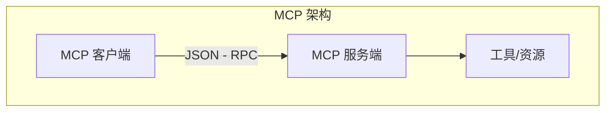

## 8.4 模型上下文协议与工具标准化

### 8.4.1 协议简介

**Model Context Protocol**（MCP）是一种开放协议规范，旨在标准化 AI 模型与外部工具、资源的交互方式。

MCP 解决的核心问题：
- 缺乏统一的工具交互标准
- 不同模型/应用的工具集成方式各异
- 工具能力难以复用

### 8.4.2 协议架构


```mermaid
graph TB
    subgraph "MCP 架构"
        A["MCP 客户端"]
        B["MCP 服务端"]
        C["工具/资源"]
    end

    A --> |"JSON - RPC"| B
    B --> C
```

图 8-6：MCP 架构图

**主要组件**：

- **MCP 客户端**：集成到 AI 应用中，发起请求
- **MCP 服务端**：提供工具和资源的接口
- **传输层**：支持多种传输方式（stdio、HTTP）

#### MCP 传输与 JSON-RPC 2.0 详解

MCP 基于 **JSON-RPC 2.0** 作为消息传输标准，在客户端和服务端之间进行结构化的远程过程调用。JSON-RPC 2.0 定义了请求、响应、通知三种消息类型，每个消息包含必要的版本、方法名、参数和ID信息。

**传输层演进**：

最新的 MCP 规范支持两类传输：
- **stdio**：经典的标准输入输出流，适合本地进程通信和容器化部署
- **Streamable HTTP**：新一代的 HTTP 传输方案，替代了早期的 HTTP+SSE 组合，支持更高效的双向流式通信，特别是对长连接和大型响应流有更好的支持

#### OAuth 2.1 与安全认证

在生产环境中，MCP 服务端通常需要进行身份认证和授权。新版 MCP 协议集成了 **OAuth 2.1** 标准，用于安全地获取和验证访问令牌：

- **Authorization Endpoint**：用户授权端点，获取授权码
- **Token Exchange**：通过授权码交换访问令牌
- **Token Validation**：服务端验证令牌有效性和权限范围
- **Scope Control**：细粒度权限控制，限制客户端的访问范围

这确保了即使客户端与服务端通过不安全的网络通信，也能保护敏感操作（如数据修改、删除）。

#### Origin 验证与本地绑定

为防止恶意来源的请求，MCP 协议引入了：

- **Origin Validation**：验证请求来自合法的客户端源
- **Localhost Binding**：对本地部署的服务端，可以限制只接受本机（127.0.0.1）的连接，防止网络攻击

这些机制构成了 MCP 协议在分布式系统中的安全基础。

### 8.4.3 核心概念

MCP 的早期介绍通常聚焦三类最常见的基础构件：**工具（Tools）**、**资源（Resources）** 和 **提示模板（Prompts）**。较新的规范与社区讨论还在探索面向长时任务的 **Tasks** 一类能力，但对读者来说，更稳妥的教学口径仍然是：先把 Tools / Resources / Prompts 作为稳定核心概念，再把 Tasks 视为正在扩展中的高级能力，不要默认所有实现都已支持。

#### 工具

可执行的函数，类似于函数调用。格式包含 `name`（工具名称）、`description`（描述）和 `inputSchema`（参数定义，遵循 JSON Schema 格式）：

```json
{
  "name": "read_file",
  "description": "读取指定路径的文件内容",
  "inputSchema": {
    "type": "object",
    "properties": {
      "path": {"type": "string"}
    },
    "required": ["path"]
  }
}
```

#### 资源

可读取的数据源，如文件、数据库、API 端点等。格式包含 `uri`（资源唯一标识符）、`name`（显示名称），以及可选的 `mimeType`（内容类型）和 `description`：

```json
{
  "uri": "file://config.json",
  "name": "配置文件",
  "mimeType": "application/json"
}
```

#### 提示模板

预定义的提示词模板，便于复用常见的交互模式。格式包含 `name`（模板名称）、`description`（描述），以及可选的 `arguments`（参数列表）：

```json
{
  "name": "code_review",
  "description": "代码审查提示模板",
  "arguments": [
    {"name": "code", "required": true}
  ]
}
```

#### 任务

用于表示可能持续较长时间的工作单元，例如批量索引、长时爬取或异步分析。相比“一次请求立即返回”的工具调用，任务更强调状态跟踪、进度查询和结果延迟获取：

```json
{
  "id": "task-123",
  "status": "running",
  "progress": {
    "total": 100,
    "completed": 45
  }
}
```

### 8.4.4 协议优势

1. **标准化**：统一的协议减少集成成本
2. **可组合**：不同 MCP 服务可以组合使用
3. **跨平台**：同一服务可被不同客户端使用
4. **生态系统**：日益丰富的预构建服务

### 8.4.5 服务示例

**文件系统服务**

提供文件读写能力：
- `read_file`：读取文件
- `write_file`：写入文件
- `list_directory`：列出目录

**数据库服务**

提供数据库访问：
- `query`：执行查询
- `describe_schema`：获取表结构

**网页服务**

提供网页访问：
- `fetch_url`：获取网页内容
- `search`：搜索网页

### 8.4.6 实现服务

简单的 MCP 服务实现框架：

```python
from mcp.server.fastmcp import FastMCP

server = FastMCP("my-service")

@server.tool()
async def my_tool(param: str) -> str:
    """工具描述"""
    result = process(param)
    return result

@server.resource("config://main")
async def get_config() -> str:
    """获取配置"""
    return load_config()

if __name__ == "__main__":
    server.run()
```

### 8.4.7 MCP与上下文工程的深度融合

MCP 不仅仅是工具调用的标准化协议，更是上下文工程的关键基础设施。理解 MCP 如何影响上下文工程的各个环节至关重要。


**传统方法的限制**：
```text
用户查询 → 检索系统 → 向量库 → 上下文
```

问题：
- 向量库中的信息可能陈旧
- 对高频实时数据的支持通常依赖增量索引、缓存刷新或直连数据源，工程复杂度更高
- 多个数据源的集成复杂

**基于MCP的上下文获取**：
```text
用户查询 → 查询规划 → MCP 服务发现 → 多个Resources
                        ├─ 文件系统 (file://)
                        ├─ 数据库 (db://)
                        ├─ API (http://)
                        └─ 实时数据源 (stream://)
                        → 动态上下文组装
```

**实现示例**：
```python
# 示意性伪代码：不同 MCP 客户端的具体方法名会不同
class MCPContextAggregator:
    """使用 MCP 聚合来自多个源的上下文"""

    def __init__(self, mcp_servers: dict):
        """
        mcp_servers: {
            'filesystem': MCPClient(...),
            'database': MCPClient(...),
            'api': MCPClient(...)
        }
        """
        self.servers = mcp_servers

    async def gather_context(self, query: str, context_type: str) -> str:
        """
        根据查询类型从不同的MCP服务获取上下文
        """
        context_parts = []

        # 优先级1：从数据库获取结构化数据
        if 'database' in self.servers:
            db_context = await self.servers['database'].read_resource(
                f"db://query/{context_type}"
            )
            if db_context:
                context_parts.append(f"【结构化数据】\n{db_context}")

        # 优先级2：从文件系统获取文档
        if 'filesystem' in self.servers:
            file_context = await self.servers['filesystem'].read_resource(
                f"file://docs/{context_type}/"
            )
            if file_context:
                context_parts.append(f"【文档内容】\n{file_context}")

        # 优先级3：从API获取实时数据
        if 'api' in self.servers:
            api_context = await self.servers['api'].read_resource(
                f"http://api/context?type={context_type}"
            )
            if api_context:
                context_parts.append(f"【实时数据】\n{api_context}")

        return "\n---\n".join(context_parts)
```

**关键优势**：
- **动态性**：资源可以是实时数据，无需预构建向量库
- **多源融合**：天然支持来自不同系统的数据整合
- **可扩展性**：新增数据源仅需接入新的MCP服务器
- **信息溯源**：资源URI明确指示数据来源

#### MCP Tools 扩展上下文操作

**上下文不仅是输入，也可能需要在推理过程中动态变换**。MCP Tools 提供了这种能力：

```python
# 示意性伪代码：用于说明如何把 MCP Tools 作为上下文处理算子
class MCPContextManipulator:
    """使用MCP工具在推理过程中变换上下文"""

    def __init__(self, mcp_tools: dict):
        """
        mcp_tools: {
            'compress': Tool,
            'filter': Tool,
            'enrich': Tool,
            'translate': Tool
        }
        """
        self.tools = mcp_tools

    async def compress_context(self, context: str, ratio: float = 0.5) -> str:
        """使用MCP工具压缩上下文"""
        result = await self.tools['compress'].execute(
            context=context,
            compression_ratio=ratio
        )
        return result['compressed']

    async def filter_context(self, context: str, keywords: list) -> str:
        """过滤上下文，仅保留相关部分"""
        result = await self.tools['filter'].execute(
            context=context,
            keep_keywords=keywords
        )
        return result['filtered']

    async def enrich_context(self, context: str, knowledge_bases: list) -> str:
        """使用知识库丰富上下文"""
        result = await self.tools['enrich'].execute(
            context=context,
            sources=knowledge_bases
        )
        return result['enriched']

    async def translate_context(self, context: str, target_language: str) -> str:
        """将上下文翻译为目标语言"""
        result = await self.tools['translate'].execute(
            text=context,
            target_lang=target_language
        )
        return result['translated']
```

**使用场景**：
1. **即时压缩**：当上下文超过限制时，动态调用压缩工具
2. **关键词过滤**：提取与查询相关的上下文片段
3. **跨语言支持**：自动翻译外语上下文
4. **知识增强**：在推理中动态调用知识库

#### MCP Prompts 标准化提示词模式

MCP Prompts 规范化了上下文的呈现方式，使得提示词设计可复用和版本管理：

```python
# 示意性伪代码：模板获取与渲染接口因客户端而异
class MCPPromptManager:
    """使用MCP Prompts标准化上下文呈现"""

    def __init__(self, mcp_prompt_server):
        """
        mcp_prompt_server: 提供预定义提示词模板的MCP服务器
        """
        self.prompt_server = mcp_prompt_server

    async def build_rag_prompt(self,
                              query: str,
                              retrieved_docs: list,
                              system_context: str = None) -> str:
        """
        使用标准化的RAG提示词模板构建提示

        MCP服务器可提供以下模板：
        - rag/basic: 基础RAG模板
        - rag/cite: 带引文的RAG
        - rag/reasoning: 带推理步骤的RAG
        """

        # 获取模板
        template = await self.prompt_server.get_prompt(
            name="rag/reasoning",
            version="1.0"
        )

        # 填充上下文
        prompt = template.format(
            system_context=system_context or "你是一个有帮助的AI助手",
            documents="\n".join([f"【{doc['id']}】{doc['content']}"
                                for doc in retrieved_docs]),
            query=query
        )

        return prompt

    async def build_agent_prompt(self,
                                task: str,
                                tools: list,
                                state: dict) -> str:
        """
        为智能体构建标准化的提示词，包含：
        - 任务描述
        - 可用工具列表
        - 当前状态
        - 推理指导
        """

        template = await self.prompt_server.get_prompt(
            name="agent/planning",
            version="2.0"
        )

        tools_description = "\n".join([
            f"- {tool['name']}: {tool['description']}"
            for tool in tools
        ])

        prompt = template.format(
            task=task,
            tools=tools_description,
            current_state=state,
            reasoning_guide="分步骤思考，先规划再执行"
        )

        return prompt
```

**标准化的好处**：
- **版本控制**：提示词可以版本管理，方便回滚和A/B测试
- **可复用性**：团队可共享优化过的提示词模板
- **一致性**：相同类型的任务使用相同的提示结构
- **可维护性**：改进某个模板自动应用到所有相关系统

#### 实战：MCP服务器配置文件示例

```json
{
  "mcpServers": {
    "knowledge_base": {
      "command": "python",
      "args": ["/path/to/kb_server.py"],
      "description": "企业知识库服务",
      "resources": [
        {
          "uri": "kb://policies/*",
          "description": "公司政策文档"
        },
        {
          "uri": "kb://technical/*",
          "description": "技术文档"
        }
      ]
    },

    "database": {
      "command": "python",
      "args": ["/path/to/db_server.py"],
      "env": {
        "DB_CONNECTION": "postgresql://..."
      },
      "description": "数据库查询服务",
      "tools": [
        {
          "name": "query_user_data",
          "description": "查询用户信息"
        },
        {
          "name": "query_order_history",
          "description": "查询订单历史"
        }
      ]
    },

    "web_search": {
      "command": "python",
      "args": ["/path/to/search_server.py"],
      "env": {
        "SEARCH_API_KEY": "..."
      },
      "description": "网络搜索服务",
      "tools": [
        {
          "name": "search",
          "description": "搜索网络信息"
        }
      ]
    }
  }
}
```

**上下文工程的三层架构**：

```text
[用户查询]
    ↓
[查询理解与规划] ← MCP Prompts (标准化)
    ↓
[上下文获取] ← MCP Resources (多源融合)
    ├─ 知识库资源
    ├─ 数据库资源
    ├─ API资源
    └─ 实时数据源
    ↓
[上下文变换] ← MCP Tools (动态操作)
    ├─ 压缩
    ├─ 过滤
    ├─ 增强
    └─ 翻译
    ↓
[推理与生成]
    ↓
[输出]
```

这个架构使得上下文工程从静态的向量检索演进到 **动态、可组合、可扩展** 的系统。

### 8.4.8 未来展望

MCP 协议正在快速发展。不同客户端、IDE 与模型平台对 MCP 的支持程度可能不同，且会随版本迭代变化；在做技术选型时建议以对应项目与产品的最新文档为准。

### 8.4.9 实战案例：构建 GitHub 协议服务

以下是一个 GitHub MCP Server 的 **示意性** 实现，用于展示如何同时提供 Tools、Resources 和 Prompts。


```python
from mcp.server.fastmcp import FastMCP
import httpx

# 初始化 MCP Server
mcp = FastMCP("github-server")
GITHUB_TOKEN = "your_token_here"  # 实际使用时从环境变量读取；不要硬编码密钥

# ============ Tools：可执行的操作 ============

@mcp.tool()
async def search_repos(query: str, language: str = None) -> str:
    """搜索 GitHub 仓库

    Args:
        query: 搜索关键词
        language: 可选，编程语言过滤
    """
    search_query = f"{query} language:{language}" if language else query
    async with httpx.AsyncClient() as client:
        resp = await client.get(
            "https://api.github.com/search/repositories",
            params={"q": search_query, "per_page": 5},
            headers={"Authorization": f"Bearer {GITHUB_TOKEN}"}
        )
        repos = resp.json().get("items", [])
        return "\n".join([
            f"- {r['full_name']} ⭐{r['stargazers_count']}: {r['description']}"
            for r in repos
        ])

@mcp.tool()
async def create_issue(repo: str, title: str, body: str) -> str:
    """在指定仓库创建 Issue

    Args:
        repo: 仓库全名，如 owner/repo
        title: Issue 标题
        body: Issue 内容
    """
    async with httpx.AsyncClient() as client:
        resp = await client.post(
            f"https://api.github.com/repos/{repo}/issues",
            json={"title": title, "body": body},
            headers={"Authorization": f"Bearer {GITHUB_TOKEN}"}
        )
        if resp.status_code == 201:
            return f"Issue 创建成功: {resp.json()['html_url']}"
        return f"创建失败: {resp.text}"

# ============ Resources：可读取的数据 ============

@mcp.resource("github://repos/{owner}/{repo}/readme")
async def get_readme(owner: str, repo: str) -> str:
    """获取仓库的 README 内容"""
    async with httpx.AsyncClient() as client:
        resp = await client.get(
            f"https://api.github.com/repos/{owner}/{repo}/readme",
            headers={
                "Authorization": f"Bearer {GITHUB_TOKEN}",
                "Accept": "application/vnd.github.raw"
            }
        )
        return resp.text if resp.status_code == 200 else "README 未找到"

@mcp.resource("github://user/starred")
async def get_starred() -> str:
    """获取用户 Star 的仓库列表"""
    async with httpx.AsyncClient() as client:
        resp = await client.get(
            "https://api.github.com/user/starred",
            headers={"Authorization": f"Bearer {GITHUB_TOKEN}"}
        )
        repos = resp.json()[:10]
        return "\n".join([f"- {r['full_name']}" for r in repos])

# ============ Prompts：预定义模板 ============

@mcp.prompt()
def code_review_prompt(repo: str, pr_number: int) -> str:
    """生成代码审查的提示词模板"""
    return f"""请审查 {repo} 仓库的 PR #{pr_number}。

审查要点：
1. 代码逻辑是否正确
2. 是否有潜在的性能问题
3. 代码风格是否符合规范
4. 是否有足够的测试覆盖

请先获取 PR 详情，然后逐一分析。"""

@mcp.prompt()
def issue_template(title: str) -> str:
    """生成 Issue 创建模板"""
    return f"""请创建一个规范的 GitHub Issue。

标题: {title}

请按以下格式填写内容：
## 问题描述
[简述问题]

## 复现步骤
1.
2.

## 期望行为
[描述期望的正确行为]

## 环境信息
- 操作系统:
- 版本号:"""

# 运行服务
if __name__ == "__main__":
    mcp.run()
```

#### 配置和使用

**1. 安装依赖**：
```bash
pip install mcp httpx
```

**2. 在 Claude Desktop 中配置**（`claude_desktop_config.json`）：
```json
{
  "mcpServers": {
    "github": {
      "command": "python",
      "args": ["/path/to/github_server.py"],
      "env": {
        "GITHUB_TOKEN": "your_token_here"
      }
    }
  }
}
```

**3. 使用示例**：
```text
用户: 帮我搜索 Python 的 RAG 相关项目
助手: [调用 search_repos(query="RAG", language="python")]
       找到以下项目：
       - langchain-ai/langchain ⭐75000: LLM 应用开发框架
       - run-llama/llama_index ⭐30000: 数据框架连接 LLM
       ...
```

**踩坑经验**：
- Token 权限要最小化，只授予必需的 scope
- 异步 HTTP 客户端比同步更适合 MCP Server
- 复杂操作应拆分为多个小工具，而非一个大工具
