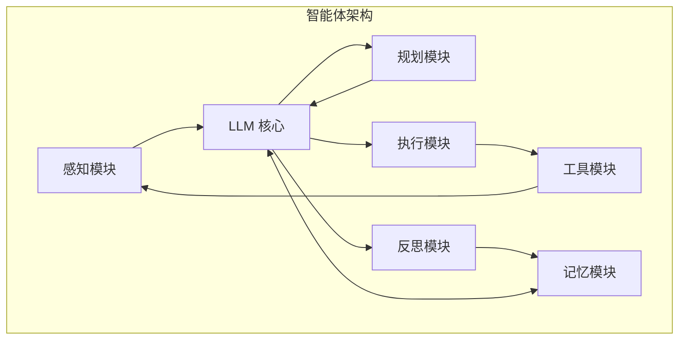

## 9.1 智能体架构与上下文

### 9.1.1 智能体的定义

**AI 智能体**是一个能够感知环境、做出决策并采取行动以实现特定目标的自主系统。相较于单次对话的 LLM 应用，智能体具有以下特征：

- **自主性**：能够独立规划和执行任务
- **持续性**：在多个步骤中持续工作
- **工具使用**：能够调用外部工具扩展能力
- **环境交互**：能够感知和影响环境

### 9.1.2 智能体的基本架构

现代智能体通常由六个核心模块组成，以 LLM 为中心协调运作：



**核心模块说明**：

- **LLM 核心**：智能体的"大脑"，负责理解、推理和决策。所有其他模块都围绕 LLM 进行信息交互
- **感知模块**：接收并处理多模态输入（文本、图像、音频等），将外部信息转化为 LLM 可理解的格式
- **规划模块**：将复杂任务分解为可执行的子任务，制定行动计划。支持动态调整和重规划
- **执行模块**：根据规划调用工具、执行操作，将决策转化为实际行动
- **工具模块**：提供外部能力扩展，包括 API 调用、代码执行、数据检索等。通过 MCP 等协议实现标准化集成
- **记忆模块**：管理短期工作记忆和长期持久记忆，提供上下文连续性和知识积累
- **反思模块**：评估执行结果，分析成功与失败，生成改进建议。支持自我纠错和持续学习

**运行循环**：

智能体遵循"感知 → 规划 → 执行 → 观察 → 反思"的循环：
1. 感知模块接收输入和环境观察
2. LLM 理解当前状态，规划模块制定行动计划
3. 执行模块调用工具模块执行操作
4. 工具返回结果，反馈到感知模块
5. 反思模块评估结果，必要时将经验存入记忆模块

### 9.1.3 上下文在智能体中的角色

上下文是智能体运作的核心：

| 角色 | 说明 |
|------|------|
| 任务定义 | 描述智能体的目标和约束 |
| 环境状态 | 当前环境的相关信息 |
| 执行历史 | 已采取的行动和结果 |
| 规划状态 | 当前的计划和进度 |
| 可用工具 | 智能体可调用的工具 |

### 9.1.4 智能体上下文的特殊挑战

相较于普通对话，智能体面临更复杂的上下文挑战：

- **长程依赖**：智能体任务可能跨越数十轮甚至数百轮交互，需要保持对早期信息的记忆
- **状态管理**：需要追踪复杂的状态，包括任务进度、环境变化、中间结果等
- **多源信息**：信息来源多样，包括用户输入、工具返回、环境观察、历史回顾等
- **动态调整**：计划可能需要根据执行情况动态调整，上下文需要反映这些变化

### 9.1.5 智能体上下文的典型结构

```text
┌─────────────────────────────────┐
│         智能体定义层            │
│  角色、能力、工具、约束         │
├─────────────────────────────────┤
│         任务层                  │
│  当前任务、目标、成功标准       │
├─────────────────────────────────┤
│         状态层                  │
│  当前进度、环境状态、计划       │
├─────────────────────────────────┤
│         历史层                  │
│  执行记录、观察结果、决策过程   │
├─────────────────────────────────┤
│         交互层                  │
│  当前步骤、即时输入             │
└─────────────────────────────────┘
```

### 9.1.6 ReAct 模式

ReAct 是常见的智能体运行模式：

```text
思考 (Reason) → 行动 (Act) → 观察 (Observe) → 思考 → ...
```

上下文需要记录这个循环的每一步：

```text
Thought: 我需要先查询用户的订单信息
Action: query_orders(user_id="123")
Observation: [订单列表...]
Thought: 找到了3个待处理订单，需要逐一处理
Action: process_order(order_id="001")
...
```

**ReAct vs Reflexion**：

| 维度 | ReAct | Reflexion |
|------|-------|-----------|
| 核心机制 | 交替进行推理和行动 | 执行后进行自我反思和改进 |
| 反馈时机 | 每步行动后获得环境观察 | 任务完成后评估整体结果 |
| 学习方式 | 即时调整下一步行动 | 将经验教训存入长期记忆 |
| 上下文需求 | 记录 Thought-Action-Observation 轨迹 | 额外存储 Self-Reflection 和历史失败案例 |
| 适用场景 | 需要实时交互的任务 | 需要从失败中学习的复杂任务 |

两种模式可以结合使用：用 ReAct 执行任务，用 Reflexion 在任务结束后总结经验。

### 9.1.7 上下文管理的核心原则

**1. 信息分层**

按重要性和时效性分层管理。智能体的上下文应该有清晰的层级结构：系统级定义最稳定、任务级目标相对固定、状态信息需要持续更新、历史记录可以压缩或淘汰。不同层级采用不同的保留策略和更新频率。

**2. 动态更新**

随任务进展更新状态信息。智能体执行过程中，环境在变化、进度在推进、计划可能调整。上下文必须反映这些变化，否则智能体将基于过时信息做出错误决策。建立清晰的状态更新机制，确保关键信息及时同步。

**3. 选择性保留**

保留关键信息，压缩或丢弃冗余。长程任务会产生大量历史信息，不可能全部保留。需要智能地选择：哪些是关键结论必须保留？哪些是过程细节可以压缩？哪些是临时信息可以丢弃？这需要根据任务类型设计合理的淘汰策略。

**4. 结构化组织**

清晰的结构便于规划和推理。杂乱的上下文会让模型迷失方向。使用明确的标签和分区组织不同类型的信息，让模型能快速定位需要的内容。良好的结构不仅提高效率，也减少模型的理解错误。

### 9.1.8 上下文工程的四大模式

上下文工程（Context Engineering）不仅仅是编写提示词，而是对智能体"操作系统"的 RAM（上下文窗口）进行系统化管理。我们可以将上下文管理策略归纳为四大模式，分别对应本书的第二部分核心章节：

1.  **Write Context (写入/卸载)**：对应 [第四章 写入策略](../04_write/README.md)。
2.  **Select Context (选择/加载)**：对应 [第五章 选择策略](../05_select/README.md)。
3.  **Compress Context (压缩/提炼)**：对应 [第六章 压缩策略](../06_compress/README.md)。
4.  **Isolate Context (隔离/分治)**：对应 [第七章 隔离策略](../07_isolate/README.md)。

在智能体架构中，这四大模式协同工作以解决不同的挑战：

| 模式 | 解决的核心问题 | 典型技术 |
| :--- | :--- | :--- |
| **Write** | 窗口容量限制 | Scratchpad，外部笔记，长期记忆 |
| **Select** | 注意力分散 / 成本 | Just-in-time 检索，RAG |
| **Compress** | 历史累积过长 | Compaction，摘要，轨迹剪枝 |
| **Isolate** | 任务复杂度过高 | 多智能体协作，VM 环境卸载 |


### 9.1.9 生产级智能体的上下文架构（案例思路）

在一些生产级 Agent 的实现中，上述上下文模式会被系统性地组合使用，以构建更健壮的“环境上下文”架构。

（关于相关案例思路的进一步讨论，请参见 [13.5 案例分析：全自主智能体架构（示意）](../13_cases/13.5_generalist_agent.md)）
