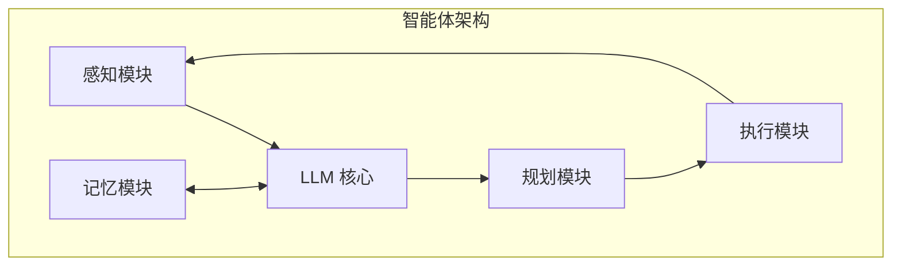

## 9.1 智能体架构与上下文

### 9.1.1 智能体的定义

**AI 智能体**是一个能够感知环境、做出决策并采取行动以实现特定目标的自主系统。相较于单次对话的 LLM 应用，智能体具有以下特征：

- **自主性**：能够独立规划和执行任务
- **持续性**：在多个步骤中持续工作
- **工具使用**：能够调用外部工具扩展能力
- **环境交互**：能够感知和影响环境

### 9.1.2 智能体的基本架构



- **感知模块**：接收并处理输入信息
- **规划模块**：分解任务、制定行动计划
- **执行模块**：调用工具、执行操作
- **记忆模块**：存储和检索历史信息
- **LLM 核心**：提供理解、推理和生成能力

### 9.1.3 上下文在智能体中的角色

上下文是智能体运作的核心：

| 角色 | 说明 |
|------|------|
| 任务定义 | 描述智能体的目标和约束 |
| 环境状态 | 当前环境的相关信息 |
| 执行历史 | 已采取的行动和结果 |
| 规划状态 | 当前的计划和进度 |
| 可用工具 | 智能体可调用的工具 |

### 9.1.4 智能体上下文的特殊挑战

相较于普通对话，智能体面临更复杂的上下文挑战：

**长程依赖**

智能体任务可能跨越数十轮甚至数百轮交互，需要保持对早期信息的记忆。

**状态管理**

智能体需要追踪复杂的状态：任务进度、环境变化、中间结果等。

**多源信息**

信息来源多样：用户输入、工具返回、环境观察、历史回顾等。

**动态调整**

计划可能需要根据执行情况动态调整，上下文需要反映这些变化。

### 9.1.5 智能体上下文的典型结构

```
┌─────────────────────────────────┐
│         智能体定义层            │
│  角色、能力、工具、约束         │
├─────────────────────────────────┤
│         任务层                  │
│  当前任务、目标、成功标准       │
├─────────────────────────────────┤
│         状态层                  │
│  当前进度、环境状态、计划       │
├─────────────────────────────────┤
│         历史层                  │
│  执行记录、观察结果、决策过程   │
├─────────────────────────────────┤
│         交互层                  │
│  当前步骤、即时输入             │
└─────────────────────────────────┘
```

### 9.1.6 ReAct 模式

ReAct 是常见的智能体运行模式：

```
思考 (Reason) → 行动 (Act) → 观察 (Observe) → 思考 → ...
```

上下文需要记录这个循环的每一步：

```
Thought: 我需要先查询用户的订单信息
Action: query_orders(user_id="123")
Observation: [订单列表...]
Thought: 找到了3个待处理订单，需要逐一处理
Action: process_order(order_id="001")
...
```

### 9.1.7 上下文管理的核心原则

**1. 信息分层**

按重要性和时效性分层管理。智能体的上下文应该有清晰的层级结构：系统级定义最稳定、任务级目标相对固定、状态信息需要持续更新、历史记录可以压缩或淘汰。不同层级采用不同的保留策略和更新频率。

**2. 动态更新**

随任务进展更新状态信息。智能体执行过程中，环境在变化、进度在推进、计划可能调整。上下文必须反映这些变化，否则智能体将基于过时信息做出错误决策。建立清晰的状态更新机制，确保关键信息及时同步。

**3. 选择性保留**

保留关键信息，压缩或丢弃冗余。长程任务会产生大量历史信息，不可能全部保留。需要智能地选择：哪些是关键结论必须保留？哪些是过程细节可以压缩？哪些是临时信息可以丢弃？这需要根据任务类型设计合理的淘汰策略。

**4. 结构化组织**

清晰的结构便于规划和推理。杂乱的上下文会让模型迷失方向。使用明确的标签和分区组织不同类型的信息，让模型能快速定位需要的内容。良好的结构不仅提高效率，也减少模型的理解错误。
