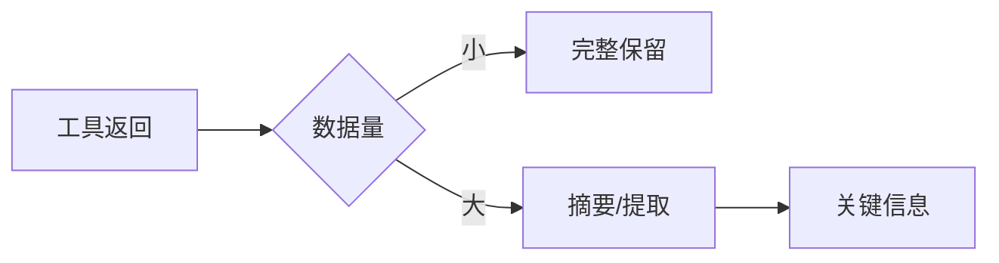

## 9.2 单智能体上下文管理

### 9.2.1 工作记忆管理

智能体的工作记忆对应上下文窗口，需要精心管理：

#### 信息优先级

不同信息的保留优先级不同：

| 优先级 | 内容类型 | 处理方式 |
|--------|----------|----------|
| 最高 | 任务目标、核心约束 | 始终保留 |
| 高 | 当前计划、即时状态 | 完整保留 |
| 中 | 近期执行记录 | 根据窗口压缩 |
| 低 | 早期历史 | 摘要或外存 |

#### 滑动窗口策略

只保留最近 N 步的详细记录：

```
[步骤 1-10: 摘要]
[步骤 11: 完整记录]
[步骤 12: 完整记录]
[步骤 13: 完整记录] ← 当前
```

### 9.2.2 状态追踪

#### 显式状态块

在上下文中维护显式的状态信息：

```xml
<current_state>
  <task>处理用户退款请求</task>
  <progress>3/5 步骤已完成</progress>
  <current_step>等待退款审批</current_step>
  <blockers>需要财务部门确认</blockers>
</current_state>
```

#### 状态更新

每次行动后更新状态：

```python
def update_state(old_state, action, result):
    new_state = old_state.copy()
    new_state["last_action"] = action
    new_state["last_result"] = result
    new_state["step_count"] += 1
    
    if is_completed(result):
        new_state["progress"] = update_progress(...)
    
    return new_state
```

### 9.2.3 计划管理

#### 计划表示

在上下文中维护当前计划：

```xml
<plan>
  <step n="1" status="completed">收集用户信息</step>
  <step n="2" status="completed">验证订单状态</step>
  <step n="3" status="in_progress">发起退款申请</step>
  <step n="4" status="pending">通知用户结果</step>
</plan>
```

#### 计划调整

根据执行情况调整计划：

```
Thought: 原计划第3步失败，需要调整策略
Revised Plan:
- 3a. 联系客服主管获取特殊授权
- 3b. 重新发起退款申请
- 4. 通知用户结果
```

### 9.2.4 执行历史压缩

长时间运行的智能体需要压缩执行历史：

#### 成功操作压缩

成功的操作可以简化记录：

```
原始：
Action: search_products(query="蓝牙耳机", limit=10)
Observation: [10个产品的详细信息...]

压缩后：
✓ 搜索"蓝牙耳机"，找到10个结果
```

#### 失败操作保留

失败的操作保留更多细节，防止重复错误：

```
✗ 尝试 API_A 失败（超时）- 应使用 API_B
```

### 9.2.5 工具结果处理

工具返回大量数据时的处理：



### 9.2.6 上下文窗口监控

监控上下文使用情况：

```python
def check_context_usage(context):
    token_count = count_tokens(context)
    if token_count > 0.8 * MAX_CONTEXT:
        trigger_compression()
    if token_count > 0.95 * MAX_CONTEXT:
        trigger_emergency_cleanup()
```

### 9.2.7 错误恢复

当智能体遇到问题时的上下文处理：

1. **记录错误状态**：保存错误详情
2. **回溯检查点**：可能需要回到之前的状态
3. **调整计划**：更新后续步骤
4. **清理无效信息**：移除失败操作的中间结果
