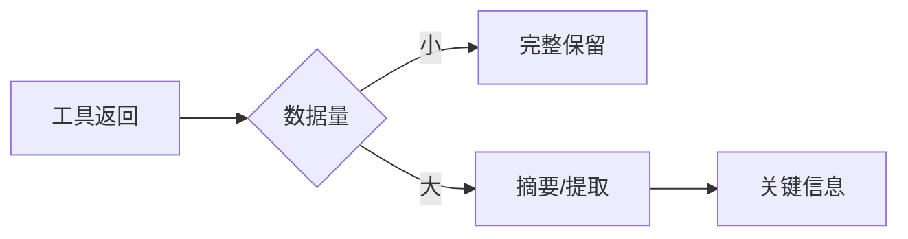

## 9.2 单智能体上下文管理

### 9.2.1 工作记忆管理

智能体的工作记忆对应上下文窗口，需要精心管理：

#### 信息优先级

不同信息的保留优先级不同：

| 优先级 | 内容类型 | 处理方式 |
|--------|----------|----------|
| 最高 | 任务目标、核心约束 | 始终保留 |
| 高 | 当前计划、即时状态 | 完整保留 |
| 中 | 近期执行记录 | 根据窗口压缩 |
| 低 | 早期历史 | 摘要或外存 |

#### 滑动窗口策略

只保留最近 N 步的详细记录：

```text
[步骤 1-10: 摘要]
[步骤 11: 完整记录]
[步骤 12: 完整记录]
[步骤 13: 完整记录] ← 当前
```

### 9.2.2 状态追踪

#### 显式状态块

在上下文中维护显式的状态信息：

```xml
<current_state>
  <task>处理用户退款请求</task>
  <progress>3/5 步骤已完成</progress>
  <current_step>等待退款审批</current_step>
  <blockers>需要财务部门确认</blockers>
</current_state>
```

#### 状态更新

每次行动后更新状态：

```python
def update_state(old_state, action, result):
    new_state = old_state.copy()
    new_state["last_action"] = action
    new_state["last_result"] = result
    new_state["step_count"] += 1

    if is_completed(result):
        new_state["progress"] = update_progress(...)

    return new_state
```

### 9.2.3 计划管理

#### 计划表示

在上下文中维护当前计划：

```xml
<plan>
  <step n="1" status="completed">收集用户信息</step>
  <step n="2" status="completed">验证订单状态</step>
  <step n="3" status="in_progress">发起退款申请</step>
  <step n="4" status="pending">通知用户结果</step>
</plan>
```

#### 计划调整

根据执行情况调整计划：

```text
Thought: 原计划第3步失败，需要调整策略
Revised Plan:
- 3a. 联系客服主管获取特殊授权
- 3b. 重新发起退款申请
- 4. 通知用户结果
```

### 9.2.4 执行历史压缩

长时间运行的智能体需要压缩执行历史：

#### 成功操作压缩

成功的操作可以简化记录：

```text
原始：
Action: search_products(query="蓝牙耳机", limit=10)
Observation: [10个产品的详细信息...]

压缩后：
✓ 搜索"蓝牙耳机"，找到10个结果
```

#### 失败操作保留

失败的操作保留更多细节，防止重复错误：

```text
✗ 尝试 API_A 失败（超时）- 应使用 API_B
```

### 9.2.5 工具结果处理

工具返回大量数据时的处理：


```mermaid
graph LR
    A["工具返回"] --> B{"数据量"}
    B --> |"小"| C["完整保留"]
    B --> |"大"| D["摘要/提取"]
    D --> E["关键信息"]
```

图 9-2：工具结果处理策略

### 9.2.6 上下文窗口监控

监控上下文使用情况：

```python
def check_context_usage(context):
    token_count = count_tokens(context)
    if token_count > 0.8 * MAX_CONTEXT:
        trigger_compression()
    if token_count > 0.95 * MAX_CONTEXT:
        trigger_emergency_cleanup()
```

### 9.2.7 错误恢复

当智能体遇到问题时的上下文处理：

1. **记录错误状态**：保存错误详情
2. **回溯检查点**：可能需要回到之前的状态
3. **调整计划**：更新后续步骤
4. **清理无效信息**：移除失败操作的中间结果

### 9.2.8 持久化执行与工件管理

对于长时间运行或涉及多个工具调用的智能体任务，建议采用 **持久化执行模式**（Durable Execution Pattern）：

#### 工件（Artifact）的定义与作用

工件是指智能体执行过程中的每一步输出，包括：

| 类型 | 内容 | 用途 |
|------|------|------|
| 步骤输出 | 工具调用结果、模型生成文本 | 下一步的输入 |
| 执行状态 | 当前进度、已完成步骤、待执行计划 | 中断恢复 |
| 决策记录 | 为什么选择某个操作 | 事后分析和审计 |
| 元数据 | 时间戳、成本、延迟等 | 性能监控 |

#### 检查点与恢复机制

```python
def step_1_query_analysis(user_input):
    """第1步：查询分析，并保存工件"""
    parsed = parse_query(user_input)
    checkpoint_save({
        "step": 1,
        "status": "completed",
        "output": parsed,
        "timestamp": now()
    })
    return parsed

def step_2_knowledge_retrieval(parsed_query):
    """第2步：知识检索，依赖第1步的工件"""
    try:
        docs = retrieve_documents(parsed_query)
        checkpoint_save({
            "step": 2,
            "status": "completed",
            "output": docs
        })
        return docs
    except Exception as e:
        # 记录失败，可以从这里重试
        checkpoint_save({
            "step": 2,
            "status": "failed",
            "error": str(e)
        })
        raise

# 恢复执行：检查最后成功的检查点
last_checkpoint = load_last_checkpoint()
if last_checkpoint["step"] >= 2:
    # 从第2步的输出继续
    docs = last_checkpoint["output"]
else:
    # 从第1步重新开始
    parsed = step_1_query_analysis(user_input)
    docs = step_2_knowledge_retrieval(parsed)
```

#### 工件的持久化与可重放

- **存储位置**：使用结构化存储（如 PostgreSQL + JSON 字段，或 DuckDB）而不是仅日志文件
- **版本控制**：为每个工件记录版本号和生成时间，便于追溯
- **内容哈希**：记录工件内容的 SHA-256 哈希值，确保重放时的一致性验证
- **重放验证**：在恢复后，可选择性地重新执行某些步骤，对比输出与保存的工件是否一致，检测非确定性问题

这种模式特别适合以下场景：

- **长流程任务**：需要调用多个工具、跨越数十个推理步骤的任务
- **高成本操作**：避免因中间失败而重复执行昂贵的 LLM 调用或 API 请求
- **合规要求**：需要完整的审计日志和决策追踪
- **多智能体协作**：下游智能体需要准确了解上游智能体的执行结果和状态

### 9.2.9 计划文件作为上下文持久化机制

在 AI 辅助开发实践中，plan.md 文件已成为跨会话上下文持久化的核心机制。与工件管理（9.2.8）不同，计划文件不仅记录执行状态，更承载了问题定义、方案选择和验收标准等高层语义信息。

#### 跨会话上下文恢复

当会话上下文丢失（如窗口关闭或上下文膨胀触发压缩）时，计划文件充当检查点。开启新会话时只需指向已有计划文件，即可从断点继续，无需重建上下文。这本质上是将上下文从易失的会话内存“外化”到持久化的文件系统。

#### 结构化设计

高质量的计划文件包含问题描述、方案选择、需修改的文件列表、验收标准（复选框形式）等结构化字段。这种结构化设计确保了上下文在跨会话传递时保持完整性和可操作性。

#### 与检查点机制的关系

计划文件与 9.2.8 节讨论的检查点机制形成互补——检查点保存执行状态的快照，计划文件则保存任务的完整语义描述。两者结合实现了从“做什么”到“做到哪了”的完整恢复。

#### 计划文件结构示例

```markdown
# 任务计划：功能 X 实现

## 问题描述

用户需要在仪表板中添加实时数据更新功能。当数据源更新时，前端自动刷新，无需手动重载。

## 方案选择

选择 WebSocket 方案而非轮询，理由：
- 减少服务器负载
- 降低延迟至 200ms 以内
- 便于扩展多个数据源

## 需修改的文件

- [ ] backend/websocket_handler.py - 实现 WebSocket 服务
- [ ] frontend/dashboard.js - 连接 WebSocket 并更新 UI
- [ ] tests/test_websocket.py - 单元测试
- [ ] docs/ARCHITECTURE.md - 更新文档

## 验收标准

- [ ] WebSocket 连接成功建立
- [ ] 数据更新延迟 < 500ms
- [ ] 单个连接内存占用 < 10MB
- [ ] 全部单元测试通过
- [ ] 文档已更新

## 执行进度

### 已完成

- 完成 backend/websocket_handler.py 的基础实现
- 编写了连接管理和消息广播的核心逻辑

### 当前进行

- 正在调试 frontend/dashboard.js 的数据绑定

### 待执行

- 完成单元测试编写
- 性能测试和优化
- 文档更新
```

计划文件通过这种结构化形式，让中断的工作能够快速恢复，新会话的 AI 无需重新理解整个项目背景，只需对准计划继续推进。
