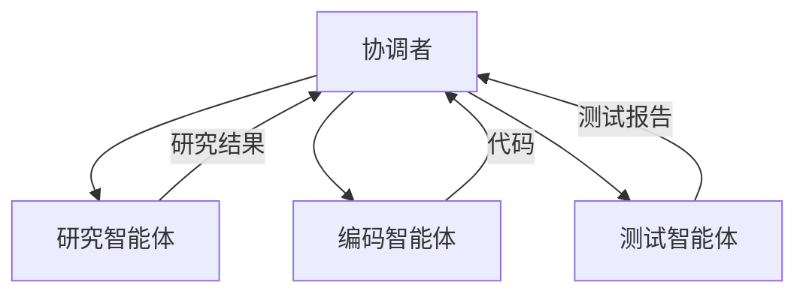
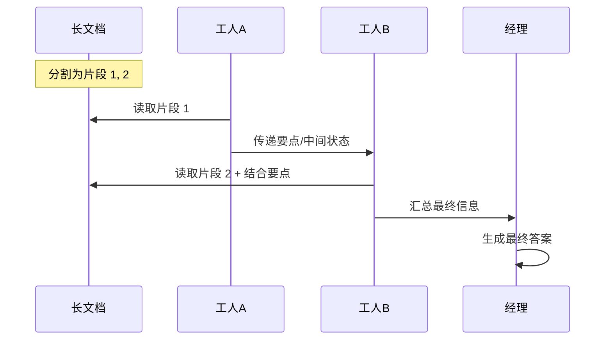

## 9.3 多智能体上下文传递

### 多智能体系统概述

**多智能体系统**由多个协作的智能体组成，每个智能体专注于特定能力或任务。



### 上下文传递的挑战

**上下文膨胀**

如果每个智能体都接收完整上下文，Token 消耗会快速增长。

**信息干扰**

无关智能体的信息可能干扰当前智能体的判断。

**一致性维护**

多个智能体需要对共享信息有一致的理解。

### 上下文共享机制

#### 1. 共享黑板模式 (Shared Blackboard)

引入一个共享记忆库或"黑板"，所有智能体都可以读取和写入这个公共空间。

- **工作方式**：智能体 A 将发现的证据写入黑板，智能体 B 读取并推理。
- **一致性**：通过访问控制和版本管理维护一致性。
- **优点**：信息同步快，避免点对点通信的复杂度。
- **缺点**：需要处理并发写入冲突。

#### 2. 通信对话模式 (Message Passing)

智能体之间直接发送消息交换上下文。

- **工作方式**：智能体 A 发送消息给智能体 B："请根据这些数据生成图表"。
- **优点**：明确的责任链，点对点隔离。
- **缺点**：通信链路可能复杂，长链条导致信息衰减。

### 高级协作模式：Chain-of-Agents

Google 提出的 **Chain-of-Agents (CoA)** 框架专门解决长上下文协作问题，通过让多个智能体 "接力"阅读和处理。



这种模式让上下文在智能体链中逐步传递和累积，而非一次性填满单个智能体的窗口，有效突破了单模型上下文限制。

### 上下文传递策略

#### 最小必要原则

只传递智能体完成任务所需的最小信息：

```python
def prepare_context_for_agent(agent, task, full_context):
    relevant = extract_relevant(full_context, agent.expertise)
    task_specific = format_task(task)
    tools = agent.available_tools
    
    return compose(relevant, task_specific, tools)
```

#### 角色专属记忆 (Intrinsic Memory)

为每个智能体维护结构化的角色专属记忆。

- **私有记忆**：只保存与自身角色相关的对话和结论。
- **视角隔离**：智能体 A 看到的上下文强调数据分析视角，智能体 B 强调代码实现视角。
- **优势**：减少干扰，保持角色一致性。

#### 接口抽象

定义清晰的信息传递接口：

```json
{
  "from": "researcher",
  "to": "coder",
  "message_type": "task_handoff",
  "content": {
    "summary": "用户需要一个日历功能",
    "requirements": ["添加事件", "提醒功能"],
    "constraints": ["使用 Python", "无需数据库"]
  }
}
```

### 共享状态管理

多智能体需要共享的状态：

```json
{
  "global_state": {
    "task_id": "task_123",
    "overall_progress": "50%",
    "key_decisions": [...],
    "artifacts": [...],
    "blocking_issues": []
  }
}
```

### 调试与追踪

多智能体系统需要完善的追踪：

1. **消息日志**：记录所有智能体间的通信
2. **上下文快照**：关键节点的上下文状态
3. **决策追踪**：每个智能体的决策依据
4. **性能指标**：上下文大小、传递延迟
