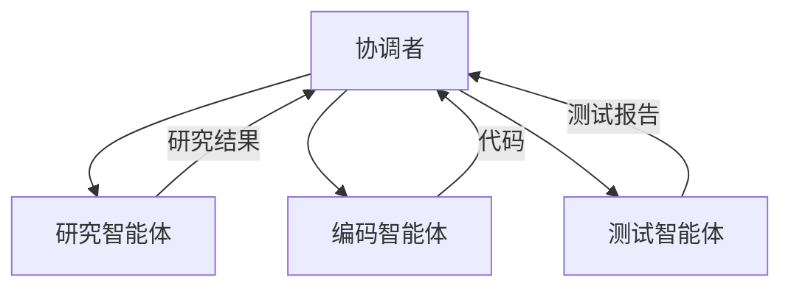
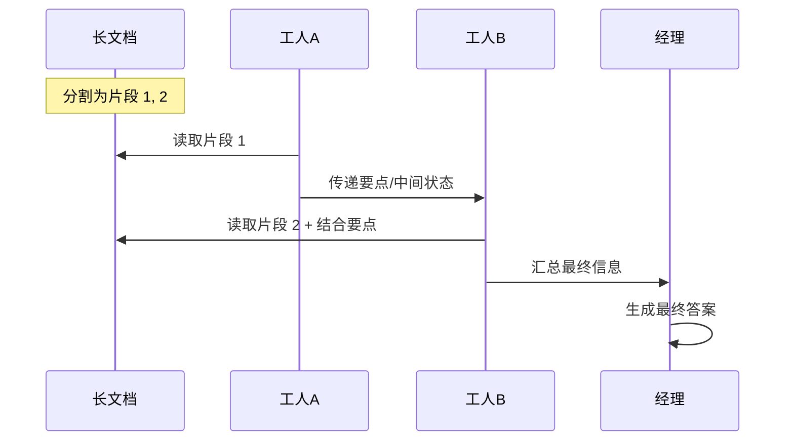
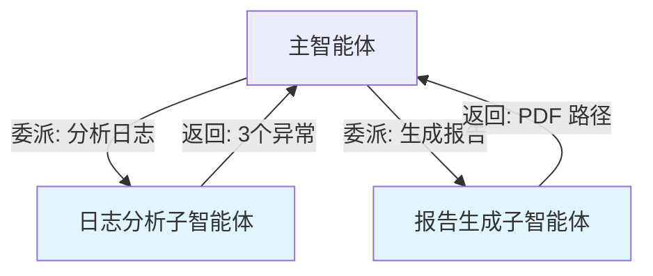

## 9.3 多智能体上下文传递

### 9.3.1 多智能体系统概述

**多智能体系统**由多个协作的智能体组成，每个智能体专注于特定能力或任务。



图 9-3：多智能体协作架构

### 9.3.2 上下文传递的挑战

- **上下文膨胀**：如果每个智能体都接收完整上下文，Token 消耗会快速增长
- **信息干扰**：无关智能体的信息可能干扰当前智能体的判断
- **一致性维护**：多个智能体需要对共享信息有一致的理解

### 9.3.3 上下文共享机制

#### 1. 共享黑板模式

引入一个共享记忆库或“黑板”，所有智能体都可以读取和写入这个公共空间。

- **工作方式**：智能体 A 将发现的证据写入黑板，智能体 B 读取并推理。
- **一致性**：通过访问控制和版本管理维护一致性。
- **优点**：信息同步快，避免点对点通信的复杂度。
- **缺点**：需要处理并发写入冲突。

#### 2. 通信对话模式

智能体之间直接发送消息交换上下文。

- **工作方式**：智能体 A 发送消息给智能体 B：“请根据这些数据生成图表”。
- **优点**：明确的责任链，点对点隔离。
- **缺点**：通信链路可能复杂，长链条导致信息衰减。

### 9.3.4 高级协作模式：链式智能体协作

一种常见的思路是使用“链式协作”（Chain-of-Agents, CoA）：让多个智能体以“接力”的方式分段阅读和处理长上下文任务。



图 9-4：链式智能体协作

这种模式让上下文在智能体链中逐步传递和累积，而非一次性填满单个智能体的窗口，有效突破了单模型上下文限制。

### 9.3.5 上下文传递策略

#### 最小必要原则

只传递智能体完成任务所需的最小信息：

```python
def prepare_context_for_agent(agent, task, full_context):
    relevant = extract_relevant(full_context, agent.expertise)
    task_specific = format_task(task)
    tools = agent.available_tools
    
    return compose(relevant, task_specific, tools)
```

#### 角色专属记忆

为每个智能体维护结构化的角色专属记忆。

- **私有记忆**：只保存与自身角色相关的对话和结论。
- **视角隔离**：智能体 A 看到的上下文强调数据分析视角，智能体 B 强调代码实现视角。
- **优势**：减少干扰，保持角色一致性。

#### 接口抽象

定义清晰的信息传递接口：

```json
{
  "from": "researcher",
  "to": "coder",
  "message_type": "task_handoff",
  "content": {
    "summary": "用户需要一个日历功能",
    "requirements": ["添加事件", "提醒功能"],
    "constraints": ["使用 Python", "无需数据库"]
  }
}
```

### 9.3.6 共享状态管理

多智能体需要共享的状态：

```json
{
  "global_state": {
    "task_id": "task_123",
    "overall_progress": "50%",
    "key_decisions": [...],
    "artifacts": [...],
    "blocking_issues": []
  }
}
```

### 9.3.7 调试与追踪

多智能体系统交互复杂，需要完善的追踪机制：

**1. 消息日志**

记录所有智能体间的通信。每一个消息的发送者、接收者、时间戳、内容类型和 Payload 都应被完整记录。这不仅用于排查错误，也是分析智能体协作模式和效率的重要数据源。

**2. 上下文快照**

关键节点的上下文状态。在任务的关键转折点（如子任务完成、决策变更时），保存各个智能体的上下文快照。这允许开发者“时光倒流”，查看系统在特定时刻的全局状态，复现 Bug。

**3. 决策追踪**

每个智能体的决策依据。智能体为什么采取这个行动？是基于哪条上下文信息？使用了哪个 Prompt？记录 ReAct 循环中的 “Thought” 过程，使智能体的行为透明可解释。

**4. 性能指标**

上下文大小、传递延迟。监控上下文在传递过程中的膨胀情况，以及智能体之间的通信延迟。通过可视化图表识别瓶颈：是某个智能体处理太慢，还是上下文过大导致传输耗时。

### 9.3.8 主流多智能体框架

现代多智能体开发通常基于成熟的框架：

| 框架 | 核心特点 | 适用场景 | 上下文管理 |
|------|----------|----------|------------|
| **LangGraph** | 基于图的控制流，强大的状态管理 | 企业级工作流 | 显式状态机，支持检查点 |
| **CrewAI** | 角色驱动，极易上手 | 快速原型，团队协作 | 角色专属记忆 |
| **AutoGen** | 对话驱动，代码执行能力强 | 复杂问题解决 | 会话历史管理 |
| **Swarm** | 轻量级，Handoff 模式 | 探索性实验 | 最小化手动管理 |

**选择建议**：
- 需要精细控制 → LangGraph
- 快速构建 → CrewAI
- 代码密集型任务 → AutoGen
- 简单探索 → Swarm

### 9.3.9 子智能体架构与上下文隔离

子智能体架构不仅是任务分解工具，更是**上下文管理策略**。

#### 上下文隔离的价值

**问题**：单一智能体执行复杂任务时，上下文会被多个子任务的细节污染，导致：
- 上下文腐烂（Context Rot）
- 注意力分散
- 决策质量下降

**解决方案**：将独立子任务委派给专用子智能体，每个子智能体有自己的上下文窗口。



图 9-5：子智能体隔离架构

**关键洞察**：主智能体只接收子任务的**摘要结果**，而非全部细节。

#### 多智能体研究系统案例（示意）

一种常见的多智能体研究系统会包含主智能体与若干专用子智能体，以展示这一架构的实际应用：

**系统组成**：
- **主智能体（Lead）**：规划研究方向、综合结果、撰写最终报告
- **搜索子智能体**：执行网络搜索，返回关键发现
- **阅读子智能体**：深度阅读文档，提取相关段落

**上下文隔离效果**：
- 搜索智能体处理数百个搜索结果 → 只返回 10 个最相关的
- 阅读智能体处理 100 页 PDF → 只返回 3 段关键内容
- 主智能体上下文保持清晰，专注于高层决策

**数据对比（示意）**：

| 场景 | 单智能体上下文 | 多智能体架构 |
|------|---------------|-------------|
| 研究 10 个网站 | 更易膨胀 | 更易控制 |
| 分析 5 份报告 | 更易膨胀 | 更易控制 |
| 综合生成报告 | 上下文溢出风险 | 轻松完成 |

#### 何时使用子智能体

- **并行探索**：需要同时调研多个方向
- **专门技能**：特定子任务需要专用工具或提示词
- **上下文隔离**：子任务产生大量中间数据
- **风险控制**：子任务失败不应影响主任务

> **重要提示**：子智能体增加了系统复杂度和延迟。只在上下文污染成为问题时使用，避免过度设计。
