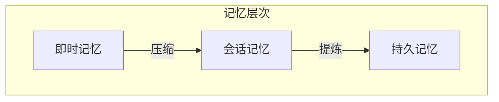

## 9.4 智能体记忆与学习

### 9.4.1 智能体记忆的层次

智能体需要多层次的记忆系统：



**即时记忆**：当前任务的工作记忆
**会话记忆**：单次会话的完整历史
**持久记忆**：跨会话保留的长期知识

### 9.4.2 记忆内容类型

| 类型 | 示例 | 存储位置 |
|------|------|----------|
| 事实 | 用户偏好、配置 | 持久记忆 |
| 经验 | 成功/失败的操作 | 持久记忆 |
| 技能 | 学到的解决方案 | 持久记忆 |
| 状态 | 当前任务进度 | 会话记忆 |
| 细节 | 操作的具体参数 | 即时记忆 |

### 9.4.3 记忆更新机制

#### 显式记忆

用户明确要求记住：
```
用户：请记住我喜欢简洁的回答风格
智能体：好的，我已记录您的偏好。
```

#### 隐式记忆

从交互中自动学习：
```python
def analyze_interaction(history):
    patterns = extract_patterns(history)
    preferences = infer_preferences(history)
    corrections = find_corrections(history)
    
    update_memory(patterns, preferences, corrections)
```

#### 反思记忆 (Reflexion Pattern)

反思是将短期经历转化为长期乃至"智慧"的关键。基于 **Reflexion** 框架的自我改进循环：

1.  **Actor (执行者)**：尝试执行任务，生成轨迹。
2.  **Evaluator (评估者)**：评估执行结果的质量（如测试通过率、准确性）。
3.  **Self-Reflection (反思者)**：分析失败原因，生成"自我反思"，总结教训。
4.  **Memory (记忆)**：将反思结果存入长期记忆。

**示例循环**：
```
--- 第一次尝试 ---
Actor: 尝试使用 requests 库抓取网页。
Evaluator: 失败，返回 403 Forbidden。
Self-Reflection: 目标网站有反爬策略，需要设置 User-Agent。

--- 第二次尝试 ---
Actor: (检索到上次的反思) 设置 User-Agent 伪装成浏览器重试。
Evaluator: 成功。
Memory Update: "抓取该网站时必须设置 User-Agent 头" -> 存入知识库。
```
这种机制让智能体不再重犯相同的错误。

### 9.4.4 从经验中学习

智能体可以从历史经验中学习：

#### 成功经验复用

```
过去经验：处理类似问题时，方法 A 比方法 B 更有效

当前任务：遇到类似问题
决策：优先尝试方法 A
```

#### 失败经验规避

```
过去经验：直接调用 API_X 会超时

当前任务：需要调用 API_X
决策：先检查连接状态，设置较长超时，或使用备用方案
```

### 9.4.5 知识积累

#### 领域知识

随着使用积累领域知识：

```
初始：通用助手
↓ 多次医疗咨询后
积累：常见症状、推荐检查、就医建议
```

#### 用户知识

了解特定用户：

```
用户画像：
- 技术背景：高级
- 沟通风格：喜欢详细解释
- 常见需求：代码审查、架构设计
```

### 9.4.6 记忆检索

在适当时机检索相关记忆：

```python
def retrieve_relevant_memory(current_context):
    # 1. 多路召回
    semantic_results = vector_search(current_context)  # 语义匹配
    keyword_results = keyword_search(current_context)  # 关键词匹配
    time_results = get_recent_ad_hoc(current_context)  # 时间相关
    
    # 2. 混合排序 (Retrieval Fusion)
    return reciprocal_rank_fusion([semantic_results, keyword_results, time_results])
```

**混合检索的核心：RRF (Reciprocal Rank Fusion)**

单一的检索方式往往有盲点（如向量搜索对专有名词不敏感），RRF 是一种无需训练的鲁棒排序算法，用于融合多个检索结果。

**算法原理**：
对于每一项文档 $d$，计算其融合得分：
$$ Score(d) = \sum_{r \in R} \frac{1}{k + rank(r, d)} $$
*   $R$：不同的检索器集合（如语义、关键词、时间）。
*   $rank(r, d)$：文档 $d$ 在检索器 $r$ 结果中的排名（1, 2, 3...）。
*   $k$：平滑常数（通常取 60），用于防止高排名文档主导分数。

**优势**：
*   **零样本**：不需要任何训练数据，直接利用排名信息。
*   **鲁棒性**：即使某个检索源效果很差，只要其他源可靠，最终结果依然准确。
*   **公平性**：平衡了不同检索源的得分尺度差异。


### 9.4.7 记忆管理挑战

- **容量管理**：记忆不能无限增长，需按重要性排序、定期清理过时信息、压缩低频信息
- **一致性维护**：记忆可能过时或矛盾，需要版本追踪、冲突检测、定期验证
- **隐私保护**：敏感信息需要保护，包括访问控制、数据加密、保留策略

### 9.4.8 记忆与上下文的协作

记忆系统与上下文工程密切配合：

**1. 记忆提供长期信息**

将持久记忆检索到当前上下文。这是最基础的协作模式。当用户提问涉及到之前的会话或特定知识时，系统从记忆模块中检索相关内容，并将其注入到当前的 Prompt 上下文中。这解决了 LLM 固有上下文窗口有限和无记忆的问题。

**2. 上下文产生新记忆**

从当前交互中提取值得记忆的内容。在对话过程中，上下文窗口中不断产生新的信息。系统需要实时或定期分析上下文，提取出有价值的信息（如用户偏好、新事实、关键决策），并将其写入到记忆模块中。这是智能体不断学习和进化的基础。

**3. 记忆优化上下文**

了解用户后可以简化上下文。随着对用户记忆的加深，智能体可以更精准地理解用户意图，从而不需要在上下文中反复包含冗长的说明或背景信息。例如，如果记忆中已经知道用户是 Python 专家，上下文中的代码解释就可以更加精简，节省 Token 并提升沟通效率。
