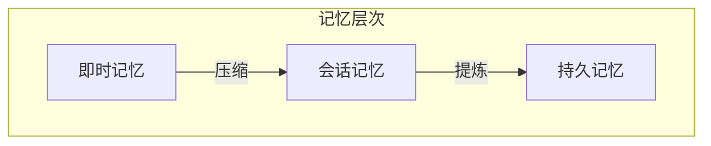

## 9.4 智能体记忆与学习

### 9.4.1 智能体记忆的层次

智能体需要多层次的记忆系统：



**即时记忆**：当前任务的工作记忆
**会话记忆**：单次会话的完整历史
**持久记忆**：跨会话保留的长期知识

### 9.4.2 记忆内容类型

| 类型 | 示例 | 存储位置 |
|------|------|----------|
| 事实 | 用户偏好、配置 | 持久记忆 |
| 经验 | 成功/失败的操作 | 持久记忆 |
| 技能 | 学到的解决方案 | 持久记忆 |
| 状态 | 当前任务进度 | 会话记忆 |
| 细节 | 操作的具体参数 | 即时记忆 |

### 9.4.3 记忆更新机制

#### 显式记忆

用户明确要求记住：
```
用户：请记住我喜欢简洁的回答风格
智能体：好的，我已记录您的偏好。
```

#### 隐式记忆

从交互中自动学习：
```python
def analyze_interaction(history):
    patterns = extract_patterns(history)
    preferences = infer_preferences(history)
    corrections = find_corrections(history)
    
    update_memory(patterns, preferences, corrections)
```

#### 反思记忆

定期回顾和整理：
```
每日任务结束时：
- 回顾今日处理的任务
- 提取成功的方法
- 记录遇到的问题
- 更新知识库
```

### 9.4.4 从经验中学习

智能体可以从历史经验中学习：

#### 成功经验复用

```
过去经验：处理类似问题时，方法 A 比方法 B 更有效

当前任务：遇到类似问题
决策：优先尝试方法 A
```

#### 失败经验规避

```
过去经验：直接调用 API_X 会超时

当前任务：需要调用 API_X
决策：先检查连接状态，设置较长超时，或使用备用方案
```

### 9.4.5 知识积累

#### 领域知识

随着使用积累领域知识：

```
初始：通用助手
↓ 多次医疗咨询后
积累：常见症状、推荐检查、就医建议
```

#### 用户知识

了解特定用户：

```
用户画像：
- 技术背景：高级
- 沟通风格：喜欢详细解释
- 常见需求：代码审查、架构设计
```

### 9.4.6 记忆检索

在适当时机检索相关记忆：

```python
def retrieve_relevant_memory(current_context):
    # 语义相似
    semantic_match = vector_search(current_context)
    
    # 实体匹配
    entities = extract_entities(current_context)
    entity_match = lookup_by_entities(entities)
    
    # 时间相关
    time_match = get_recent_interactions()
    
    return merge_and_rank(semantic_match, entity_match, time_match)
```

### 9.4.7 记忆管理挑战

**容量管理**

记忆不能无限增长：
- 按重要性排序
- 定期清理过时信息
- 压缩低频信息

**一致性维护**

记忆可能过时或矛盾：
- 版本追踪
- 冲突检测
- 定期验证

**隐私保护**

敏感信息需要保护：
- 访问控制
- 数据加密
- 保留策略

### 9.4.8 记忆与上下文的协作

记忆系统与上下文工程密切配合：

1. **记忆提供长期信息**：将持久记忆检索到当前上下文
2. **上下文产生新记忆**：从当前交互中提取值得记忆的内容
3. **记忆优化上下文**：了解用户后可以简化上下文
