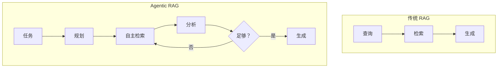

## 10.1 自主检索增强生成与自主检索

### 10.1.1 从被动检索增强生成到主动检索增强生成

传统 [RAG](../05_select/5.1_rag_principles.md) 是被动的：收到查询后检索一次，返回结果。**Agentic RAG** 则是主动的：AI 智能体能够自主决定何时检索、检索什么、以及是否需要多次检索。



### 10.1.2 自主检索增强生成的核心能力

**自主决策**

智能体决定是否需要检索：
- 简单问题直接回答
- 复杂问题触发检索
- 不确定时主动查证

**迭代检索**

根据初次结果决定后续：
```text
初次检索 → 发现信息不足 → 改进查询 → 再次检索
```

**多源整合**

根据需要访问多个信息源：
- 不同知识库
- 实时 API
- 文档搜索

### 10.1.3 实现模式

#### 路由模式

根据查询类型选择检索策略：

```python
def route_query(query):
    query_type = analyze_query(query)
    
    if query_type == "factual":
        return retrieve_from_knowledge_base(query)
    elif query_type == "recent":
        return retrieve_from_news_api(query)
    elif query_type == "code":
        return retrieve_from_code_base(query)
    else:
        return multi_source_retrieve(query)
```

#### 反馈循环模式

检索结果不满足时自动改进：

```text
尝试 1: 检索"机器学习优化" → 结果太泛
尝试 2: 检索"深度学习 梯度下降 优化算法" → 结果更精确
```

#### 查询分解模式

复杂问题分解为子查询：

```text
原问题：比较 Transformer 和 RNN 在长序列处理上的优劣

分解：
1. Transformer 处理长序列的机制
2. RNN 处理长序列的局限
3. 两者的对比研究
```

### 10.1.4 优势与挑战

**优势**：
- 更精准的信息获取
- 能处理复杂查询
- 自适应不同场景

**挑战**：
- 延迟增加
- 成本上升
- 需要更复杂的编排

### 10.1.5 实践建议

1. **从简单场景开始**：先实现基本路由

2. **设置迭代上限**：防止无限检索

3. **监控检索效率**：跟踪迭代次数和效果

4. **缓存中间结果**：避免重复检索
