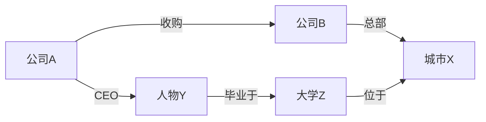
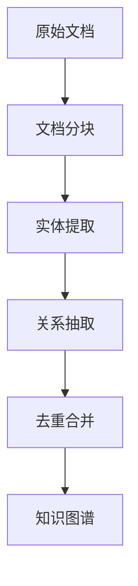
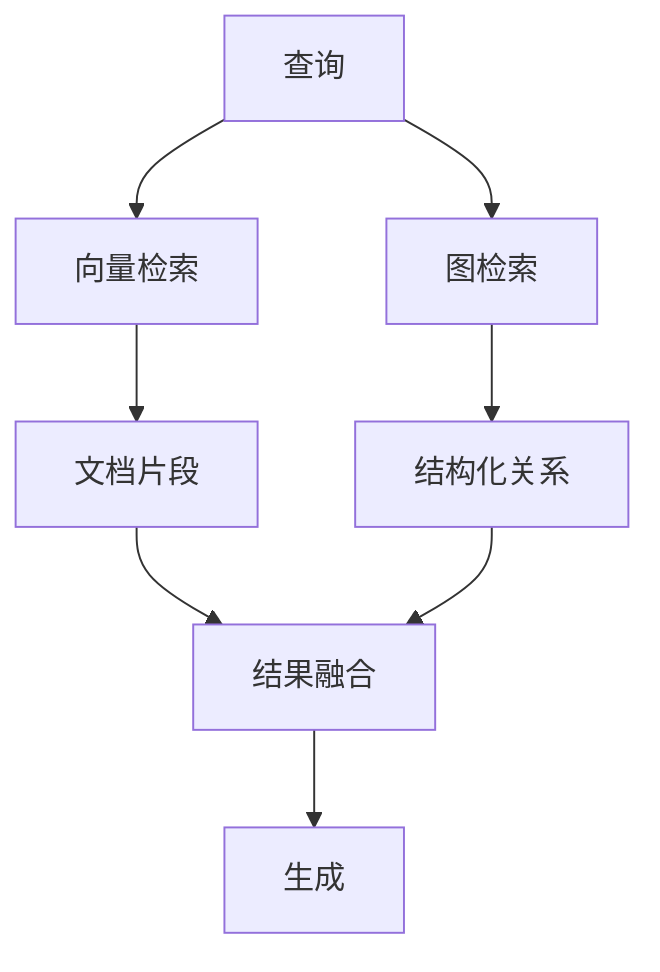

## 10.2 Graph RAG 与知识图谱

### 10.2.1 向量检索的局限

传统向量检索基于语义相似度，在许多场景下效果显著，但存在固有局限：

- **难以捕捉实体间的关系**：向量相似度无法表达"A 是 B 的子公司"这类结构化关系
- **跨多个文档的推理能力弱**：当答案需要整合多个文档的信息时，单纯的相似性检索力不从心
- **无法处理复杂的关联查询**：如"找出所有投资了 AI 公司的 PE 基金合伙人"这类多跳查询

### 10.2.2 Graph RAG 的概念

**Graph [RAG](../05_select/5.1_rag_principles.md)** 将知识图谱与 RAG 结合，通过实体和关系增强检索能力。知识图谱以（实体，关系，实体）三元组的形式存储结构化知识，可以表达复杂的关联关系。



通过图结构，可以回答诸如"公司 A 的 CEO 毕业于哪个城市的学校"这类需要多跳推理的问题。

### 10.2.3 Graph RAG 的工作流程

Graph RAG 的典型流程包含四个阶段：

1. **实体识别**：从用户查询中提取关键实体
2. **图检索**：在知识图谱中查找相关节点和边
3. **上下文构建**：将图结构转换为文本上下文
4. **生成回答**：基于增强上下文生成答案


### 10.2.4 相较于向量检索的优势

| 场景 | 向量检索 | Graph RAG |
|------|----------|-----------|
| 实体关系查询 | 弱 | 强 |
| 多跳推理 | 困难 | 自然支持 |
| 结构化查询 | 不支持 | 支持 |
| 可解释性 | 低 | 高 |
| 全局理解 | 局部相似 | 全局视角 |

### 10.2.5 实现方式

#### 构建知识图谱

从非结构化文档中提取实体和关系是构建知识图谱的关键步骤：

**实体提取**

使用 NER（命名实体识别）或 LLM 提取实体：
```
文档: "张三是A公司的CEO，A公司总部位于北京，2024年收入达10亿元..."

提取的实体:
- 人物: 张三
- 组织: A公司
- 地点: 北京
- 金额: 10亿元
- 时间: 2024年
```

**关系抽取**

识别实体之间的关系：
```
提取的关系:
(张三, 职位, A公司CEO)
(A公司, 总部, 北京)
(A公司, 收入_2024, 10亿元)
```

**图谱构建流程**



实践中可以使用 LLM 进行实体和关系的提取：

```python
prompt = """
从以下文本中提取实体和关系，输出JSON格式：
文本：{text}

输出格式：
{
  "entities": [{"name": "实体名", "type": "类型"}],
  "relations": [{"head": "头实体", "relation": "关系", "tail": "尾实体"}]
}
"""
```

#### 图检索策略

**局部子图提取**

以查询相关实体为中心，提取 N 跳范围内的子图：

```python
def extract_subgraph(graph, seed_entities, max_hops=2):
    visited = set()
    subgraph = []
    
    for entity in seed_entities:
        bfs(graph, entity, max_hops, visited, subgraph)
    
    return subgraph
```

**路径查询**

查找两个实体之间的关系路径，适用于关联分析：

```cypher
MATCH path = (a:Entity {name: "张三"})-[*1..3]-(b:Entity {name: "北京"})
RETURN path
```

**社区检测**

识别高度关联的实体簇，整体提取相关社区：
- 适用于主题聚类
- 可以提供全局视角的摘要

#### 将图结构转换为上下文

检索到的子图需要转换为 LLM 可理解的文本：

```python
def graph_to_text(subgraph):
    lines = []
    for triple in subgraph:
        head, relation, tail = triple
        lines.append(f"- {head} {relation} {tail}")
    return "\n".join(lines)

# 输出示例：
# - 张三 担任 A公司CEO
# - A公司 总部位于 北京
# - A公司 收购 B公司
```

### 10.2.6 与向量检索结合

实践中，混合使用 Graph RAG 和向量检索效果更好：



融合策略：
- **互补增强**：向量检索提供详细描述，图检索提供关系结构
- **相互验证**：两种方式的结果相互印证
- **按需切换**：根据查询类型选择主要方法

### 10.2.7 工具与框架

| 工具/方案类型 | 特点 | 适用场景 |
|------|------|----------|
| 图数据库 + 编排框架 | 成熟的图查询能力与生态 | 企业级部署 |
| GraphRAG 框架 | 自动建图、社区摘要、分层索引 | 大规模文档集 |
| 数据索引框架的图扩展 | 支持多种图索引模式 | 灵活定制 |
| 云托管图数据库 | 托管运维、可扩展 | 云生态集成 |

### 10.2.8 GraphRAG 框架特点（示意）

一些 GraphRAG 框架会提供一套相对完整的方案：

1. **自动建图**：使用 LLM 从文档中自动提取实体和关系
2. **社区检测**：识别实体社区，生成社区级摘要
3. **分层索引**：支持局部查询和全局查询
4. **全局摘要**：可以回答需要全文档理解的问题

### 10.2.9 实践建议

1. **评估适用性**：知识密集、关系复杂的场景最受益；简单问答可能不需要
2. **渐进式实施**：先从核心实体开始构建图谱，逐步扩展
3. **维护图质量**：定期更新和清理过时的实体和关系
4. **结合向量检索**：发挥各自优势，而非完全替代
5. **关注构建成本**：图谱构建需要额外的 LLM 调用，需权衡成本
