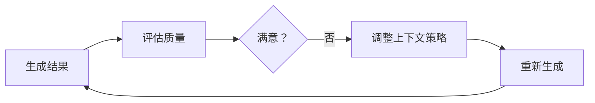
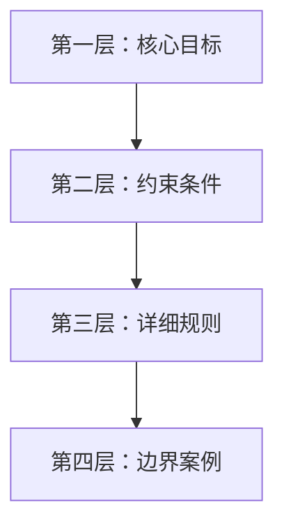

## 10.3 自适应与智能上下文管理

### 10.3.1 静态 vs 自适应

传统上下文管理使用固定策略，而**自适应上下文管理**根据具体情况动态调整。未来的方向是让模型"参与"到上下文的选择中来。

### 10.3.2 自适应策略

#### 自适应检索 (Adaptive Retrieval)

根据查询复杂度调整检索强度：

```python
def adaptive_retrieve(query):
    complexity = assess_complexity(query)
    # 简单问题直接回答，复杂问题多跳检索
    if complexity == "high":
        return multi_step_agentic_retrieve(query)
    return simple_vector_search(query)
```

#### 任务感知型重排 (Task-Aware Reordering)

不同任务对上下文顺序的偏好不同。Transformer 模型对开头和结尾的内容关注度更高（Primacy/Recency Effect）。

- **代码调试任务**：错误日志置顶 > 相关代码 > 环境信息
- **法律分析任务**：法规条文置顶 > 案件事实 > 历史判例

可以通过分类器判断任务类型，动态调整 prompt 模板中的各部分顺序。

#### 注意力预测注入 (Attention-Based Injection)

这是一种前沿的自适应架构：利用轻量级模型预测主模型对候选上下文的**注意力热图**。

1. **候选池**：准备大量候选上下文片段。
2. **预测**：小模型预测主模型在回答当前问题时会"关注"哪些片段。
3. **注入**：只将高关注度的片段注入上下文。

这种方法实现了上下文的按需供给，最大化利用窗口的有效信息密度。

#### 智能压缩 (ICAE)

**上下文自动编码器 (In-Context Autoencoder, ICAE)** 是一种新兴技术。它训练模型将长文本压缩为短的"软提示词"（Soft Prompts）或潜在向量，而非人类可读的摘要。

- **编码**：将较长文本压缩为少量“特殊 Token/软提示词”（压缩规模取决于具体方法与模型）。
- **解码**：LLM 能够理解这些压缩 Token 并基于此回答问题。
- **优势**：压缩率极高，且保留了原始上下文的语义特征。

### 10.3.3 实现机制

#### 反馈循环

基于结果反馈调整策略：



#### 学习优化

从历史数据中学习最优策略：
- 记录不同策略的效果
- 分析成功和失败案例
- 自动优化参数

### 10.3.4 实施要点

1. **定义评估指标**：如何判断效果好坏

2. **设置调整范围**：避免过度调整

3. **保持可解释**：理解为什么做出调整

4. **监控效果**：验证自适应是否有效

### 10.3.5 渐进式上下文披露

**渐进式披露（Progressive Disclosure）** 是一种将上下文分层次、分阶段提供给模型的高级策略。

#### 核心理念

不一次性提供所有信息，而是根据任务进展逐步披露：



#### 工具定义中的应用

以 Tool Search Tool 为例，工具定义可以分层加载：

**第一层（始终加载）**：
- 工具搜索元工具
- 核心常用工具（3-5 个）

**第二层（按需加载）**：
- 领域特定工具（通过搜索发现）
- 详细参数说明

**第三层（触发加载）**：
- 完整工具示例
- 复杂用法说明

#### 实现模式

```python
def get_progressive_context(task, depth=1):
    contexts = {
        1: get_core_instructions(task),
        2: get_core_instructions(task) + get_constraints(task),
        3: get_core_instructions(task) + get_constraints(task) + get_examples(task)
    }
    return contexts[min(depth, 3)]

# 初始执行用第一层
context = get_progressive_context(task, depth=1)

# 如果失败，加载更多上下文重试
if not success:
    context = get_progressive_context(task, depth=2)
```

#### 优势

- **降低初始 Token 成本**：简单任务只需第一层
- **避免信息过载**：复杂规则不干扰简单判断
- **支持自适应深度**：根据任务复杂度调整
