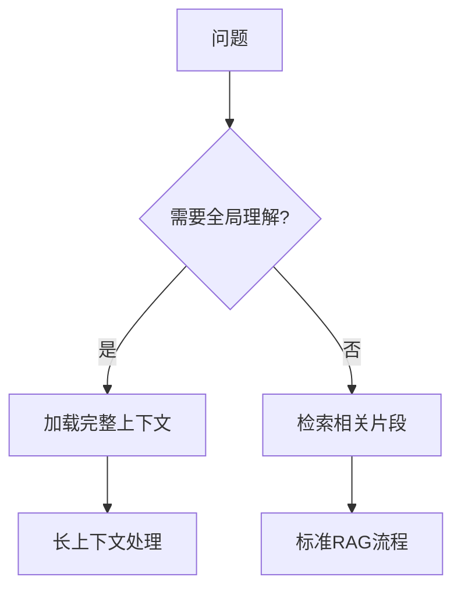

## 10.4 长上下文模型应用

### 10.4.1 长上下文时代

模型上下文窗口正在持续扩展，从早期的较短窗口发展到更长窗口，这一变化深刻影响着上下文工程的实践方式。

| 阶段 | 典型上下文量级（示意） | 里程碑意义 |
|------|------------------------|------------|
| 短上下文阶段 | 4K–32K | 基础对话与常规任务 |
| 中等上下文阶段 | 32K–128K | 长文档处理成为可能 |
| 长上下文阶段 | 128K–1M | 更大规模的多文档整合 |
| 超长上下文探索 | 多百万级 | 更强调信息组织、成本与延迟权衡 |

### 10.4.2 长上下文的应用场景

长上下文能力开启了许多新的应用可能性：

**全书/全库分析**

可以一次性加载完整的技术书籍、法律合同或学术论文进行分析：
- 跨章节的主题分析
- 一致性和矛盾检测
- 全面的内容摘要

**代码库理解**

整个代码库可以作为上下文：
- 跨文件的代码重构
- 全局架构理解
- 更准确的代码生成

```text
示例：将整个 10 万行的 Python 项目加载到上下文中
- 模型可以理解模块间的依赖关系
- 生成的代码与现有风格一致
- 重构建议考虑全局影响
```

**长时间对话**

对话历史可以更完整地保留：
- 无需频繁压缩对话历史
- 更好地理解用户的长期需求
- 支持复杂的多轮任务

**大规模文档问答**

将多个相关文档同时加载：
- 跨文档的信息整合
- 不同来源的观点对比
- 更全面的答案

**复杂推理任务**

充分的背景信息支持深度推理：
- 多步骤的逻辑推导
- 需要大量前提的分析
- 长链条的因果推理

### 10.4.3 有效利用长上下文

拥有超长上下文窗口并不意味着可以忽视上下文工程原则。事实上，管理超大上下文需要更精细的策略。

#### 性能基准：长上下文与检索增强生成（示意）

不同任务与系统实现下，长上下文与 RAG 的效果对比差异很大。下面给出一个**示意性的**对比视角，用于帮助建立权衡意识：

| 评估维度 | 场景描述 | 长上下文（示意） | RAG（示意） | 倾向 |
|----------|----------|-----------------------------|------------------|------|
| **准确率** | 单点事实查找 | 可能更稳 | 依赖检索质量 | 视检索而定 |
| | 跨文档综合分析 | 更易捕捉隐性关联 | 可能受召回限制 | 长上下文更占优 |
| **延迟** (TTFT) | 处理较长输入 | 通常更高 | 通常更低 | RAG 更占优 |
| **成本** | 单次查询 | 通常更高 | 通常更可控 | RAG 更占优 |

**常见结论**：
- **准确性**：需要全局理解时，长上下文可能更占优；但对局部事实查找，RAG 也可能足够好。
- **成本与速度**：RAG 往往更“快且便宜”，适合高频、低延时场景。
- **混合趋势**：常见做法是先检索筛选，再用更强的长上下文能力做精读与整合。

#### 信息组织

**重要信息的位置**

研究表明，模型对上下文开头和结尾的内容关注度更高（Primacy/Recency Effect），中间部分可能被“忽视”：

```text
┌──────────────────────────────────────────┐
│  ⬆️ 高关注区：关键指令、核心约束            │
├──────────────────────────────────────────┤
│                                          │
│  📉 中间区域：参考资料、背景知识            │
│     （关注度相对较低）                     │
│                                          │
├──────────────────────────────────────────┤
│  ⬆️ 高关注区：当前问题、格式要求            │
└──────────────────────────────────────────┘
```

策略：
- 最重要的系统指令放在开头
- 关键约束可以在结尾再次强调
- 参考知识放在中间区域
- 使用明确的结构标记便于模型定位

**结构化标记**

在超长上下文中，清晰的结构尤为重要：
- 使用 XML 标签划分不同部分
- 添加目录或导航信息
- 为每个部分添加标题和编号

```xml
<document_index>
1. 产品规格 (行 1-500)
2. 用户手册 (行 501-1500)
3. FAQ (行 1501-2000)
</document_index>

<section id="1" title="产品规格">
...
</section>
```

#### 避免过度填充

长上下文不意味着应该填满：

**信息质量问题**
- 无关信息仍会降低效果，甚至引入干扰
- 噪声会稀释关键信息的权重
- 冗余内容增加模型处理负担

**成本问题**
- Token 成本与上下文长度成正比
- 百万级上下文的单次调用成本可能很高
- 需要评估投入产出比

**延迟问题**
- 首 Token 延迟随上下文长度增加
- 超长上下文的处理时间可能达到数十秒
- 对延迟敏感的应用需慎重

#### 结合检索

即使有长上下文，检索仍有重要价值：



**混合策略**的优势：
- 预筛选最相关内容，提高信息密度
- 动态加载按需信息，控制成本
- 对于局部问题，检索更高效

### 10.4.4 长上下文的挑战

#### 成本问题

更长的上下文意味着更高成本：

| 上下文规模 | 预估成本（单次，示意） | 适用场景 |
|-----------|-----------------|----------|
| 10K | 低 | 常规对话 |
| 100K | 中 | 长文档分析 |
| 1M | 高 | 全书/代码库 |

需要根据具体价值评估是否值得投入。

#### 延迟问题

首 Token 延迟通常会随上下文长度增加而上升；具体数值取决于模型、部署形态与系统优化。

对于延迟敏感的应用，需要在完整性和响应速度之间权衡。

#### 系统级实现挑战（显存与调度）

在真实生产环境中，支撑百万上下文的推理是一项复杂的系统工程挑战。

- **显存墙与并行切分**：KV Cache 的体积随上下文长度呈线性增长。一条百万 Tokens 请求的 KV Cache 可能高达上百 GB，远超单卡物理显存极限。现代系统必须通过**序列并行 (Sequence Parallelism, 例如 Ring Attention)** 或**上下文并行 (Context Parallelism)**，沿 Sequence 维度将巨大的 Token 序列切分至不同的物理 GPU 上，部分架构甚至依赖跨节点的高速 RDMA 网络协同计算。
- **调度冲突与卡顿控制**：极长上下文在进入系统的预填充（Prefill）阶段会引发恐怖的计算洪峰。若任由一个新请求霸占系统算力，其他正在生成后续 Token（Decode 阶段）的请求会被阻断，从而引发严重的延迟卡顿（即队头阻塞）。目前行业的主流解决方案是引入 **Chunked Prefill（分块预填充）** 技术，将数百 KB 长度的 Prompt 切割成小碎块（如 512 Tokens），然后再与 Decode 请求混合编排、共批次（Co-batching）执行，确保整体输出的平稳顺滑。


#### 效果问题

超长上下文中的信息利用效率可能下降：
- “大海捞针”问题：关键信息可能被淹没
- 注意力稀释：每个 Token 获得的平均关注度降低
- 相关性判断变难：更多内容增加了判断难度

### 10.4.5 最佳实践

1. **按需使用**：只在真正需要全局理解时使用长上下文，简单问题用检索更高效

2. **质量优先**：精选高质量内容比全量加载更有效，始终关注信噪比

3. **结构清晰**：良好的组织和标记提升利用效率，帮助模型快速定位

4. **持续监控**：跟踪长上下文的实际效果，收集成本和质量数据

5. **混合策略**：结合长上下文和 [RAG](../05_select/5.1_rag_principles.md) 的优势，根据场景灵活选择

6. **渐进式加载**：先加载核心内容，需要时再扩展

7. **缓存优化**：充分利用 Prompt Caching 降低重复成本

### 10.4.6 “检索增强生成已死”的误区

有观点认为长上下文会取代 RAG，但实际上两者是互补关系：

| 方面 | 长上下文 | RAG |
|------|----------|-----|
| 全局理解 | ✅ 优势 | ❌ 局部 |
| 成本 | ❌ 较高 | ✅ 可控 |
| 延迟 | ❌ 较慢 | ✅ 较快 |
| 动态更新 | ❌ 需重新加载 | ✅ 实时 |
| 精确定位 | ❌ 可能遗漏 | ✅ 精准 |

未来的最佳实践是根据具体场景灵活组合两种方法。
