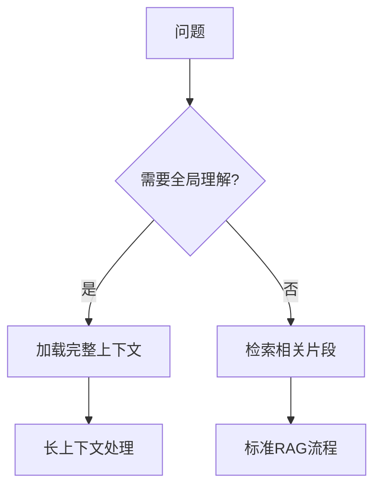

## 11.4 长上下文模型应用

### 11.4.1 长上下文时代

模型上下文窗口正在快速扩展，从早期的 4K 发展到如今的百万级别，这一变化深刻影响着上下文工程的实践方式。

| 时期 | 典型上下文 | 代表模型 | 里程碑意义 |
|------|------------|----------|------------|
| 2022 | 4K-8K | GPT-3.5 | 基础对话能力 |
| 2023 | 32K-128K | GPT-4 Turbo, Claude 2 | 长文档处理成为可能 |
| 2024 | 128K-200K | Claude 3 Opus, GPT-4 Turbo | 整书分析能力 |
| 2025 | 400K-2M | Gemini 3.0 Pro, GPT-5 | 代码库级别理解 |
| 2026 | 10M | LLaMA 4 Scout | 接近无限记忆 |

### 11.4.2 长上下文的应用场景

长上下文能力开启了许多新的应用可能性：

**全书/全库分析**

可以一次性加载完整的技术书籍、法律合同或学术论文进行分析：
- 跨章节的主题分析
- 一致性和矛盾检测
- 全面的内容摘要

**代码库理解**

整个代码库可以作为上下文：
- 跨文件的代码重构
- 全局架构理解
- 更准确的代码生成

```
示例：将整个 10 万行的 Python 项目加载到上下文中
- 模型可以理解模块间的依赖关系
- 生成的代码与现有风格一致
- 重构建议考虑全局影响
```

**长时间对话**

对话历史可以更完整地保留：
- 无需频繁压缩对话历史
- 更好地理解用户的长期需求
- 支持复杂的多轮任务

**大规模文档问答**

将多个相关文档同时加载：
- 跨文档的信息整合
- 不同来源的观点对比
- 更全面的答案

**复杂推理任务**

充分的背景信息支持深度推理：
- 多步骤的逻辑推导
- 需要大量前提的分析
- 长链条的因果推理

### 11.4.3 有效利用长上下文

拥有超长上下文窗口并不意味着可以忽视上下文工程原则。事实上，管理超大上下文需要更精细的策略。

#### 性能基准：长上下文 vs RAG

根据 "Needle In A Haystack"（大海捞针）测试及行业基准（截至 2025 年底），两种方案在不同维度的对比数据如下：

| 评估维度 | 场景描述 | 1M 长上下文 (Gemini/Claude) | RAG + 32K 上下文 | 结论 |
|----------|----------|-----------------------------|------------------|------|
| **准确率** | 单点事实查找 | 99.8% | 85-92% (依赖检索) | 长上下文稳胜，无检索损失 |
| | 跨文档综合分析 | 92% | 65% | 长上下文能捕捉隐性关联 |
| **延迟** (TTFT) | 处理 100K Token | 8-12 秒 | < 1 秒 | RAG 交互体验更佳 |
| | 处理 1M Token | 45-60 秒 | N/A | 长上下文不适合实时交互 |
| **成本** | 单次查询 (1M tokens) | ~$3.00 | < $0.05 | RAG 成本优势巨大 (60x) |

**实验结论**：
- **准确性**：在上下文窗口范围内，全量加载的准确率普遍优于 RAG，尤其是涉及全篇理解的问题。
- **成本与速度**：RAG 依然是"快且便宜"的王者，适合高频、低延时场景。
- **混合趋势**：最佳实践是先用 RAG 检索出 Top-50 文档（约 100K Token），再通过长上下文模型进行精读，平衡成本与效果。

#### 信息组织

**重要信息的位置**

研究表明，模型对上下文开头和结尾的内容关注度更高（Primacy/Recency Effect），中间部分可能被"忽视"：

```
┌──────────────────────────────────────────┐
│  ⬆️ 高关注区：关键指令、核心约束            │
├──────────────────────────────────────────┤
│                                          │
│  📉 中间区域：参考资料、背景知识            │
│     （关注度相对较低）                     │
│                                          │
├──────────────────────────────────────────┤
│  ⬆️ 高关注区：当前问题、格式要求            │
└──────────────────────────────────────────┘
```

策略：
- 最重要的系统指令放在开头
- 关键约束可以在结尾再次强调
- 参考知识放在中间区域
- 使用明确的结构标记便于模型定位

**结构化标记**

在超长上下文中，清晰的结构尤为重要：
- 使用 XML 标签划分不同部分
- 添加目录或导航信息
- 为每个部分添加标题和编号

```xml
<document_index>
1. 产品规格 (行 1-500)
2. 用户手册 (行 501-1500)
3. FAQ (行 1501-2000)
</document_index>

<section id="1" title="产品规格">
...
</section>
```

#### 避免过度填充

长上下文不意味着应该填满：

**信息质量问题**
- 无关信息仍会降低效果，甚至引入干扰
- 噪声会稀释关键信息的权重
- 冗余内容增加模型处理负担

**成本问题**
- Token 成本与上下文长度成正比
- 百万级上下文的单次调用成本可能很高
- 需要评估投入产出比

**延迟问题**
- 首 Token 延迟随上下文长度增加
- 超长上下文的处理时间可能达到数十秒
- 对延迟敏感的应用需慎重

#### 结合检索

即使有长上下文，检索仍有重要价值：



**混合策略**的优势：
- 预筛选最相关内容，提高信息密度
- 动态加载按需信息，控制成本
- 对于局部问题，检索更高效

### 11.4.4 长上下文的挑战

#### 成本问题

更长的上下文意味着更高成本：

| 上下文规模 | 预估成本（单次） | 适用场景 |
|-----------|-----------------|----------|
| 10K | $0.01-0.05 | 常规对话 |
| 100K | $0.1-0.5 | 长文档分析 |
| 1M | $1-5 | 全书/代码库 |

需要根据具体价值评估是否值得投入。

#### 延迟问题

首 Token 延迟随上下文增加：
- 10K 上下文：1-2 秒
- 100K 上下文：5-10 秒
- 1M 上下文：30-60+ 秒

对于延迟敏感的应用，需要在完整性和响应速度之间权衡。

#### 效果问题

超长上下文中的信息利用效率可能下降：
- "大海捞针"问题：关键信息可能被淹没
- 注意力稀释：每个 Token 获得的平均关注度降低
- 相关性判断变难：更多内容增加了判断难度

### 11.4.5 最佳实践

1. **按需使用**：只在真正需要全局理解时使用长上下文，简单问题用检索更高效

2. **质量优先**：精选高质量内容比全量加载更有效，始终关注信噪比

3. **结构清晰**：良好的组织和标记提升利用效率，帮助模型快速定位

4. **持续监控**：跟踪长上下文的实际效果，收集成本和质量数据

5. **混合策略**：结合长上下文和 [RAG](../05_select/5.1_rag_principles.md) 的优势，根据场景灵活选择

6. **渐进式加载**：先加载核心内容，需要时再扩展

7. **缓存优化**：充分利用 Prompt Caching 降低重复成本

### 11.4.6 "RAG 已死"的误区

有观点认为长上下文会取代 RAG，但实际上两者是互补关系：

| 方面 | 长上下文 | RAG |
|------|----------|-----|
| 全局理解 | ✅ 优势 | ❌ 局部 |
| 成本 | ❌ 较高 | ✅ 可控 |
| 延迟 | ❌ 较慢 | ✅ 较快 |
| 动态更新 | ❌ 需重新加载 | ✅ 实时 |
| 精确定位 | ❌ 可能遗漏 | ✅ 精准 |

未来的最佳实践是根据具体场景灵活组合两种方法。
