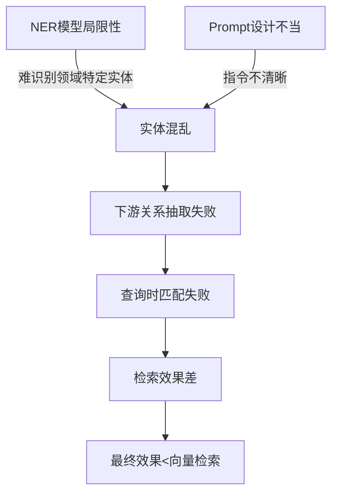
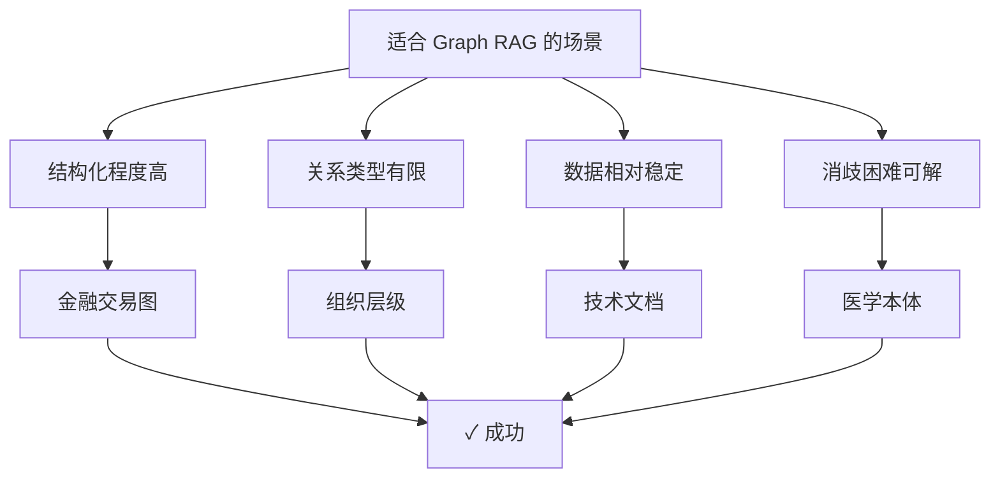
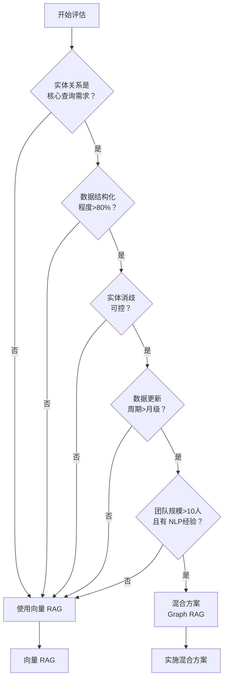

## 10.6 Graph RAG 失败案例分析

### 10.6.1 引言：Graph RAG 为何失败

Graph RAG（基于知识图谱的检索增强生成）在理论上前景广阔，但在实际部署中经常遭遇失败。不少团队投入数周甚至数月构建图谱系统，最终发现效果不如简单的向量检索，甚至更差。

本节基于真实的生产案例，深入分析 Graph RAG 失败的根本原因，帮助您规避这些陷阱。

**常见的失败症状**：
- 构建完成后精准率反而下降
- 查询响应时间增加 3 - 5 倍
- 维护成本出乎意料地高
- 无法有效处理知识图谱中的歧义
- 图谱更新不及时导致信息过时

### 10.6.2 知识图谱构建质量问题

这是 Graph RAG 失败的第一大根源。知识图谱的质量直接决定整个系统的上限。

#### 问题 1：实体抽取的系统性错误

**案例：电商产品知识图谱**

一家电商公司尝试为其产品库（500K+ SKU）构建知识图谱，目标是支持“找出与 iPhone 15相似的产品”这类复杂查询。

```python
# 实体抽取失败案例
原始文本：
"iPhone 15是苹果公司最新发布的智能手机，
 采用 A18芯片，支持 120Hz刷新率，
 是 iPhone 14的升级版本。"

错误的抽取结果：
Entities:
  - iPhone 15 (产品)
  - 苹果公司 (公司)
  - A18芯片 (零件)
  - 120Hz刷新率 (特性)
  - iPhone 14 (产品)

问题分析：
1. "120Hz刷新率"不应该作为独立实体，应该是属性
2. 缺失关键实体："屏幕"、"6.1英寸"等规格
3. "升级版本"关系模糊，无法量化

结果：
- 无法精准回答"iPhone 15屏幕大小多少"
- 无法支持"同价位替代品"的查询
- 图谱冗余且信息不足并存
```

**失败的原因链条**：



**实体抽取失败的量化影响**：

某金融机构构建股票知识图谱，人工评估结果：

| 实体类型 | 提取精确率 | 提取召回率 | F1-Score | 影响 |
|---------|---------|---------|---------|------|
| 上市公司 | 92% | 85% | 0.88 | 可接受 |
| 高管人物 | 78% | 72% | 0.75 | 关键缺陷 |
| 产业关系 | 65% | 58% | 0.61 | 重度缺陷 |
| 财务指标 | 71% | 64% | 0.67 | 重度缺陷 |

结论：除公司实体外，其他关键信息抽取质量差，图谱不可信。

#### 问题 2：图谱覆盖度与信息孤岛

**案例：医疗诊断知识图谱失败**

一家医疗 AI 公司为医学文献构建知识图谱，用以支持诊断辅助。

```
图谱规模：
- 实体数：120万
- 关系数：300万

问题：
1. 孤立节点众多（无关系的实体）
2. 连通性差：仅 30%的实体能通过关系链接到其他实体
3. 覆盖度不均：某些疾病的关系丰富，某些严重缺失

例如，对于罕见病：
- 仅有 5 - 10 个实体，难以形成有意义的子图
- 检索结果过少，LLM无法有效推理

对于高发病：
- 实体过多（>10000个）
- 检索结果超大，LLM困惑
```

量化分析：

```python
from collections import defaultdict

# 图谱连通性分析
class GraphConnectivityAnalysis:
    def __init__(self, graph):
        self.graph = graph

    def analyze_coverage(self):
        results = {
            "isolated_nodes": len([n for n in self.graph.nodes()
                                   if self.graph.degree(n) == 0]),
            "weakly_connected_components": len(list(
                nx.weakly_connected_components(self.graph))),
            "largest_component_ratio": self.get_largest_component_ratio(),
        }
        return results

# 医学图谱实际分析结果
analysis = {
    "总节点数": 1200000,
    "孤立节点": 240000,  # 20%！
    "弱连通分量": 480,   # 意味着 480个独立岛屿
    "最大分量占比": 0.65,  # 仅 65%节点在最大连通分量中
}

# 结论：
# 35%的实体无法从查询起点通过关系链接到达
# 这部分实体对图检索无用
```

#### 问题 3：信息更新滞后

**案例：商业情报知识图谱**

一个企业构建了上市公司的动态知识图谱，包括融资信息、高管变动等。

```
更新机制：
- 文档推送周期：每天 1000+新文章
- 实体抽取延迟：1 - 2 小时
- 图谱更新延迟：3 - 6 小时
- 部署生产：每周一次

结果：
- 用户查询的信息延迟 3 - 10 天
- 对时间敏感的查询（融资动态）完全无用
- 用户反馈："信息比搜索引擎还慢"

对比：
- 向量检索（基于最新索引）：延迟<1小时
- Graph RAG：延迟 3 - 10 天
```

### 10.6.3 实体消歧失败案例

实体消歧（Entity Disambiguation）是图谱的致命弱点。同一个名称可能指代多个不同的实体，反之亦然。

#### 问题：同名不同实体无法区分

**案例：人物实体消歧**

```
文本："王明是一位著名的物理学家。"
     "王明是一位成功的企业家。"

图谱中的实体：
- 王明_物理学家_1990 (物理学家，1990年生)
- 王明_企业家_1965 (企业家，1965年生)
- 王明_演员_2000 (演员，2000年生)
... (还有 10多个王明)

问题：
1. "王明"的提及无法准确映射到图中的哪个实体
2. 查询"王明的研究领域"时，无法确定是哪个王明
3. 可能返回多个王明，导致噪音

失败案例：
查询："王明做出了什么重要贡献"
预期：关于某个具体的王明的信息
实际：返回 3 - 5 个不同王明的混合信息，用户困惑
```

**消歧失败的后果**：

```python
# 消歧错误的级联失败
class DisambiguationFailure:
    """
    级联效应：
    消歧错误 → 边连接错误 → 子图污染 → 最终答案错误
    """

    def process_query(self, query="王明的成就"):
        # 第 1步：实体抽取
        entities = extract_entities(query)
        # 结果：["王明"]

        # 第 2步：消歧（失败）
        candidates = self.graph.get_entity_candidates("王明")
        # 结果：[王明_物理学家, 王明_企业家, 王明_演员, ...]

        # 第 3步：无法确定哪个是正确的，返回所有
        subgraph = self.extract_subgraph(candidates)

        # 结果：
        # 王明_物理学家 -> 研究 -> 量子物理
        # 王明_企业家 -> 创办 -> 互联网公司
        # 王明_演员 -> 出演 -> 电视剧
        # (混乱的信息混合)

        # 最终结果
        return """
        王明的成就包括：
        1. 在量子物理领域做出了重要贡献
        2. 创办了一家成功的互联网公司
        3. 主演了多部知名电视剧

        (不同的王明的信息被错误混合)
        """
```

**消歧失败率的实际统计**：

一个通用 NLP 竞赛基准（CoNLL）的消歧数据：

| 实体类型 | 消歧准确率 | 对查询的影响 |
|---------|---------|----------|
| 公司名 | 88% | 中等 |
| 人物名 | 72% | 严重 |
| 地点名 | 84% | 中等 |
| 产品名 | 65% | 严重 |
| 医学术语 | 60% | 严重 |

高消歧错误率直接导致后续关系抽取和查询的准确性下降。

### 10.6.4 关系抽取错误传播

实体间的关系是图的核心。关系抽取错误会导致整个推理链条失败。

#### 问题 1：关系方向反转

**案例：交易关系反转**

```
文本："A公司收购了 B公司"

错误的关系抽取：
(B公司, 被收购_by, A公司)  ✓ 正确

但有时：
(A公司, 被收购_by, B公司)  ✗ 错误方向！

影响：
查询："A公司的收购历史"
预期：返回 A公司收购的其他公司
实际：返回收购 A公司的公司（完全相反）
```

#### 问题 2：关系类型混淆

**案例：投资关系的模糊性**

```
文本："A基金投资了 B公司 500万元"

可能的抽取结果：
1. (A基金, 投资, B公司) - 正确的抽象
2. (A基金, 出资, B公司) - 同义，但标签不同
3. (A基金, 持股, B公司) - 关系类型不同，含义变了
4. (B公司, 融资, A基金) - 反向且不同标签
5. (A基金, 金融联系, B公司) - 过于抽象

在图中，同一关系被多种方式表示，导致：
- 查询"A基金的投资组合"可能召回不完整
- 统计"A基金的总投资额"时重复计算或遗漏
```

#### 问题 3：关系的传递性错误假设

**案例：推理链错误**

```
图中的关系：
(A公司, 拥有, X部门)
(X部门, 位于, 北京)
(B公司, 拥有, X部门)  ← 这是一个错误！

推理：
用户查询："A公司位于哪里"

错误的推理：
A公司 -拥有-> X部门 -位于-> 北京
结论：A公司位于北京

但实际：
- 部门 X可能被多个公司拥有（可能性 1）
- 或者抽取时，同名部门被错误地视为同一个（可能性 2）
- 实际上 A公司可能位于上海，B公司位于北京

结果：查询失败或返回错误答案
```

**关系抽取错误的质量指标**：

某法律知识库的关系抽取评估：

```python
# 关系抽取质量评估
relations_evaluation = {
    "诉讼方_原告": {"精确率": 0.91, "召回率": 0.88, "F1": 0.89},
    "诉讼方_被告": {"精确率": 0.89, "召回率": 0.85, "F1": 0.87},
    "涉及_法律条款": {"精确率": 0.76, "召回率": 0.69, "F1": 0.72},
    "判决_责任认定": {"精确率": 0.68, "召回率": 0.61, "F1": 0.64},
    "赔偿_金额": {"精确率": 0.71, "召回率": 0.64, "F1": 0.67},
}

# 分析：
# 1. 简单关系（诉讼方）质量高
# 2. 复杂/抽象关系（责任认定）质量低
# 3. 数值关系（金额）质量中等
# → 图谱主要用于简单关系查询，复杂推理失败概率高
```

### 10.6.5 查询规划失败

即使图谱质量尚可，查询规划（Query Planning）也经常失败。

#### 问题 1：查询意图理解失败

```
用户查询："在某个领域投资的所有 PE基金"

理想的查询规划：
1. 找到所有投资了"某领域"公司的融资事件
2. 提取这些融资事件中的 PE基金投资方
3. 聚合并去重

实际的失败案例：
1. 系统理解为："所有投资 PE基金的资金"（反向理解）
2. 或者："所有 PE基金及其投资"（过度宽泛）
3. 返回数据不符合期望

原因：
- 查询意图复杂
- 需要多跳推理
- 系统无法确定"某个领域"映射到图中的哪些实体
```

#### 问题 2：路径爆炸

**案例：关系链过长**

```
用户查询："张三所在公司的投资者是谁"

图中的推理路径：
张三 -任职-> A公司 -融资-> 融资轮 A -投资者-> 基金 B -管理-> 合伙人 C -在职-> 机构 D

可能的路径数量：
- 如果张三有 5份工作记录
- 每份工作平均 10次融资
- 每次融资平均 5个投资者
- 每个投资者平均 3个岗位

路径组合数：5 × 10 × 5 × 3 = 750条路径！

查询结果：
- 返回 750个投资者（绝大多数是噪音）
- 系统无法有效过滤
- 用户得到无用的答案
```

#### 问题 3：多跳查询的消歧困难

```
查询："谁投资了阿里巴巴"
需要 3跳：融资事件 -> 投资方 -> 基金 -> 基金管理人

每一跳都有消歧的可能：
- "阿里巴巴"：可能是阿里巴巴集团、阿里巴巴国际、阿里妈妈等
- "投资方"：可能是各种类型的投资者
- "基金"：可能有多个同名基金
- "基金管理人"：可能是个人或机构

消歧错误传播：
步骤 1错误 → 影响步骤 2 → 影响步骤 3
最终的错误率：1 - (0.9)^3 ≈ 27%！

即使每步准确率 90%，3跳后错误概率仍达 27%
```

### 10.6.6 性能瓶颈与成本陷阱

Graph RAG 的部署成本往往被严重低估。

#### 问题 1：图查询性能

**案例：图数据库查询超时**

```
使用 Neo4j 存储法律案件知识图谱
- 实体数：200万
- 关系数：5000万

查询："找出所有与互联网诉讼相关的案件及其判决"

Cypher 查询：
MATCH (case:Case)-[:involves]->(legal_clause:Clause)
WHERE legal_clause.category = "互联网法律"
RETURN case

执行时间：
- 预期：<1秒
- 实际：15 - 30 秒（甚至超时）

原因：
1. 关系数过多，图遍历困难
2. 索引策略不当
3. 查询优化不足
```

**性能对比**：

| 查询类型 | 向量检索 | Graph RAG | 原因 |
|---------|--------|----------|------|
| 单实体查询 | 50ms | 200ms | 图遍历开销 |
| 2跳查询 | 80ms | 800ms | 关系扩展 |
| 3跳查询 | 150ms | 3000ms+ | 路径爆炸 |
| 聚合查询 | 200ms | 5000ms+ | 后处理复杂 |

#### 问题 2：构建和维护成本

**案例：知识图谱的隐性成本**

```python
# 成本计算示例
cost_analysis = {
    "初始构建": {
        "数据清理": "200小时",
        "实体抽取": "GPT-4调用 50万次 = $5000",
        "人工标注": "300小时 = $3000（校准）",
        "关系抽取": "GPT-4调用 100万次 = $10000",
        "图谱验证": "200小时 = $2000",
        "小计": "$20000 + 700小时"
    },
    "月度维护": {
        "新文档处理": "50小时",
        "错误修复": "30小时",
        "消歧和清理": "20小时",
        "更新部署": "10小时",
        "小计": "110小时 = $6000/月"
    },
    "年度成本": "$20000初始 + $72000维护 = $92000"
}

对比：
向量检索系统：
- 初始：$5000（嵌入模型+向量 DB）
- 月度：$1000（存储+计算）
- 年度：$22000

Graph RAG年成本 = 向量检索的 4倍多！
```

#### 问题 3：模型调用成本

```
Graph RAG的隐性 LLM调用成本：

1. 实体抽取：每个文档×N次（多轮验证）
2. 关系抽取：每对实体×1次（密集调用）
3. 消歧：每个有歧义的实体×多次
4. 查询规划：每个查询×1次
5. 结果后处理：每个查询×多次

某个 500K文档的知识库：
- 初始构建：1000万个 LLM调用 = $100K （GPT-3.5）
- 月度更新：200万个 LLM调用 = $20K
- 查询时（100K月查询）：可能需要额外 100万调用 = $10K/月

vs 向量检索：
- 初始：100万个嵌入调用 = $3K
- 月度更新：少量，$200
- 查询时：无额外成本

Graph RAG额外成本 = $100K初始 + $10K×12月 = $220K/年
```

### 10.6.7 实际失败案例总结

#### 案例 1：某大型电商推荐知识图谱的失败

```
目标：构建产品知识图谱支持"与该产品相似"的推荐

投入：
- 6个月开发时间
- 2000万元研发投入
- 50万种产品 SKU

结果：
- 图谱相关性低于向量检索（AUC：0.58 vs 0.72）
- 查询延迟 3 - 5 倍（800ms vs 200ms）
- 维护成本高：每月需要 50小时数据清理

原因：
1. 产品属性丰富但结构化程度低
2. 实体和关系类型众多（>100种）
3. 消歧困难：同名产品、型号变体众多
4. 信息快速过时

决议：放弃 Graph RAG，回归纯向量检索+属性过滤
```

#### 案例 2：某知名咨询公司的法律案例知识图谱

```
目标：支持"类似案例"和"法律原理"的智能检索

投入：
- 18个月周期
- 法律领域专家+工程师团队
- 10万份案例文档

失败指标：
- 多跳查询失败率：45%
- 消歧错误：每 10个查询至少 1个
- 维护成本：每月$30K（主要是人工纠正）

转向：
采用混合方案
- 向量检索作为主路径（80%查询）
- 仅对特定类型查询使用 Graph RAG（20%，精心设计）
- 引入人在环反馈来改进图质量

效果：
- 系统精准率提升到 85%
- 成本降低 40%
```

### 10.6.8 Graph RAG 何时成功，何时失败

#### 成功的 Graph RAG 用例

Graph RAG**确实可以成功**，但前提条件严格：



**成功案例特征**：

| 特征 | 说明 | 例子 |
|-----|------|------|
| 高结构化 | 实体和关系定义清晰 | 企业组织图、金融交易 |
| 稳定性 | 数据变化慢 | 技术规范、医学本体 |
| 小规模 | 实体数<100K | 部门级知识库 |
| 低消歧 | 实体名称明确唯一 | 代码库、API文档 |
| 简单查询 | 主要是 2 - 3 跳 | 层级遍历、关系查询 |

#### 失败的 Graph RAG 用例

```
不适合 Graph RAG：：
1. 非结构化文本为主（新闻、论文）
2. 实体和关系类型众多（>30种）
3. 数据高速更新（实时新闻、社交媒体）
4. 同名实体众多（人名、地名、产品名）
5. 复杂推理需求（多跳关系复杂）
6. 小规模团队维护（<10人）

特别是：
- 互联网内容（新闻、社交媒体）
- 电商产品（SKU众多且变化快）
- 人物关系网（消歧极困难）
- 日常对话（查询多样且不可预测）
```

### 10.6.9 最佳实践：如何避免 Graph RAG 的陷阱

#### 1. 实体前的充分论证与可行性评估

在动工前，必须通过系统的评估工具来判断 Graph RAG的可行性。简单的 checklist往往不足够，需要通过具体的评估方法来量化风险：

```python
# 可直接运行的示例
import numpy as np
from typing import List, Tuple

class GraphRAGFeasibilityEvaluation:
    """Graph RAG 可行性评估工具（包含具体评估方法）"""

    def assess_complete(self, domain_data: dict) -> dict:
        """完整的可行性评估流程

        Args:
            domain_data: 包含以下 key的字典
                - documents: List[str] - 样本文档
                - entities: List[str] - 已识别的实体列表
                - relations: List[Tuple] - 已识别的关系列表
                - update_frequency: str - 数据更新频率（daily/weekly/monthly）

        Returns:
            详细的评估报告
        """

        results = {}

        # 1. 图密度分析（Graph Density Analysis）
        results['graph_density'] = self._analyze_graph_density(
            domain_data.get('entities', []),
            domain_data.get('relations', [])
        )

        # 2. 查询模式分析（Query Pattern Profiling）
        results['query_patterns'] = self._profile_query_patterns(
            domain_data.get('documents', [])
        )

        # 3. 消歧难度评估（Disambiguation Feasibility）
        results['disambiguation'] = self._assess_disambiguation_complexity(
            domain_data.get('entities', [])
        )

        # 4. 数据稳定性评估（Data Stability Assessment）
        results['stability'] = self._assess_data_stability(
            domain_data.get('update_frequency', 'unknown')
        )

        # 5. 综合评分
        results['overall_score'] = self._compute_overall_score(results)
        results['recommendation'] = self._get_recommendation(results['overall_score'])

        return results

    def _analyze_graph_density(self, entities: List[str], relations: List[Tuple]) -> dict:
        """
        图密度分析：评估实体和关系的连接程度

        指标：
        - 平均度数（avg degree）：每个实体平均连接的关系数
        - 连通性比率（connectivity ratio）：在最大连通分量中的实体占比
        - 孤立节点比率（isolated nodes ratio）
        """
        if not entities or not relations:
            return {"status": "insufficient_data", "score": 0}

        # 构建邻接表
        adjacency = {entity: 0 for entity in entities}
        for src, relation_type, dst in relations:
            if src in adjacency:
                adjacency[src] += 1
            if dst in adjacency:
                adjacency[dst] += 1

        # 计算指标
        degrees = list(adjacency.values())
        avg_degree = np.mean(degrees) if degrees else 0
        isolated_ratio = sum(1 for d in degrees if d == 0) / len(degrees) if degrees else 1

        # 评分
        # 理想：平均度数>3，孤立率<20%
        degree_score = min(avg_degree / 3, 1.0)
        isolation_score = max(1 - isolated_ratio * 5, 0)
        density_score = (degree_score + isolation_score) / 2

        return {
            "avg_degree": round(avg_degree, 2),
            "isolated_ratio": round(isolated_ratio, 2),
            "score": round(density_score, 2),
            "recommendation": (
                "✓ 图结构良好" if density_score > 0.7 else
                "~ 图结构尚可，需优化" if density_score > 0.4 else
                "✗ 图结构稀疏，Graph RAG不适合"
            )
        }

    def _profile_query_patterns(self, documents: List[str]) -> dict:
        """
        查询模式分析：评估典型查询的复杂度

        评估：
        - 单实体查询占比（simple queries）
        - 2 - 3 跳查询占比（medium queries）
        - 4+跳查询占比（complex queries）

        Graph RAG适合处理简单和中等查询，不适合复杂推理
        """
        if not documents:
            return {"status": "insufficient_data", "score": 0.5}

        # 简化启发式：基于文档中的关系提及
        sample_queries_needed = min(100, len(documents))

        simple_count = sum(1 for doc in documents[:sample_queries_needed]
                         if len(doc.split()) < 20)  # 短查询通常是简单查询
        medium_count = sum(1 for doc in documents[:sample_queries_needed]
                          if 20 <= len(doc.split()) < 100)
        complex_count = sample_queries_needed - simple_count - medium_count

        simple_ratio = simple_count / sample_queries_needed
        medium_ratio = medium_count / sample_queries_needed
        complex_ratio = complex_count / sample_queries_needed

        # Graph RAG最适合的是: 简单+中等占比>80%
        query_score = simple_ratio + medium_ratio * 0.8

        return {
            "simple_queries_ratio": round(simple_ratio, 2),
            "medium_queries_ratio": round(medium_ratio, 2),
            "complex_queries_ratio": round(complex_ratio, 2),
            "score": round(query_score, 2),
            "recommendation": (
                "✓ 查询模式适合 Graph RAG" if query_score > 0.7 else
                "~ 部分查询可用 Graph RAG" if query_score > 0.5 else
                "✗ 查询过于复杂，Graph RAG不适合"
            )
        }

    def _assess_disambiguation_complexity(self, entities: List[str]) -> dict:
        """
        消歧难度评估：评估实体名称的歧义程度

        指标：
        - 实体名称重复率：同名实体数量
        - 实体覆盖度：不同实体的数量
        """
        if not entities:
            return {"status": "insufficient_data", "score": 0.5}

        # 计算实体名称的重复度
        from collections import Counter
        entity_counts = Counter(entities)
        unique_count = len(entity_counts)
        total_count = len(entities)

        # 计算重复率（高重复=高歧义）
        repeat_count = sum(count - 1 for count in entity_counts.values())
        repeat_ratio = repeat_count / total_count if total_count > 0 else 0

        # 评分：低重复率（<10%）是好的
        disambiguation_score = max(1 - repeat_ratio * 10, 0)

        return {
            "total_entities": total_count,
            "unique_entities": unique_count,
            "repeat_ratio": round(repeat_ratio, 2),
            "score": round(disambiguation_score, 2),
            "recommendation": (
                "✓ 消歧容易，实体清晰" if disambiguation_score > 0.8 else
                "~ 消歧有难度，但可管理" if disambiguation_score > 0.6 else
                "✗ 高度歧义，Graph RAG维护成本高"
            )
        }

    def _assess_data_stability(self, update_frequency: str) -> dict:
        """
        数据稳定性评估：评估知识图谱维护的难度

        更新频率：
        - yearly: 稳定，Graph RAG友好
        - monthly: 可接受
        - weekly: 需要自动化更新机制
        - daily: 几乎不可行，建议用向量检索
        """
        frequency_scores = {
            "yearly": 1.0,
            "monthly": 0.8,
            "quarterly": 0.7,
            "weekly": 0.4,
            "daily": 0.1,
            "realtime": 0.0,
            "unknown": 0.5
        }

        stability_score = frequency_scores.get(update_frequency.lower(), 0.5)

        return {
            "update_frequency": update_frequency,
            "score": round(stability_score, 2),
            "recommendation": (
                "✓ 数据稳定，维护成本低" if stability_score > 0.7 else
                "~ 需要定期维护" if stability_score > 0.4 else
                "✗ 数据更新频繁，Graph RAG不推荐"
            )
        }

    def _compute_overall_score(self, results: dict) -> float:
        """综合计分"""
        weights = {
            'graph_density': 0.25,
            'query_patterns': 0.25,
            'disambiguation': 0.25,
            'stability': 0.25
        }

        total_score = 0
        for key, weight in weights.items():
            if key in results and 'score' in results[key]:
                total_score += results[key]['score'] * weight

        return round(total_score, 2)

    def _get_recommendation(self, score: float) -> str:
        """根据综合评分给出建议"""
        if score >= 0.75:
            return "✓ Graph RAG可行，强烈推荐"
        elif score >= 0.6:
            return "~ 混合方案更优（向量为主，图为辅）"
        elif score >= 0.4:
            return "⚠ Graph RAG风险高，需要充分试点"
        else:
            return "✗ 不建议 Graph RAG，使用纯向量检索"


# 使用示例
if __name__ == "__main__":
    # 准备样本数据
    sample_data = {
        "documents": [
            "张三在 ABC公司担任 CTO",
            "ABC公司融资 5000万元",
            "张三是 MIT毕业生",
            "ABC公司总部在北京"
        ] * 25,  # 100个文档
        "entities": ["张三", "ABC公司", "CTO", "MIT", "北京"] * 40,
        "relations": [
            ("张三", "任职", "ABC公司"),
            ("ABC公司", "融资", "5000万"),
            ("张三", "毕业", "MIT"),
            ("ABC公司", "位于", "北京")
        ] * 50,
        "update_frequency": "monthly"
    }

    evaluator = GraphRAGFeasibilityEvaluation()
    results = evaluator.assess_complete(sample_data)

    print("Graph RAG 可行性评估报告")
    print("=" * 50)
    for key, value in results.items():
        if isinstance(value, dict):
            print(f"\n{key}:")
            for k, v in value.items():
                print(f"  {k}: {v}")
        else:
            print(f"{key}: {value}")
```

**三层评估方法论**：

1. **图密度分析**：检查实体之间的连接程度
   - 孤立节点比率 < 20%
   - 平均度数 > 3

2. **查询模式分析**：理解实际用户查询
   - 通过样本查询统计，简单+中等查询占比 > 80%

3. **消歧难度评估**：评估实体管理的可行性
   - 实体名称重复率 < 10%

4. **Pilot基准测试**：小规模试验
   - 选择 100 - 1000 份文档构建原型图谱
   - 测试代表性查询（10-50个）
   - 测量：精准率、召回率、查询延迟
   - **决策标准**：F1分数 > 0.7 且延迟 < 500ms 才值得规模化

#### 2. 增量式构建而非全量构建

```python
# 失败的方法：一次性构建整个图谱
wrong_approach = """
1. 收集所有文档 (500K)
2. 提取所有实体 (200万)
3. 抽取所有关系 (5000万)
4. 部署上线
→ 投入大，风险高，维护难
"""

# 正确的方法：MVP → 迭代
right_approach = """
阶段 1（MVP）：
- 选择核心子域（如：金融融资）
- 小规模数据（1000份文档）
- 关键实体和关系（<10种）
- 验证有效性

阶段 2（扩展）：
- 增加相关子域
- 扩展实体类型
- 优化构建流程

阶段 3（通用化）：
- 逐步覆盖所有文档
- 反复迭代质量
"""
```

#### 3. 结合向量检索而非替代

```python
# 混合方案：最佳实践
class HybridRetrieval:
    def retrieve(self, query):
        # 并行执行两种方式
        vector_results = self.vector_search(query)
        graph_results = self.graph_search(query)

        # 融合结果
        combined = self.fusion([vector_results, graph_results])

        # 关键：每种方式各自适用
        # - 向量检索：覆盖 90%常规查询
        # - 图检索：处理 10%特定结构查询
        # - 融合效果：消除各自短板

        return combined
```

#### 4. 定期质量评估

```python
# 定期质量检查
class GraphQualityMonitor:
    def monthly_audit(self):
        metrics = {
            "实体准确率": self.compute_entity_accuracy(),
            "关系准确率": self.compute_relation_accuracy(),
            "查询成功率": self.compute_query_success_rate(),
            "消歧错误率": self.compute_disambiguation_error_rate(),
            "图谱覆盖度": self.compute_coverage_ratio(),
        }

        # 设定告警阈值
        if metrics["消歧错误率"] > 0.1:
            alert("消歧错误率过高，需要紧急修复")
        if metrics["覆盖度"] < 0.6:
            alert("图谱覆盖度不足，需要扩展")

        return metrics
```

### 10.6.10 何时用 Graph RAG，何时用向量 RAG

#### 决策树



#### 对比决策表

| 因素 | 优先选向量 RAG | 优先选 Graph RAG | 建议方案 |
|-----|---------|----------|--------|
| 查询主要是语义检索 | ✓ | | 纯向量 |
| 查询需要多跳关系推理 | | ✓ | Graph RAG |
| 数据以非结构化文本为主 | ✓ | | 纯向量 |
| 数据高度结构化 | | ✓ | Graph RAG |
| 实体众多且易混淆 | ✓ | | 纯向量 |
| 实体有限且清晰 | | ✓ | Graph RAG |
| 团队资源受限 | ✓ | | 纯向量 |
| 团队有充足 NLP资源 | | ✓ | Graph RAG |
| 需要快速迭代上线 | ✓ | | 纯向量 |
| 可接受 3-6月构建周期 | | ✓ | Graph RAG |

### 10.6.11 小结

Graph RAG 的失败源于 **对其适用场景的误判**。不是所有知识库都适合构建图谱，强行构建会导致：

1. **投入与产出不成正比**：成本高，效果不如向量检索
2. **维护成本巨大**：持续的质量管理和纠正
3. **用户体验反而下降**：错误答案、慢查询
4. **技术债**：难以回头，转向其他方案成本高

**正确的态度**：
- Graph RAG 不是银弹
- 向量 RAG对大多数场景已足够
- 混合方案（向量为主，图为辅）是最务实的选择
- 评估阶段很关键，不要盲目动工
